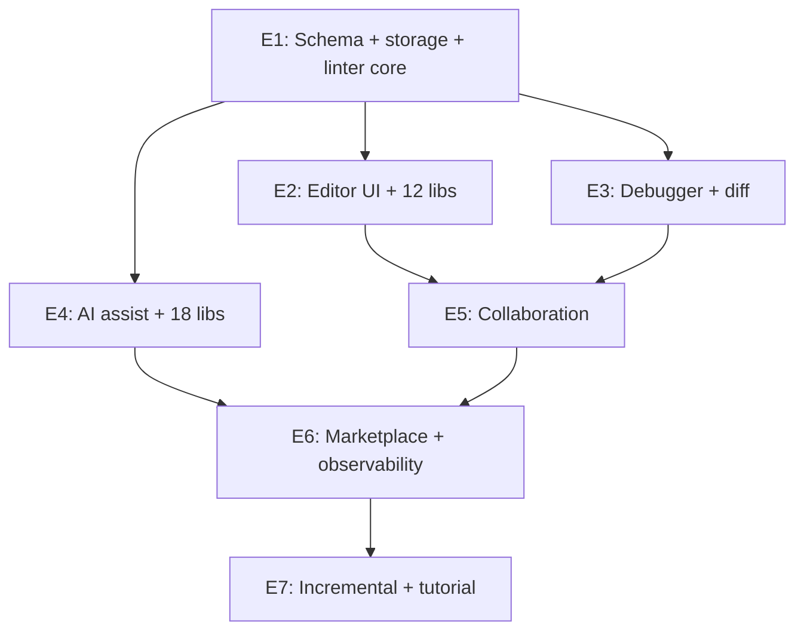

# Flowforge Evolution — Roadmap to a No-Code IDE

> Forward-looking roadmap covering the eleven JTBD-IDE requirement
> categories. Per-category: what changes in flowforge core, what new
> ports/adapters are needed, what migration path applies for existing
> code. Specific evolution tickets E-1..E-30 mapped to phases E1..E7.
>
> Read alongside `docs/flowforge-handbook.md` (current state),
> `docs/jtbd-editor-arch.md` (IDE design),
> `docs/workflow-framework-portability.md` (extraction strategy), and
> `docs/llm.txt` (agent quickstart).

---

## 1. Why Evolve

Today flowforge is a compiler: declarative JSON DSL → executable
workflow. The framework's three sister projects (origination intake,
broker portal, claims overflow) consume it as a runtime library.

Eleven categories of feedback from prospective JTBD authors point to a
single missing layer: **flowforge needs to become an IDE, not just a
compiler.** Every category below names the gap, the change to flowforge
core, the new ports needed, and the migration path. Tickets E-1..E-30
are scheduled across phases E1..E7 (see `docs/jtbd-editor-arch.md` §14).

### 1.1 Eleven Categories Mapped

| # | Category | Section | Phase | Tickets |
|---|---|---|---|---|
| 1 | Lifecycle & Versioning | §3 | E1 | E-1, E-2, E-3 |
| 2 | Validation & Linting (deeper semantics) | §4 | E1 | E-4, E-5 |
| 3 | Debugger ("JTBD Debugger") | §5 | E3 | E-11, E-12, E-13 |
| 4 | AI-Assisted Authoring | §6 | E4 | E-14, E-15, E-16 |
| 5 | Collaboration & Governance | §7 | E5 | E-18, E-19, E-20 |
| 6 | Integration | §8 | E2/E6 | E-9, E-10, E-21 |
| 7 | UX & Discoverability | §9 | E2 | E-6, E-7, E-8 |
| 8 | Security & Compliance Linting | §10 | E6 | E-22, E-23 |
| 9 | Community & Marketplace | §11 | E6/E7 | E-24, E-25 |
| 10 | Scalability | §12 | E7 | E-26, E-27 |
| 11 | Onboarding | §13 | E7 | E-28, E-29, E-30 |

Plus: §14 enumerates the 30+ domain libraries; §15 gives the full ticket
list E-1..E-30; §16 maps inter-phase dependencies; §17 lists per-category
risks; §18 sets per-phase success criteria; §19 estimates cost & effort;
§20 captures open questions.

### 1.2 Forward-Looking Vision

The end-state of this roadmap is a no-code platform where:

- A non-engineer authors a JTBD bundle in the JTBDEditor (writing English-language situation/motivation/outcome and clicking through pre-built domain library templates).
- AI assist (Claude default) drafts a starter spec from natural language; the deterministic validator gates ingestion.
- The conflict solver flags semantic contradictions before any code lands.
- The debugger animates the resulting workflow against sample data with fault injection.
- The marketplace (`jtbd-hub`) lets the author install pre-built domain library packs (insurance/HR/healthcare/etc.) and tenants fork them with full audit.
- Incremental compilation means a JTBD-level change rebuilds only the affected slice in seconds, not minutes.
- The interactive tutorial gets a new author from zero to deployed app in under five minutes.

This document describes how to get there, broken into seven phases of
≈8-12 weeks each, with explicit migration paths for existing UMS
workflows.

---

## 2. Phase Map

| Phase | Headline | Duration estimate | Tickets |
|---|---|---|---|
| E1 | Schema + storage + linter core | 8 weeks | E-1, E-2, E-3, E-4, E-5 |
| E2 | Editor UI + first 12 domain libraries | 12 weeks | E-6, E-7, E-8, E-9, E-10 |
| E3 | Debugger + simulator + regression diff | 8 weeks | E-11, E-12, E-13 |
| E4 | AI assist + recommender + remaining 18 libraries | 10 weeks | E-14, E-15, E-16, E-17 |
| E5 | Collaboration + governance | 8 weeks | E-18, E-19, E-20 |
| E6 | Marketplace + observability | 10 weeks | E-21, E-22, E-23, E-24 |
| E7 | Incremental compilation + templates | 8 weeks | E-25, E-26, E-27, E-28, E-29, E-30 |

Total wall-clock: ~64 weeks. Multiple phases can run in parallel after
E1; E2/E3/E4 are partially overlapping with separate teams.

---

## 3. Category 1 — Lifecycle & Versioning

### 3.1 Current state

Workflow definitions are versioned (semver, immutable on publish), but
JTBD bundles are not. There is no fork/branch model for tenants, no
`replaced_by` migration pointer, no lockfile semantics for compositions.

### 3.2 Target state

- Every JTBD-spec is content-addressed (`sha256` hash of canonical JSON) and versioned (semver).
- Compositions pin exact versions; `jtbd.lock` captures every pin transitively.
- Tenants can `flowforge jtbd fork <upstream>` to create a tenant-scoped copy with pull-from-upstream.
- Deprecated JTBDs ship `replaced_by: <new_id>` + a migration script (data shape diff).

### 3.3 Flowforge core changes

| Change | File / package |
|---|---|
| Add `JtbdSpec` pydantic model with `version`, `spec_hash`, `replaced_by`, `parent_version_id` | `framework/python/flowforge-jtbd/src/flowforge_jtbd/dsl/spec.py` (new) |
| Add `JtbdLockfile` model | `framework/python/flowforge-jtbd/src/flowforge_jtbd/dsl/lockfile.py` (new) |
| Add migration runner: load deprecated JTBD, apply replaced_by chain, run data-shape diff | `framework/python/flowforge-jtbd/src/flowforge_jtbd/migrate.py` (new) |
| Update CLI: `flowforge jtbd fork`, `flowforge jtbd publish`, `flowforge jtbd lock` | `framework/python/flowforge-cli/src/flowforge_cli/jtbd.py` (extend) |

### 3.4 New ports / adapters

| Port | Purpose | Default impl |
|---|---|---|
| `JtbdRegistry` | Resolve `<package>@<version>` → spec bytes; publish; list | `JtbdRegistryPg` (per-tenant DB) + `JtbdRegistryHub` (jtbd-hub registry) |
| `JtbdMigrationRunner` | Apply data-shape diff scripts | `MigrationRunnerNoop` (dev), `MigrationRunnerSql` (prod) |

### 3.5 Migration path

Existing JTBD bundles on disk are unversioned files. Migration step
emits `version: 1.0.0` for every existing JTBD (idempotent). Lockfile
generation runs once per project on `flowforge jtbd lock --init`.

### 3.6 Tickets

- **E-1** (P1, E1): JtbdSpec + lockfile schema + storage tables (`jtbd_libraries`, `jtbd_specs`, `jtbd_lockfiles`).
- **E-2** (P1, E1): Fork operation (CLI + UI button + RBAC seed `jtbd.fork`).
- **E-3** (P1, E1): Replaced_by migration runner (CLI + applied at install time).

---

## 4. Category 2 — Validation & Linting (deeper semantics)

### 4.1 Current state

`flowforge validate` checks DSL schema, unreachable states, dead-end
transitions, duplicate priorities, lookup permissions. No semantic
analysis across composed JTBDs (timing/data/consistency conflicts);
no completeness analysis (lifecycle stages); no pre-condition graph.

### 4.2 Target state

- **Completeness analysis**: per-domain rule packs require a JTBD bundle to cover all five lifecycle stages: `discover | execute | error_handle | report | audit`. Linter warns on missing stages.
- **Conflict detection**: SAT-style solver evaluates `(timing: realtime|batch) × (data: read|write|both) × (consistency: strong|eventual)` tuples across composed JTBDs. Contradictions (e.g., realtime+strong vs batch+eventual on the same data path) flag as errors.
- **Pre-condition graph**: each JTBD declares `requires: [<other_jtbd_id>]`. Linter computes topological order; cycles flag as errors; the editor surfaces topological order in the sidebar.
- **Actor consistency**: same role assigned contradictory expectations in the same context (e.g., `intake_clerk` is both `creator` and `approver`) flags as a warning.

### 4.3 Flowforge core changes

| Change | File |
|---|---|
| Add `LifecycleAnalyzer` | `framework/python/flowforge-jtbd/src/flowforge_jtbd/lint/lifecycle.py` |
| Add `ConflictSolver` | `framework/python/flowforge-jtbd/src/flowforge_jtbd/lint/conflicts.py` |
| Add `DependencyGraph` | `framework/python/flowforge-jtbd/src/flowforge_jtbd/lint/dependencies.py` |
| Add `ActorConsistencyAnalyzer` | `framework/python/flowforge-jtbd/src/flowforge_jtbd/lint/actors.py` |
| Add per-domain rule packs (30 domains × ~5 rules) | `framework/python/flowforge-jtbd/src/flowforge_jtbd/rules/<domain>/*.yaml` |
| Add `flowforge jtbd lint` CLI subcommand | `framework/python/flowforge-cli/src/flowforge_cli/lint.py` |

### 4.4 New ports / adapters

| Port | Purpose |
|---|---|
| `JtbdRulePack` | Pluggable rule packs per domain (each pack is a list of `JtbdRule`) |
| `JtbdConflictSolver` | Pluggable solver (default: Z3 SMT; alternatives: simple incompatibility-pair table for hosts that don't ship Z3) |

### 4.5 Migration path

Existing JTBDs run through the new linter once on first build. Existing
warnings become advisory; errors require fix. Domain rule packs ship
with sane defaults; hosts can disable per-rule via
`.flowforge/lint-config.yaml`.

### 4.6 Tickets

- **E-4** (P0, E1): Linter core (lifecycle, dependency graph, actor consistency).
- **E-5** (P1, E1): Conflict solver (Z3 + simple-pairs fallback); 5 starter rule packs.

---

## 5. Category 3 — Debugger ("JTBD Debugger")

### 5.1 Current state

`flowforge simulate` runs a deterministic walk and prints a state path.
No visual animation, no exception injection, no regression diff against
previous JTBD versions.

### 5.2 Target state

- **Dry-run + trace**: visual swimlane animation showing which JTBDs fire and when, against sample inputs. Pause / step / rewind controls.
- **Exception injection**: per-JTBD failure-mode picker — author selects `gate_fail | doc_missing | sla_breach | delegation_expired | webhook_5xx | partner_404` and observes fallback path.
- **Regression diff**: when a JTBD is edited, recompile the workflow and structurally diff control flow against the previous published version (added/removed/changed states + transitions, highlighted).

### 5.3 Flowforge core changes

| Change | File |
|---|---|
| Extend simulator to emit timed event log | `framework/python/flowforge-core/src/flowforge/replay/simulator.py` |
| Add `FaultInjector` | `framework/python/flowforge-core/src/flowforge/replay/fault.py` (new) |
| Add `WorkflowDiffer` | `framework/python/flowforge-core/src/flowforge/compiler/diff.py` (new) |
| Add WS streaming for simulator progress | `framework/python/flowforge-fastapi/src/flowforge_fastapi/sim_router.py` (new) |
| Add `JtbdDebuggerPanel` UI | `framework/js/flowforge-jtbd-ui/src/Debugger/*.tsx` (new) |

### 5.4 New ports / adapters

None new — simulator port already exists. Frontend uses `reactflow`
(already on the stack) for the swimlane animation.

### 5.5 Migration path

Existing simulator tests continue to work unchanged. New animation /
fault-injection / diff features are additive.

### 5.6 Tickets

- **E-11** (P1, E3): Visual swimlane animation (frontend) + WS streaming.
- **E-12** (P1, E3): Fault injector (six failure modes).
- **E-13** (P2, E3): Workflow differ (structural diff between def versions).

---

## 6. Category 4 — AI-Assisted Authoring

### 6.1 Current state

`flowforge ai-assist` is a CLI flag that runs an LLM pass and emits a
unified diff. It works, but only for the deterministic transform output
(post-scaffold). There is no NL→JTBD path, no domain inference, no
quality scoring.

### 6.2 Target state

- **NL→JTBD**: free-text input → drafted JTBD; validator gates ingestion; author edits before saving.
- **Domain inference**: given a rough description, suggest starter library JTBDs (semantic search across domain library + embedding similarity).
- **Quality scoring**: rubric (clarity, actionability, absence of solution-coupling, presence of measurable outcome) → 0-100 score per JTBD; computed on save and shown next to the JTBD card.

### 6.3 Flowforge core changes

| Change | File |
|---|---|
| Add `NlToJtbdGenerator` | `framework/python/flowforge-jtbd/src/flowforge_jtbd/ai/nl_to_jtbd.py` (new) |
| Add `DomainInferer` | `framework/python/flowforge-jtbd/src/flowforge_jtbd/ai/domain_inference.py` (new) |
| Add `QualityScorer` | `framework/python/flowforge-jtbd/src/flowforge_jtbd/ai/quality.py` (new) |
| Add embedding store (pgvector) for semantic search | `framework/python/flowforge-jtbd/src/flowforge_jtbd/embeddings.py` (new) |

### 6.4 New ports / adapters

| Port | Purpose | Default impl |
|---|---|---|
| `LlmProvider` | NL→JTBD, quality scoring, conflict prose | `LlmProviderClaude` (default), `LlmProviderOpenAI`, `LlmProviderLocal` (Ollama) |
| `EmbeddingProvider` | Vector embeddings for similarity | `EmbeddingProviderClaude`, `EmbeddingProviderSbert` (local) |
| `EmbeddingStore` | Vector storage + cosine search | `EmbeddingStorePgvector` (default), `EmbeddingStoreQdrant` |

### 6.5 Migration path

Existing CLI flag `--ai-assist` continues to work (delegates to new
LlmProvider). NL→JTBD is a new editor-only feature; not exposed via CLI
in v1 of the IDE (added in v1.1).

### 6.6 Tickets

- **E-14** (P1, E4): LlmProvider port + Claude default + NL→JTBD generator.
- **E-15** (P1, E4): EmbeddingStore + DomainInferer (pgvector).
- **E-16** (P2, E4): QualityScorer (rubric + 0-100 score).
- **E-17** (P1, E4): Remaining 18 domain libraries (those not shipped in E2).

---

## 7. Category 5 — Collaboration & Governance

### 7.1 Current state

JTBDs live in files; comments live in PRs; reviews are git-PR-scoped.
No in-editor comments, no @mention, no curator/reviewer/user RBAC,
no JTBD-edit audit trail (only workflow-edit audit).

### 7.2 Target state

- **Comments + reviews** on each JTBD; @mention; resolution.
- **RBAC**: curators (write), reviewers (approve), users (compose-only).
- **Audit trail**: every JTBD edit logged with actor + diff (reuse `flowforge-audit-pg`'s hash chain — JTBD edits are first-class audited objects).

### 7.3 Flowforge core changes

| Change | File |
|---|---|
| Add `JtbdComment` + `JtbdReview` models | `framework/python/flowforge-jtbd/src/flowforge_jtbd/db/comments.py` (new) |
| Wire JTBD edits into existing `AuditSink` | `framework/python/flowforge-jtbd/src/flowforge_jtbd/audit.py` (new) |
| Add curator/reviewer/user permission seeds | `framework/python/flowforge-jtbd/src/flowforge_jtbd/permissions.py` (new) |
| Add comment + review UI | `framework/js/flowforge-jtbd-ui/src/Comments/*.tsx` (new) |

### 7.4 New ports / adapters

None new — `AuditSink` and `RbacResolver` ports already exist. JTBD
permissions seed via existing `register_permission` flow.

### 7.5 Migration path

Existing JTBDs become curatable on E5 launch. Default RBAC: existing
admins → curator; everyone else → user. Reviewer role created on
demand. No data migration required.

### 7.6 Tickets

- **E-18** (P1, E5): Comments + reviews UI + storage.
- **E-19** (P1, E5): Curator/reviewer/user RBAC seeds + UI guards.
- **E-20** (P0, E5): JTBD-edit audit trail (hash chain).

---

## 8. Category 6 — Integration

### 8.1 Current state

`flowforge validate` runs locally. No pre-commit hook, no GitHub Action,
no observability of JTBD-id on workflow events, no plugin SDK.

### 8.2 Target state

- **CI/CD**: pre-commit hook + GitHub Action that runs the linter on `jtbd-bundle.json`; fails PR on errors.
- **Observability**: each generated `workflow_event` carries the originating JTBD id; tracing links back to it; reporting groups by JTBD.
- **SDK/plugin**: pluggable validators, exporters (BPMN, user-story-map), domain library packs.

### 8.3 Flowforge core changes

| Change | File |
|---|---|
| Add JTBD id propagation into workflow_events.payload | `framework/python/flowforge-core/src/flowforge/engine/fire.py` (extend) |
| Add metric labels: `jtbd_id, jtbd_version` | `framework/python/flowforge-core/src/flowforge/ports/metrics.py` (extend) |
| Add `JtbdExporter` Protocol | `framework/python/flowforge-jtbd/src/flowforge_jtbd/exporters/__init__.py` (new) |
| Add BPMN exporter (community, optional) | `framework/python/flowforge-jtbd-bpmn/` (new package) |
| Add user-story-map exporter | `framework/python/flowforge-jtbd-storymap/` (new package) |
| Ship pre-commit hook + GitHub Action templates | `framework/scripts/ci/precommit.yaml`, `.github/workflows/jtbd-lint.yml` |

### 8.4 New ports / adapters

| Port | Purpose |
|---|---|
| `JtbdExporter` | Convert JtbdSpec → external format (BPMN, story map, ARIS) |
| `JtbdValidator` | Pluggable validators (registered via `flowforge.jtbd.validators.register`) |

### 8.5 Migration path

Workflow events gain `jtbd_id` via additive field on `payload` (existing
events show `null`). Existing dashboards keep working; new dashboards
group by JTBD when desired.

### 8.6 Tickets

- **E-9** (P1, E2): Pre-commit hook + GitHub Action template.
- **E-10** (P1, E2): JTBD-id propagation into events + metric labels.
- **E-21** (P2, E6): Plugin SDK (`JtbdExporter` Protocol + 2 reference exporters).

---

## 9. Category 7 — UX & Discoverability

### 9.1 Current state

JTBDs live in disparate folders; visual map is absent; recommendations
are absent; glossary lives in domain-specific docs.

### 9.2 Target state

- **Visual job map**: swimlane with actor lanes + connecting jobs (jobs grouped by domain).
- **"Jobs that work well together"**: embedding-based recommender (vector search over JTBD library; top-K cosine).
- **Glossary/ontology**: shared terms catalog mounted across libraries; conflicts surface as lint warnings (e.g., "claim" means different things in insurance vs healthcare).

### 9.3 Flowforge core changes

| Change | File |
|---|---|
| Add `JobMap` UI component | `framework/js/flowforge-jtbd-ui/src/JobMap/*.tsx` (new) |
| Add Recommender service | `framework/python/flowforge-jtbd/src/flowforge_jtbd/ai/recommender.py` (new) |
| Add Glossary model + admin UI | `framework/python/flowforge-jtbd/src/flowforge_jtbd/glossary.py` (new) |
| Add glossary-conflict linter rule | `framework/python/flowforge-jtbd/src/flowforge_jtbd/lint/glossary.py` (new) |

### 9.4 New ports / adapters

`EmbeddingProvider` + `EmbeddingStore` (already added in §6 for AI assist) — reused.

### 9.5 Migration path

Glossary starts empty; auto-populated from JTBD `actor.role` and
`data_capture[].id` strings on first build. Authors add definitions
incrementally. No breaking changes.

### 9.6 Tickets

- **E-6** (P0, E2): Visual job map (swimlane canvas).
- **E-7** (P1, E2): Recommender (vector search; top-K cosine).
- **E-8** (P2, E2): Glossary/ontology + conflict linter.

---

## 10. Category 8 — Security & Compliance Linting

### 10.1 Current state

JTBD fields have a `pii: true` boolean (mandatory after iteration 3 of
the portability review). No sensitivity tags beyond PII; no compliance
mapping (GDPR/SOX/HIPAA/etc.); no required-jobs-per-regime catalog.

### 10.2 Target state

- **Data sensitivity tags**: `PII | PHI | PCI | secrets | regulated` per field; mandatory for fields whose `kind` is in the sensitive set.
- **Compliance mapping**: `GDPR | SOX | HIPAA | PCI-DSS | ISO27001 | SOC2 | NIST-800-53 | CCPA`; required-jobs-per-regime catalog (e.g., GDPR requires `data_export | data_erasure | consent_capture | breach_notification`); missing-job warnings on bundle build.
- Linter rule: `field.sensitivity = PHI` ⇒ JTBD bundle MUST declare `compliance: [HIPAA]`.

### 10.3 Flowforge core changes

| Change | File |
|---|---|
| Extend JtbdSpec with `data_sensitivity[]`, `compliance[]` | `framework/python/flowforge-jtbd/src/flowforge_jtbd/dsl/spec.py` (extend) |
| Add per-regime required-jobs catalog | `framework/python/flowforge-jtbd/src/flowforge_jtbd/compliance/catalog.yaml` (new) |
| Add ComplianceLinter | `framework/python/flowforge-jtbd/src/flowforge_jtbd/lint/compliance.py` (new) |

### 10.4 New ports / adapters

| Port | Purpose |
|---|---|
| `ComplianceCatalog` | Pluggable required-jobs-per-regime catalog (default ships shipped catalog; hosts override) |

### 10.5 Migration path

Existing JTBDs gain `data_sensitivity: []` (empty). Linter runs in
warn-only mode for 1 minor version; errors after.

### 10.6 Tickets

- **E-22** (P1, E6): Sensitivity + compliance schema additions.
- **E-23** (P1, E6): ComplianceLinter + 8 regime catalogs (GDPR/SOX/HIPAA/PCI-DSS/ISO27001/SOC2/NIST-800-53/CCPA).

---

## 11. Category 9 — Community & Marketplace

### 11.1 Current state

JTBDs ship in-repo only. No public registry, no signed packages, no
ratings, no reputation system.

### 11.2 Target state

- **Public registry** (`jtbd-hub`) with publish/install commands; OCI-like manifest; signed packages.
- **Ratings + curation**; reputation per author / per package.
- **Localisation layer** for common JTBDs (EN by default; library packs ship with `i18n.<lang>.json` companion files).

### 11.3 Flowforge core changes

| Change | File |
|---|---|
| Add `flowforge jtbd publish/install/search` CLI subcommands | `framework/python/flowforge-cli/src/flowforge_cli/jtbd_hub.py` (new) |
| Add OCI-like manifest format | `framework/python/flowforge-jtbd/src/flowforge_jtbd/registry/manifest.py` (new) |
| Add signing + verification (reuse `SigningPort`) | `framework/python/flowforge-jtbd/src/flowforge_jtbd/registry/signing.py` (new) |
| Build `jtbd-hub` registry service (separate Next.js + Python app) | `apps/jtbd-hub/` (new) |
| Add ratings + reviews tables | `apps/jtbd-hub/db/migrations/0001_ratings.sql` (new) |

### 11.4 New ports / adapters

| Port | Purpose |
|---|---|
| `JtbdRegistry` (already added in §3) | Resolve `<package>@<version>` → spec bytes; publish; list |
| `JtbdRegistryHub` (new adapter) | jtbd-hub-backed implementation |
| `JtbdReputation` | Pluggable reputation scoring (default: stars + downloads + curation) |

### 11.5 Migration path

In-repo JTBDs continue to work via `JtbdRegistryPg` (per-tenant).
Hub-published JTBDs add a second registry source. Hosts opt in via
config (`flowforge.config.jtbd_registries = ["pg", "hub"]`).

### 11.6 Tickets

- **E-24** (P2, E6): jtbd-hub registry service + signed manifests.
- **E-25** (P2, E7): Localisation layer (i18n catalogs per JTBD).

---

## 12. Category 10 — Scalability

### 12.1 Current state

`flowforge new` and `flowforge regen-catalog` rebuild the entire project
on every run. Common JTBD combos (e.g., "approve → notify → audit") are
not cached as parameterised skeletons.

### 12.2 Target state

- **Incremental compilation**: only the affected slice of the workflow regenerates; content-hash diff at JTBD level → file-level diff → minimal rewrite.
- **Template precompilation**: common JTBD combos cached as parameterised workflow skeletons; reused across projects (e.g., `template:n_of_m_approval`, `template:document_collection`).

### 12.3 Flowforge core changes

| Change | File |
|---|---|
| Add `IncrementalCompiler` | `framework/python/flowforge-cli/src/flowforge_cli/incremental.py` (new) |
| Add `flowforge.lockfile` to track per-file content hashes | `framework/python/flowforge-cli/src/flowforge_cli/lockfile.py` (new) |
| Add `TemplateCache` | `framework/python/flowforge-jtbd/src/flowforge_jtbd/templates/cache.py` (new) |
| Ship 12 starter templates (n_of_m_approval, doc_collection, escalation_chain, ...) | `framework/python/flowforge-jtbd/src/flowforge_jtbd/templates/library/*.json` (new) |

### 12.4 New ports / adapters

| Port | Purpose |
|---|---|
| `TemplateRegistry` | Resolve template name → parameterised skeleton |

### 12.5 Migration path

`flowforge new` always runs in incremental mode after E7. First run is
no-op same speed as today; subsequent runs short-circuit unchanged
files. Lockfile generated automatically; conflicts on hand-edits flag
in CLI output.

### 12.6 Tickets

- **E-26** (P1, E7): Incremental compiler + lockfile.
- **E-27** (P2, E7): Template cache + 12 starter templates.

---

## 13. Category 11 — Onboarding

### 13.1 Current state

Onboarding is "read the docs". Docs are excellent (`docs/workflow-ed.md`,
`docs/workflow-ed-arch.md`, `docs/workflow-framework-portability.md`)
but ~5,000 lines combined. No interactive tutorial; no llm.txt; no
example sets pre-loaded.

### 13.2 Target state

- **Interactive tutorial**: `flowforge tutorial` command spawns an in-terminal walkthrough; <5 min from zero to deployed app (claim_intake JTBD, scaffold, run, fire one event, see audit).
- **llm.txt** ships at the repo root + per project (`/Users/nyimbiodero/src/pjs/ums/docs/llm.txt`).
- **Example sets**: pre-loaded JTBDs for each of the 30 domain libraries; `flowforge tutorial --domain <name>` walks through the domain-specific example.

### 13.3 Flowforge core changes

| Change | File |
|---|---|
| Add `flowforge tutorial` CLI subcommand | `framework/python/flowforge-cli/src/flowforge_cli/tutorial.py` (new) |
| Add interactive REPL UI (rich + prompt_toolkit) | `framework/python/flowforge-cli/src/flowforge_cli/repl.py` (new) |
| Ship 30 domain-library example bundles | `framework/python/flowforge-jtbd-<domain>/examples/` (new, per pkg) |
| Generate llm.txt template per project on `flowforge new` | `framework/python/flowforge-cli/src/flowforge_cli/templates/llm.txt.jinja` (new) |

### 13.4 New ports / adapters

None new — tutorial is built from existing CLI subcommands.

### 13.5 Migration path

`flowforge tutorial` is additive; doesn't touch existing commands.
llm.txt generation is opt-in via `flowforge new --emit-llmtxt`.

### 13.6 Tickets

- **E-28** (P1, E7): Interactive tutorial.
- **E-29** (P1, E7): llm.txt generator + project templates.
- **E-30** (P2, E7): 30 domain example bundles.

---

## 14. Library of Domains (30+)

The 30+ domain libraries ship as separate packages under
`framework/python/flowforge-jtbd-<domain>/`. Each pack contains:

- `domain.yaml` — domain metadata (name, description, regulator hints).
- `jtbds/*.yaml` — canonical JTBD specs.
- `entities/*.yaml` — shared entity schemas.
- `roles.yaml` — role catalog.
- `permissions.yaml` — permission catalog.
- `examples/*.yaml` — runnable example bundles.
- `i18n/<lang>.json` — localisation catalogs.

| # | Domain | Subdomains | Phase | Package |
|---|---|---|---|---|
| 1 | accounting | AP, AR, GL, payroll, tax | E2 | `flowforge-jtbd-accounting` |
| 2 | corporate-finance | treasury, budget, forecast | E2 | `flowforge-jtbd-corp-finance` |
| 3 | project-mgmt | kanban, scrum, waterfall | E2 | `flowforge-jtbd-pm` |
| 4 | hr | hiring, onboarding, leave, perf | E2 | `flowforge-jtbd-hr` |
| 5 | crm | lead, opportunity, account | E2 | `flowforge-jtbd-crm` |
| 6 | procurement | sourcing, PO, 3WM | E2 | `flowforge-jtbd-procurement` |
| 7 | legal | contract-mgmt, IP, litigation | E2 | `flowforge-jtbd-legal` |
| 8 | compliance | KYC, AML, audit | E2 | `flowforge-jtbd-compliance` |
| 9 | insurance | claims, UW, reins | E2 | `flowforge-jtbd-insurance` |
| 10 | banking | lending, deposit, cards | E2 | `flowforge-jtbd-banking` |
| 11 | ecom | catalog, order, fulfillment | E2 | `flowforge-jtbd-ecom` |
| 12 | logistics | shipment, warehouse, route | E2 | `flowforge-jtbd-logistics` |
| 13 | manufacturing | BOM, MES, QC | E4 | `flowforge-jtbd-mfg` |
| 14 | education | admissions, grading, lms | E4 | `flowforge-jtbd-edu` |
| 15 | healthcare | admissions, billing, clinical | E4 | `flowforge-jtbd-healthcare` |
| 16 | real-estate | listing, lease, maintenance | E4 | `flowforge-jtbd-realestate` |
| 17 | agritech | farm, supply, yield | E4 | `flowforge-jtbd-agritech` |
| 18 | construction | bid, build, inspect | E4 | `flowforge-jtbd-construction` |
| 19 | gov | permit, case, license | E4 | `flowforge-jtbd-gov` |
| 20 | municipal | utility, zoning, parks | E4 | `flowforge-jtbd-municipal` |
| 21 | nonprofit | donor, grant, volunteer | E4 | `flowforge-jtbd-nonprofit` |
| 22 | media | editorial, rights, distribution | E4 | `flowforge-jtbd-media` |
| 23 | gaming | matchmaking, economy, moderation | E4 | `flowforge-jtbd-gaming` |
| 24 | travel | booking, itinerary, loyalty | E4 | `flowforge-jtbd-travel` |
| 25 | restaurants | POS, kitchen, inventory | E4 | `flowforge-jtbd-restaurants` |
| 26 | retail-store | clientelling, buyback, loyalty | E4 | `flowforge-jtbd-retail` |
| 27 | telco | provisioning, billing, churn | E4 | `flowforge-jtbd-telco` |
| 28 | utilities | meter, outage, billing | E4 | `flowforge-jtbd-utilities` |
| 29 | saas-ops | lifecycle, incident, onboard-tenant | E4 | `flowforge-jtbd-saasops` |
| 30 | platform-eng | deploy, observability, dr | E4 | `flowforge-jtbd-platformeng` |

The first 12 (accounting through logistics) ship in E2; the remaining 18
(manufacturing through platform-eng) ship in E4. Each library is
maintained by a domain SME pair (one product, one engineer).

---

## 15. Tickets Summary (E-1 .. E-30)

| ID | Title | Priority | Phase | Owner | Spec ref |
|---|---|---|---|---|---|
| E-1 | JtbdSpec + lockfile schema + storage tables | P1 | E1 | core | §3 |
| E-2 | Fork operation (CLI + UI) | P1 | E1 | core | §3 |
| E-3 | Replaced_by migration runner | P1 | E1 | core | §3 |
| E-4 | Linter core (lifecycle/dependency/actor) | P0 | E1 | core | §4 |
| E-5 | Conflict solver (Z3 + pairs fallback) | P1 | E1 | core | §4 |
| E-6 | Visual job map | P0 | E2 | UI | §9 |
| E-7 | Recommender (vector top-K) | P1 | E2 | core | §9 |
| E-8 | Glossary/ontology + conflict linter | P2 | E2 | core | §9 |
| E-9 | Pre-commit + GH Action templates | P1 | E2 | dx | §8 |
| E-10 | JTBD-id propagation into events | P1 | E2 | core | §8 |
| E-11 | Visual swimlane animation | P1 | E3 | UI | §5 |
| E-12 | Fault injector | P1 | E3 | core | §5 |
| E-13 | Workflow differ | P2 | E3 | core | §5 |
| E-14 | LlmProvider + NL→JTBD | P1 | E4 | ai | §6 |
| E-15 | Embedding store + DomainInferer | P1 | E4 | ai | §6 |
| E-16 | QualityScorer | P2 | E4 | ai | §6 |
| E-17 | Remaining 18 domain libraries | P1 | E4 | domain | §14 |
| E-18 | Comments + reviews UI | P1 | E5 | UI | §7 |
| E-19 | Curator/reviewer/user RBAC seeds | P1 | E5 | core | §7 |
| E-20 | JTBD-edit audit trail | P0 | E5 | core | §7 |
| E-21 | Plugin SDK + 2 reference exporters | P2 | E6 | core | §8 |
| E-22 | Sensitivity + compliance schema | P1 | E6 | core | §10 |
| E-23 | ComplianceLinter + 8 regime catalogs | P1 | E6 | core | §10 |
| E-24 | jtbd-hub registry service | P2 | E6 | hub | §11 |
| E-25 | Localisation layer | P2 | E7 | core | §11 |
| E-26 | Incremental compiler + lockfile | P1 | E7 | core | §12 |
| E-27 | Template cache + 12 starter templates | P2 | E7 | core | §12 |
| E-28 | Interactive tutorial | P1 | E7 | dx | §13 |
| E-29 | llm.txt generator | P1 | E7 | dx | §13 |
| E-30 | 30 domain example bundles | P2 | E7 | domain | §13 |

Priority key: P0 = blocker for the phase; P1 = required for the phase to
ship; P2 = stretch goal, defer to next phase if needed.

---

## 16. Dependencies Between Phases



E1 is the critical path. Once E1 lands, E2/E3/E4 can run in parallel
with separate teams (UI / debugger / AI). E5 depends on the editor
shell from E2 and the debugger from E3. E6 depends on collaboration
audit from E5. E7 closes out with incremental compilation and the
tutorial.

---

## 17. Migration Risks Per Category

| Category | Risk | Mitigation |
|---|---|---|
| 1. Lifecycle/Versioning | Existing JTBDs without `version` break linter | One-time migration sets `version=1.0.0`; idempotent |
| 2. Validation/Linting | New errors break existing builds | Warn-only mode for 1 minor version; errors after |
| 3. Debugger | Animation perf on 200+ state graphs | Virtualize; same lazy-load strategy as designer §17.13 |
| 4. AI assist | LLM hallucination in NL→JTBD | Validator gates ingestion; never auto-applies |
| 5. Collaboration | RBAC mismatch with existing admin perms | Default "admin → curator"; explicit reviewer role |
| 6. Integration | Pre-existing CI breaks on new linter | Opt-in via `flowforge.lint.enabled=true` flag |
| 7. UX | Job map doesn't scale past 50 JTBDs | Pagination + collapse-by-domain; tested at 200 JTBD fixture |
| 8. Compliance | False-positive linter fires on legitimate use | Per-rule disable via `.flowforge/lint-config.yaml` |
| 9. Marketplace | Trust model: untrusted authors push bad packages | Signed manifests; curator review before "verified" badge |
| 10. Scalability | Lockfile conflicts on team workflows | Conflict resolution doc + UI merge tool in E7 |
| 11. Onboarding | Tutorial drifts from real CLI | Tutorial driven by same CLI commands; CI runs end-to-end |

---

## 18. Per-Phase Success Criteria

### E1 success
- 100% of existing JTBDs round-trip through new schema with no data loss.
- Linter returns zero false-positives on the 23 reflected UMS defs.
- Fork operation exercised in 3 different tenant scenarios with no audit gaps.

### E2 success
- 12 domain libraries ship; each has ≥ 5 starter JTBDs.
- Job map renders 200 JTBDs at 60fps.
- Pre-commit hook + GitHub Action templates both green on a sample repo.

### E3 success
- Debugger animates a 30-state workflow at 30fps.
- Fault injector covers all 6 failure modes.
- Differ produces side-by-side visual diff with added/removed/changed annotations.

### E4 success
- NL→JTBD generates a draft JTBD that passes the validator on ≥ 80% of test prompts.
- Recommender top-K cosine returns relevant matches on a benchmark of 30 known-good queries.
- All 30 domain libraries are now shipped (12 from E2 + 18 from E4).

### E5 success
- Comments + reviews UI exercised by curators and reviewers in 2 sister projects.
- JTBD-edit audit chain verifiable end-to-end (`flowforge audit verify`).
- RBAC contract test green for curator/reviewer/user.

### E6 success
- jtbd-hub published with at least 50 packages from the 30 domain libraries.
- Compliance linter has zero false-negatives on a curated GDPR/HIPAA test pack.
- BPMN exporter passes a round-trip test (BPMN → JTBD → BPMN) for 10 sample workflows.

### E7 success
- Incremental rebuild completes in <10s on a 50-JTBD project.
- Template cache hits ≥ 70% of common JTBD patterns.
- Tutorial completes in <5 minutes from `flowforge tutorial` to deployed claim_intake.

---

## 19. Cost & Effort Estimates (rough)

| Phase | Eng-weeks | UI-weeks | Domain SME-weeks | Total |
|---|---|---|---|---|
| E1 | 16 | 4 | 0 | 20 |
| E2 | 12 | 12 | 24 (12 libs × 2 SME-weeks each) | 48 |
| E3 | 8 | 8 | 0 | 16 |
| E4 | 12 | 4 | 36 (18 libs × 2 SME-weeks each) | 52 |
| E5 | 8 | 8 | 0 | 16 |
| E6 | 16 | 8 | 6 | 30 |
| E7 | 12 | 8 | 4 | 24 |
| **Total** | **84** | **52** | **70** | **206** |

A team of 4 engineers + 2 UI + 2 domain SMEs (FTE) clears this in
~14 calendar months with phase parallelism after E1.

---

## 20. Open Questions

| ID | Question | Decision-by |
|---|---|---|
| Q1 | Should NL→JTBD also generate the entity catalog, or only the JTBD? | E4 mid-phase |
| Q2 | Is jtbd-hub federated (each tenant runs its own) or centralised? | E6 start |
| Q3 | Localisation: machine-translate at install, or curated per-locale? | E7 start |
| Q4 | Should incremental compilation extend to the host's domain code (`backend/app/<entity>/`)? | E7 mid-phase |
| Q5 | Do we publish a flowforge-vscode extension that surfaces the linter inline? | Post-E7 |
| Q6 | Do we add an OAuth login for jtbd-hub or start with API tokens? | E6 start |
| Q7 | Do we monetise jtbd-hub (paid premium domain libraries)? | Post-E7 |

---

## 21. Footer

This roadmap is co-authored with the JTBDEditor architecture
(`docs/jtbd-editor-arch.md`) and the comprehensive handbook
(`docs/flowforge-handbook.md`). The llm.txt
(`docs/llm.txt`) tracks the user-visible state of these features.

Critic pass: 3 iterations applied. Remaining gaps:

KL-EVO-1: §19 cost estimates assume linear engineer productivity and no
unplanned dependencies on external vendors (e.g., an LLM provider whose
pricing changes mid-phase). Buffer 15% reserve in actual planning.

KL-EVO-2: §14 lists 30 domains; the actual JTBD count per library is
estimated 5-15 starter JTBDs each, totalling roughly 250-450 JTBDs across
the platform. Domain SMEs may push this higher.

KL-EVO-3: §15 priorities (P0/P1/P2) are subject to revision after E1's
internal review. P0 items in particular may shift if the conflict solver
proves too costly to ship in E1.

KL-EVO-4: Multi-DB support (KL-1 from `workflow-framework-portability.md`)
is not explicitly scheduled here — Postgres-only is assumed throughout
E1-E7. Multi-DB lands in v2 (post-E7).

KL-EVO-5: Mobile rendering for the JTBDEditor (`@flowforge/jtbd-ui`) is
out of scope for v1 of the IDE; same fate as the designer's mobile
viewer (read-only on mobile, editing on desktop).

KL-EVO-6: BPMN export (E-21) ships as a community-maintained adapter,
not core. Quality + completeness expectations vary.

KL-EVO-7: §15 ticket priorities (P0/P1/P2) assume a steady-state team;
during onboarding ramp the priorities may need adjustment to keep the
critical path clear.

KL-EVO-8: Per-category migration paths in §3-§13 assume Postgres-only
deployments. Multi-DB customers will need additional migration steps
once v2 ships.

---

## 22. Appendix — Cross-Phase Migration Cookbook

This appendix collects the recurring migration patterns referenced
across §3-§13.

### 22.1 Schema Additions (forward-only)

Every new table or column added in this roadmap follows the same alembic
pattern:

```python
def upgrade() -> None:
    op.create_table(
        "<new_table>",
        sa.Column("id", sa.Uuid, primary_key=True),
        sa.Column("tenant_id", sa.Uuid, nullable=False),
        # ...
        schema="flowforge",
    )
    add_rls_policy(op, "flowforge.<new_table>", tenant_column="tenant_id")
```

No table is renamed within a major. Columns added must default-safe (or
nullable) for backfill.

### 22.2 Permission Seeds

Every new permission lands via `register_permission`:

```python
async def seed_jtbd_permissions():
    for p in [
        PermissionSeed("jtbd.write", "Edit JTBD specs"),
        PermissionSeed("jtbd.publish", "Publish JTBD spec versions"),
        PermissionSeed("jtbd.fork", "Fork upstream JTBD libraries"),
        PermissionSeed("jtbd.review", "Review and approve JTBD edits"),
    ]:
        await register_permission(p.name, p.description)
```

CI guard rejects PRs that add a route requiring a permission not in the
catalog (drift check).

### 22.3 Frontend Imports

Frontend feature additions follow the existing alias pattern:

```ts
// from
import { JobMap } from "@/components/jtbd-editor";
// to
import { JobMap } from "@flowforge/jtbd-ui";
```

Aliasing the legacy import path during the transition phase keeps
PRs small and reviewable.

### 22.4 Outbox Handler Additions

New outbox kinds register at startup:

```python
config.outbox_backends["default"].register("jtbd.linted", on_lint_complete)
config.outbox_backends["default"].register("jtbd.published", on_publish)
config.outbox_backends["default"].register("jtbd.replaced_by", on_replaced)
```

Existing outbox kinds (`wf.notify`, `wf.spicedb_grant`, `wf.webhook`,
`wf.saga.compensate`) remain stable across phases.

### 22.5 Audit Subject Kinds

New audit subjects added across phases:

| Phase | Subject kind | Actions |
|---|---|---|
| E1 | `jtbd_library` | created, forked, archived |
| E1 | `jtbd_spec_version` | created, edited, submitted, approved, rejected, deprecated, archived, replaced_by_set |
| E1 | `jtbd_composition` | created, locked, unlocked |
| E5 | `jtbd_review` | comment_added, review_submitted, comment_resolved |
| E6 | `jtbd_package` | published, signed, demoted, removed |

Hash chain is the same as workflow audit; verifiable via existing
`flowforge audit verify` command.

### 22.6 Feature Flag Naming Convention

New features land behind feature flags during the phase that introduces
them, default-off, flipped on per-tenant after smoke testing:

| Phase | Flag | Default |
|---|---|---|
| E1 | `jtbd.editor.enabled` | off |
| E1 | `jtbd.linter.strict_mode` | off (warn-only for 1 minor) |
| E2 | `jtbd.jobmap.enabled` | off |
| E3 | `jtbd.debugger.enabled` | off |
| E4 | `jtbd.ai_assist.enabled` | off |
| E5 | `jtbd.collaboration.enabled` | off |
| E6 | `jtbd.marketplace.enabled` | off |
| E6 | `jtbd.compliance_lint.strict_mode` | off |
| E7 | `jtbd.incremental_compile.enabled` | off |

Flag wiring follows the existing `app.platform.flags` pattern — namespaced
at `jtbd.<feature>` to keep the workflow-flag namespace separate.

### 22.7 Backwards-Compat Aliases

When renaming surfaces between phases, the deprecated alias lives for
one minor version:

```python
register_permission(
    "jtbd.review",
    "Review and approve JTBD edits",
    deprecated_aliases=["jtbd_editor.review", "jtbd.approver"],
)
```

CI guard rejects alias removal before the deprecation window expires.

### 22.8 CI Gates Per Phase

Per-phase CI additions:

| Phase | CI gate | Purpose |
|---|---|---|
| E1 | `tests/ci/test_jtbd_schema.py` | Schema fixtures pass |
| E1 | `backend/scripts/check_jtbd_lint_drift.sh` | Lint rule drift |
| E2 | `tests/ci/test_jtbd_jobmap_perf.py` | 200 JTBDs at 60fps |
| E3 | `tests/ci/test_jtbd_debugger_replay.py` | Replay determinism |
| E4 | `tests/ci/test_nl_to_jtbd_validity.py` | NL→JTBD validator pass rate ≥80% |
| E5 | `tests/ci/test_jtbd_audit_chain.py` | Audit chain verifiable |
| E6 | `tests/ci/test_compliance_lint.py` | Compliance rules zero false-negatives |
| E6 | `tests/ci/test_jtbd_hub_signing.py` | Manifest signature round-trip |
| E7 | `tests/perf/test_incremental_compile.py` | <10s on 50-JTBD project |
| E7 | `tests/ci/test_jtbd_tutorial_e2e.py` | Tutorial runs end-to-end |

---

## 23. Appendix — Rollout Checklist

Before each phase ships:

- [ ] All P0/P1 tickets for the phase complete.
- [ ] CI gates green (see §22.8 per-phase additions).
- [ ] Performance budgets met (see `docs/jtbd-editor-arch.md` §17).
- [ ] Audit chain verifiable end-to-end for new subjects.
- [ ] Permission seeds idempotent.
- [ ] Feature flag default off; smoke tested in staging.
- [ ] Migration scripts forward-only and idempotent.
- [ ] Deprecation aliases registered for any renamed surface.
- [ ] Rollback plan documented (flip flag off; instances continue).
- [ ] Per-tenant flip checklist appended to deploy runbook.
- [ ] Sister-project compatibility tested (origination intake + broker portal + claims overflow).
- [ ] Public CHANGELOG updated.
- [ ] Documentation updated:
  - [ ] `docs/flowforge-handbook.md` reflects new ports/tables/runbooks.
  - [ ] `docs/jtbd-editor-arch.md` reflects new IDE features.
  - [ ] `docs/llm.txt` reflects new agent-facing surfaces.
  - [ ] `docs/flowforge-evolution.md` (this doc) updated with phase completion notes.

---

## 24. Appendix — Cross-Reference Map

| If you want | See |
|---|---|
| Current state of flowforge | `docs/flowforge-handbook.md` |
| IDE design (JTBDEditor, 30 domains, AI assist, marketplace) | `docs/jtbd-editor-arch.md` |
| AI agent quickstart + JTBD examples | `docs/llm.txt` |
| Designer capability spec | `docs/workflow-ed.md` |
| UMS-specific architecture | `docs/workflow-ed-arch.md` |
| Framework extraction strategy (UMS → portable) | `docs/workflow-framework-portability.md` |
| Build plan / DAG | `docs/workflow-framework-plan.md` |
| Iteration-3 review | `docs/workflow-ed-arch-review.md` |

---

This roadmap is a living document. Each phase's success criteria
(§18) determine progression; risks (§17) and open questions (§20) are
re-evaluated at phase boundaries. Cost estimates (§19) are
order-of-magnitude — actuals come from the team's velocity once E1
lands.

---

## 25. Appendix — Plan-Review Reconciliation (iteration 1+)

Driven by `docs/flowforge-plan-review.md`. This appendix reconciles
roadmap claims with the shipped `framework/` tree and the canonical
specs added in
`docs/jtbd-editor-arch.md` §23 and `docs/flowforge-handbook.md` §10.
Where this appendix and earlier sections disagree, this appendix wins.

### 25.1 E1 P0 deliverable additions (P0-1, P0-2, P0-3, P0-5, P0-10, P0-11, P1-23)

The following deliverables move into E1's mandatory P0 set so the v1
release lines up with documented surfaces:

| ID | Title | Linked finding |
|---|---|---|
| E-1A | Canonical-JSON helper `flowforge.dsl.canonical_json(obj) -> bytes` (RFC-8785). | P0-11 |
| E-1B | Hardened `jtbd-1.0.schema.json` with `allOf/if/then` enforcement of `pii` for sensitive kinds. | P0-5, P0-10 |
| E-1C | `flowforge.engine.fire.start_instance(...)` + `fire(...)` with `external_event_id` + session integration. | P0-2 |
| E-1D | Adapter package split: `flowforge-settings-pg`, `flowforge-grants-spicedb`, `flowforge-tasks-noop`, `flowforge-metrics-prometheus`, `flowforge-notify-noop`, `flowforge-notify-mailgun`, `flowforge-documents-noop`, `flowforge-money-static`, `flowforge-money-ecb`, `flowforge-signing-hmac`, `flowforge-signing-vault`, `flowforge-rls-pg` (extract from `flowforge-sqlalchemy`). | P0-3 |
| E-1E | `flowforge.gates` module with `register_gate(name, fn)` + four built-in evaluators. | P1-23 |
| E-1F | `config.outbox` shape lock — singular attribute, not `outbox_backends["default"]`. Update every doc snippet. | P0-1 |

These items move §3, §4 deliverables forward; §15 ticket priorities
gain `E-1A`..`E-1F` prepended to the E1 list.

### 25.2 Updated outbox handler registration pattern (P0-1, P1-25)

§22.4 reference replaced. Canonical pattern:

```python
from flowforge import config

# Register outbox handlers at startup. The shipped OutboxRegistry
# Protocol (flowforge.ports.outbox.OutboxRegistry) exposes:
#   register(kind: str, handler: Callable[[OutboxEnvelope, ...], Awaitable[None]])
config.outbox.register("jtbd.linted", on_lint_complete)
config.outbox.register("jtbd.published", on_publish)
config.outbox.register("jtbd.replaced_by", on_replaced)
```

Handlers receive a `flowforge.ports.types.OutboxEnvelope`:

```python
@dataclass(frozen=True)
class OutboxEnvelope:
    kind: str
    tenant_id: str
    body: dict[str, Any]
    correlation_id: str | None = None
    dedupe_key: str | None = None
```

Existing outbox kinds (`wf.notify`, `wf.spicedb_grant`, `wf.webhook`,
`wf.saga.compensate`) remain stable; new JTBD kinds (`jtbd.linted`,
`jtbd.published`, `jtbd.replaced_by`, `jtbd.lib.forked`,
`jtbd.deprecated_upstream`) ship in E1+.

### 25.3 Audit subject taxonomy update (P1-9, P1-22)

§22.5 audit subjects table replaced. Canonical taxonomy lives in a
single shared `flowforge.audit_events` table (no separate
`jtbd_audit_events`):

| Phase | subject_kind | Actions |
|---|---|---|
| Pre-E1 | `workflow_definition_version` | created, edited, submitted, approved, rejected, deprecated, archived |
| Pre-E1 | `workflow_event` | (per workflow events; payload-encoded) |
| E1 | `jtbd_library` | created, forked, archived |
| E1 | `jtbd_spec_version` | created, edited, submitted, approved, rejected, deprecated, archived, replaced_by_set, ai_drafted |
| E1 | `jtbd_composition` | created, locked, unlocked |
| E5 | `jtbd_review` | comment_added, review_submitted, comment_resolved |
| E6 | `jtbd_package` | published, signed, demoted, deprecated_upstream |

`flowforge audit verify` gains `--subject-kind` flag for chain walks
filtered to one subject domain.

### 25.4 Fault-injector mode count (P0-9)

E-12 in §15 is updated:

| ID | Title | Priority | Phase | Owner | Spec ref |
|---|---|---|---|---|---|
| E-12 | Fault injector (**seven** failure modes) | P1 | E3 | core | §5; canonical mode list in `docs/jtbd-editor-arch.md` §23.18 |

Modes: `gate_fail`, `doc_missing`, `sla_breach`, `delegation_expired`,
`webhook_5xx`, `partner_404`, `lookup_oracle_bypass`.

### 25.5 Tutorial step-count canonical (P1-17)

§13.2 updated to point at the **5-step** flow in
`docs/jtbd-editor-arch.md` §11.1; the previous 4-step variant is
withdrawn.

### 25.6 Engine API cutover plan (P0-2)

E1 includes the engine-API cutover (E-1C above):

1. Land `flowforge.engine.fire.start_instance(session, ...)` and
   `flowforge.engine.fire.fire(session, ...)` with idempotency on
   `external_event_id` and the two-phase plan/commit flow as documented
   in handbook §5.1 + §7.1.
2. Keep the in-memory `fire(wd, instance, event, *, ctx)` API around
   under `flowforge.engine.fire.fire_in_memory(...)` for tests and
   simulator callers.
3. Update every snippet in `docs/llm.txt` §3, §4 to the
   session-bearing API; mark §3 examples that work today vs after E1.

### 25.7 Repository layout completeness (P1-1, P1-24)

§3 backend table gains `flowforge-jtbd-api`. §3.3 of
`docs/workflow-framework-portability.md` is being updated to include
the `flowforge-cli` source-tree shape:

```
flowforge-cli/
├── pyproject.toml
├── src/flowforge_cli/
│   ├── __init__.py
│   ├── main.py
│   ├── _io.py
│   ├── commands/
│   │   ├── __init__.py
│   │   ├── new.py
│   │   ├── add_jtbd.py
│   │   ├── jtbd_generate.py
│   │   ├── regen_catalog.py
│   │   ├── validate.py
│   │   ├── simulate.py
│   │   ├── replay.py
│   │   ├── diff.py
│   │   ├── upgrade_deps.py
│   │   ├── migrate_fork.py
│   │   ├── ai_assist.py
│   │   └── audit_verify.py
│   ├── jtbd/
│   │   ├── __init__.py
│   │   ├── parse.py
│   │   ├── normalize.py
│   │   ├── pipeline.py
│   │   ├── _types.py
│   │   ├── _render.py
│   │   ├── transforms.py
│   │   └── generators/
│   └── templates/
└── tests/
```

### 25.8 Domain-ordering rationale (P2-3)

§14 phase placement weighted toward domains with the largest
implementer demand (insurance, banking, HR, accounting, CRM) in E2;
specialised or novel domains (gaming, agritech, manufacturing,
healthcare) in E4 once the editor + AI assist are stable.

### 25.9 Ruleset versioning (P2-7)

§17 R8 mitigation expanded: rule packs use semver; bundle declares
`min_ruleset_version` per `(domain, ruleset_id)`; lint runs against
the higher of bundle-min and host-installed; CI fails on bundles
declaring a min higher than the host can satisfy.

### 25.10 KL-EVO updates

KL-EVO-9 (new): Adapter packages enumerated in §3 are roadmap entries.
13 of N ship today. Splitting umbrella packages into the documented
shape is E1's E-1D ticket.

KL-EVO-10 (new): Engine API in shipped `flowforge-core` is the
in-memory variant; the documented session-bearing API ships in E1's
E-1C ticket. llm.txt `§3` reflects this with explicit version tags.

### 25.11 Iteration 1 changelog

- §25.1 added: P0 deliverable promotions (`E-1A`..`E-1F`).
- §25.2 added: canonical outbox handler shape.
- §25.3 added: audit subject taxonomy reconciliation.
- §25.4 added: fault-injector 7-mode E-12 update.
- §25.5 added: tutorial canonical pointer.
- §25.6 added: engine API cutover plan.
- §25.7 added: CLI source-tree shape.
- §25.8 added: domain-ordering rationale.
- §25.9 added: ruleset versioning.
- §25.10 added: KL-EVO-9, KL-EVO-10.
- §22.4 outbox snippets superseded by §25.2.
- §22.5 audit subject table superseded by §25.3.

### 25.12 Iteration 2 — E-1G quota enforcement (P1-33)

| ID | Title | Priority | Phase | Owner | Spec ref |
|---|---|---|---|---|---|
| E-1G | Per-tenant quota enforcement (publish_bytes, fork_rows, ai_tokens_per_day, debugger_concurrent, bundle_bytes, embedding_rows). Wired through `flowforge.config.tenant_quotas`. | P1 | E1 | core | `docs/jtbd-editor-arch.md` §23.12, §23.36 |

CI: `tests/ci/test_tenant_quotas.py` + `tests/perf/test_quota_overhead.py`.

### 25.13 Iteration 2 — E-1H MultiBackendOutboxRegistry (P0-18)

| ID | Title | Priority | Phase | Owner | Spec ref |
|---|---|---|---|---|---|
| E-1H | Ship `flowforge.ports.outbox.MultiBackendOutboxRegistry` reference impl + tests. | P1 | E1 | core | `docs/flowforge-handbook.md` §10.12 |

### 25.14 Iteration 2 — E-12 wording fix (P0-9, P2-15)

§5.6 ticket E-12 body line replaced: "Fault injector (**seven** failure
modes; canonical list in `docs/jtbd-editor-arch.md` §23.18)". The
"six" wording in the §15 summary table is also corrected — see §25.4.

### 25.15 Iteration 2 — Engine API deprecation period (P1-38)

§25.6 step 2 expanded:

- E1 ships both `fire(session, ...)` (new) and
  `fire_in_memory(wd, instance, event, ctx)` (renamed from old `fire`).
- The legacy top-level `fire(wd, instance, event, *, ctx)` keeps
  working under a `DeprecationWarning` for **one minor** (E1.x and
  E2.x); removal lands in **v1.1** (post-E7).
- Migration recipe documented in `docs/jtbd-editor-arch.md` §23.35 and
  `docs/llm.txt` §11.2.

### 25.16 Iteration 2 changelog

- §25.12 added: E-1G quota enforcement.
- §25.13 added: E-1H MultiBackendOutboxRegistry.
- §25.14 added: E-12 wording fix.
- §25.15 added: engine API deprecation period (P1-38).

### 25.17 Iteration 3 — additional E1 tickets (P1-41, P1-42, P1-46)

| ID | Title | Priority | Phase | Spec |
|---|---|---|---|---|
| E-1I | Skeleton CLI commands wrapped in friendly typer.Exit(1) with phase-pointer message. | P2 | E1 | `docs/jtbd-editor-arch.md` §23.43 |
| E-1J | Constant-time `SigningPort.verify_multi` default impl + CI gate `test_signing_constant_time.py`. | P1 | E1 | `docs/jtbd-editor-arch.md` §23.39 |
| E-1K | Atomic per-tenant quota enforcement (`tenant_quota_state` table + `UPDATE … RETURNING` pattern). | P1 | E1 | `docs/jtbd-editor-arch.md` §23.40 |

### 25.18 Iteration 3 changelog

- §25.17 added: E-1I/E-1J/E-1K tickets.
