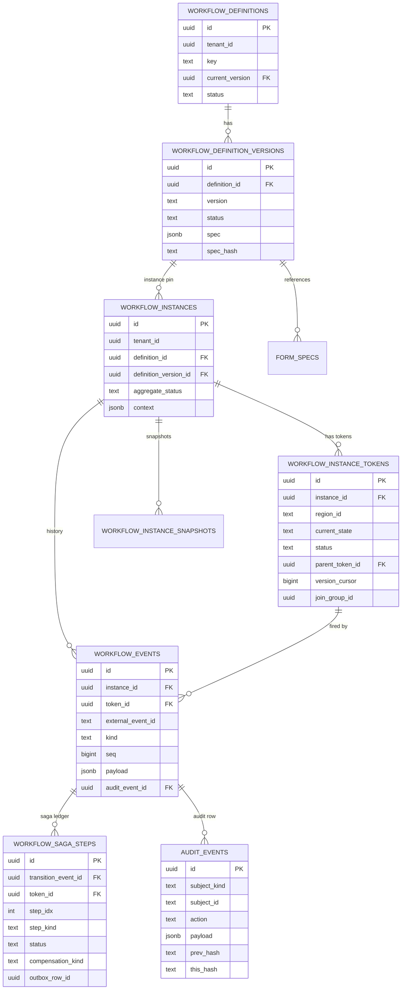
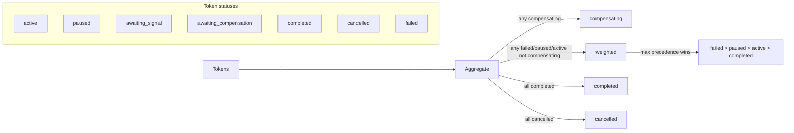

# Flowforge Handbook

> Comprehensive system overview. Sister docs:
> `docs/jtbd-editor-arch.md` (the IDE design that turns flowforge into a
> no-code platform), `docs/flowforge-evolution.md` (forward roadmap),
> `docs/llm.txt` (AI quickstart). Reference architecture:
> `docs/workflow-ed-arch.md`, `docs/workflow-framework-portability.md`.

---

## Table of Contents

1. [System Overview](#1-system-overview)
2. [Architectural Decision Records](#2-architectural-decision-records)
3. [Glossary](#3-glossary)
4. [Data Model](#4-data-model)
5. [Public API Reference (Backend)](#5-public-api-reference-backend)
6. [Public API Reference (Frontend)](#6-public-api-reference-frontend)
7. [Request Lifecycle](#7-request-lifecycle)
8. [Operational Runbook Hooks](#8-operational-runbook-hooks)
9. [Cross-References & Footer](#9-cross-references--footer)
10. [Plan-Review Reconciliation](#10-appendix--plan-review-reconciliation-iteration-1)

---

## 1. System Overview

### 1.1 What Flowforge Is

Flowforge is a JSON-DSL workflow engine + visual designer + JTBD-driven
project generator. Three roles use it:

| Role | What they do |
|---|---|
| **Author** | Writes a JTBD bundle (YAML/JSON) describing the *jobs* the workflow performs. |
| **Designer** | Edits the workflow definition (states, transitions, gates, forms) in the visual canvas. |
| **Operator** | Runs the deployed workflow — fires events, monitors instances, audits decisions. |

Flowforge gives every role a different surface — JTBDEditor / Designer /
Runtime — over the same underlying spec.

### 1.2 Top-Level Topology

```mermaid
flowchart TB
  subgraph Editing["Editing surfaces"]
    JE[JTBDEditor<br/>(apps/jtbd-editor/)]
    DG[Designer<br/>(@flowforge/designer)]
  end
  JE -->|JTBD bundle| GEN[Generator<br/>(flowforge-cli)]
  GEN -->|workflow_def.json + form_spec.json + ...| RT[Runtime API<br/>(flowforge-fastapi)]
  DG -->|workflow_def.json| RT
  RT --> ENG[Engine<br/>(flowforge-core)]
  ENG --> DB[(Postgres)]
  ENG --> OB[Outbox<br/>(flowforge-outbox-pg)]
  ENG --> AU[AuditSink<br/>(flowforge-audit-pg)]
  OB --> NOT[NotificationPort<br/>(flowforge-notify-multichannel)]
  RT --> WS[WS stream]
  WS --> RC[@flowforge/runtime-client]
  RC --> RND[@flowforge/renderer]
```

### 1.3 Repository Layout (current)

```
framework/
├── pyproject.toml             # uv workspace root
├── python/
│   ├── flowforge-core/        # DSL types, engine, expr, ports, replay, testing
│   ├── flowforge-fastapi/     # Designer + runtime routers, WS, CSRF
│   ├── flowforge-sqlalchemy/  # ORM, alembic bundle, snapshots
│   ├── flowforge-tenancy/     # SingleTenantGUC, MultiTenantGUC, NoTenancy
│   ├── flowforge-audit-pg/    # Hash-chain audit sink
│   ├── flowforge-outbox-pg/   # Outbox + dramatiq worker
│   ├── flowforge-rbac-spicedb/
│   ├── flowforge-rbac-static/
│   ├── flowforge-documents-s3/
│   ├── flowforge-money/
│   ├── flowforge-signing-kms/
│   ├── flowforge-notify-multichannel/
│   └── flowforge-cli/         # `flowforge` typer CLI
├── js/
│   ├── flowforge-types/
│   ├── flowforge-renderer/
│   ├── flowforge-runtime-client/
│   ├── flowforge-step-adapters/
│   ├── flowforge-designer/
│   └── flowforge-integration-tests/
├── examples/
│   ├── insurance_claim/
│   ├── hiring-pipeline/
│   └── building-permit/
└── tests/
    └── integration/
```

### 1.4 Package Inventory

> **Phase status:** the table below shows the *target* package set. For
> *shipped vs roadmap* status by phase, see §10.9. The PyPI distribution
> name for the core is `flowforge` (singular); per-package nicknames
> below distinguish siblings (per §10.1).

#### Backend (Python, PyPI)

| Package | Path | Lines (target) | Responsibility |
|---|---|---|---|
| `flowforge-core` | `framework/python/flowforge-core/` | ≤4k | DSL types, schema, compiler, validator, expression evaluator, two-phase fire algorithm, simulator, replay, ports/ABCs, testing fixtures |
| `flowforge-fastapi` | `framework/python/flowforge-fastapi/` | ≤1.5k | Designer router, runtime router, WS adapter, CSRF passthrough, cookie auth shim |
| `flowforge-sqlalchemy` | `framework/python/flowforge-sqlalchemy/` | ≤2k | ORM models, alembic bundle, RLS binder default, snapshot store, saga ledger queries |
| `flowforge-tenancy` | `framework/python/flowforge-tenancy/` | ≤500 | Tenancy resolver impls (`SingleTenantGUC`, `MultiTenantGUC`, `NoTenancy`), RLS templates |
| `flowforge-audit-pg` | `framework/python/flowforge-audit-pg/` | ≤600 | Hash-chain audit sink |
| `flowforge-outbox-pg` | `framework/python/flowforge-outbox-pg/` | ≤700 | Outbox registry + worker (dramatiq) |
| `flowforge-rbac-spicedb` | `framework/python/flowforge-rbac-spicedb/` | ≤500 | SpiceDB-backed `RbacResolver` |
| `flowforge-rbac-static` | `framework/python/flowforge-rbac-static/` | ≤200 | RBAC from YAML/JSON |
| `flowforge-documents-s3` | `framework/python/flowforge-documents-s3/` | ≤600 | S3-backed `DocumentPort` |
| `flowforge-money` | `framework/python/flowforge-money/` | ≤300 | FX + money formatting |
| `flowforge-signing-kms` | `framework/python/flowforge-signing-kms/` | ≤300 | AWS KMS `SigningPort` (HMAC dev fallback) |
| `flowforge-notify-multichannel` | `framework/python/flowforge-notify-multichannel/` | ≤700 | Email/Slack/SMS/in-app fan-out |
| `flowforge-cli` | `framework/python/flowforge-cli/` | ≤1.5k | `flowforge new`, `add-jtbd`, `regen-catalog`, `validate`, `simulate` |

#### Frontend (TypeScript, npm)

| Package | Path | Responsibility |
|---|---|---|
| `@flowforge/types` | `framework/js/flowforge-types/` | TS types generated from `flowforge-core/schema/*.json` |
| `@flowforge/renderer` | `framework/js/flowforge-renderer/` | `FormRenderer`, field components, validators |
| `@flowforge/designer` | `framework/js/flowforge-designer/` | Canvas, property panel, form builder, simulation panel, diff viewer |
| `@flowforge/runtime-client` | `framework/js/flowforge-runtime-client/` | REST + WS client, `useTenantQueryKey`-style hook (host-pluggable) |
| `@flowforge/step-adapters` | `framework/js/flowforge-step-adapters/` | Generic step components (`ManualReviewStep`, `FormStep`, `DocumentReviewStep`) |

### 1.5 Ports (the 14 ABCs)

| # | Port | Purpose | Default impl |
|---|---|---|---|
| 1 | `TenancyResolver` | Resolve current tenant; bind session GUCs; elevation scope | `SingleTenantGUC`, `MultiTenantGUC`, `NoTenancy` |
| 2 | `RbacResolver` | `has_permission`, `list_principals_with`, `register_permission`, `assert_seed` | `flowforge-rbac-spicedb`, `flowforge-rbac-static` |
| 3 | `AuditSink` | `record`, `verify_chain`, `redact` | `flowforge-audit-pg` (hash chain) |
| 4 | `OutboxRegistry` | `register(kind, handler, backend)`, `dispatch(envelope)` | `flowforge-outbox-pg` (default), Temporal/Celery alternatives |
| 5 | `DocumentPort` | `list_for_subject`, `attach`, `get_classification`, `freshness_days` | `flowforge-documents-s3`, `flowforge-documents-noop` |
| 6 | `MoneyPort` | `convert`, `format` | `flowforge-money-static`, `flowforge-money-ecb` |
| 7 | `SettingsPort` | `get`, `set`, `register` | `flowforge-settings-pg`, `flowforge-settings-env` |
| 8 | `SigningPort` | `sign_payload`, `verify`, `current_key_id` | `flowforge-signing-hmac` (dev), `flowforge-signing-kms` (AWS), `flowforge-signing-vault` |
| 9 | `NotificationPort` | `render`, `send`, `register_template` | `flowforge-notify-noop`, `flowforge-notify-mailgun`, `flowforge-notify-multichannel` |
| 10 | `RlsBinder` | `bind(session, ctx)`, `elevated(session)` | `flowforge-rls-pg` (GUC-based) |
| 11 | `EntityAdapter` registry | `create`, `update`, `lookup`, `compensations` | None default — host code |
| 12 | `MetricsPort` | `emit(name, value, labels)` | `flowforge-metrics-prometheus`, `flowforge-metrics-noop` |
| 13 | `TaskTrackerPort` | `create_task(kind, ref, note)` | `flowforge-tasks-noop` |
| 14 | `AccessGrantPort` | `grant(rel, until)`, `revoke(rel)` | `flowforge-grants-spicedb`, `flowforge-grants-noop` |

### 1.6 Generated Artefacts (per JTBD)

For one JTBD `claim_intake`, the generator emits ≈ 12-15 files
totalling ≈ 600 LOC of host code:

| File | Purpose |
|---|---|
| `alembic/versions/000N_jtbd_<id>.py` | Entity table migration + RLS policy |
| `backend/src/<pkg>/<entity>/models.py` | SQLAlchemy model with `WorkflowExposed` mixin |
| `backend/src/<pkg>/<entity>/views.py` | Pydantic models for HTTP/CLI |
| `backend/src/<pkg>/<entity>/service.py` | Business logic (`<Entity>Service`) |
| `backend/src/<pkg>/<entity>/router.py` | FastAPI router |
| `backend/src/<pkg>/<entity>/workflow_adapter.py` | `EntityAdapter` impl + compensations map |
| `backend/src/<pkg>/<entity>/tests/test_workflow_adapter.py` | Unit tests |
| `backend/src/<pkg>/workflows/<id>/definition.json` | Workflow DSL |
| `backend/src/<pkg>/workflows/<id>/form_spec.<form_id>.json` | Form spec |
| `backend/src/<pkg>/workflows/<id>/tests/test_simulation.py` | Auto-generated simulator tests |
| `frontend/src/components/<entity>/<Entity>Step.tsx` | React step wrapper |
| `tests/e2e/<id>.spec.ts` | Playwright happy-path |

For a bundle of N JTBDs the generator additionally emits 4-6
cross-cutting files (permission seeds, RBAC seed test, navigation
index, JTBD glossary, audit taxonomy enum, frontend wiring).

---

## 2. Architectural Decision Records

### ADR-1 — JSON DSL, not BPMN

| | |
|---|---|
| Status | Accepted |
| Date | 2026-04 |
| Decision | Workflow definitions are a single JSON document with a canonical schema; no BPMN XML import/export in the public surface. |

**Context.** BPMN is the obvious candidate: it's an industry standard,
with vendor support across IBM, Camunda, Activiti, Bonita, etc. Tools
exist for BPMN visual editing, simulation, and execution.

**Why not.** BPMN's XML surface area is enormous, its semantics are
ambiguous (token semantics for inclusive gateways differ across
vendors), and no two implementations agree on the canonical
serialization. A workflow that runs on Camunda may not run on
Activiti. The IDE story for BPMN is also poor — most editors are
heavy desktop apps with proprietary extensions.

**What we did.** Defined a narrow JSON DSL with one canonical schema
(`framework/python/flowforge-core/src/flowforge/dsl/schema/workflow_def.schema.json`).
Schema is testable, diffable, AI-generatable. BPMN export ships as a
community plugin (`flowforge-jtbd-bpmn`), not the public surface.

**Consequence.** Adopters who require BPMN compatibility take on the
exporter integration. The benefit: zero ambiguity in the engine's
semantics.

### ADR-2 — Ports / Adapters, not Framework Lock-In

| | |
|---|---|
| Status | Accepted |
| Date | 2026-04 |
| Decision | Every host-specific assumption is a port (ABC); each port has at least one default adapter shipped as a sibling package. |

**Context.** Three sister projects (origination intake, broker portal,
claims overflow) need the engine. Each has different RBAC backends
(SpiceDB, Casbin, static), audit sinks (Postgres hash chain, Loki),
document storage (S3, GCS, file system).

**Why not lock in to one stack.** Hard-coding any one drives the
sister projects off-platform within weeks. Vendor-as-submodule
accretes host-specific patches that diverge.

**What we did.** Extracted 14 ports (see §1.5). Each port is admitted
under the rule: "a port is justified only when ≥ 2 hosts need a
different impl." UMS-only behaviour stays in UMS, not the framework.

**Consequence.** First load is slower (more files), but maintenance
cost is bounded by the ABC contract. Adapter packages can be replaced
or swapped per host.

### ADR-3 — Deterministic Transform, Not LLM, for Generation

| | |
|---|---|
| Status | Accepted |
| Date | 2026-04 |
| Decision | The JTBD-to-app generator is fully deterministic; the LLM is opt-in via `--ai-assist` and only emits diffs for review. |

**Context.** The natural temptation is to generate code with an LLM
("describe your business in English; we'll generate the app").

**Why not.** Reproducibility. Two engineers running the same bundle
need the same output. CI pipelines need byte-identical artefacts to
diff. LLM hallucinations create silent business-rule bugs.

**What we did.** Templates are jinja2 over a normalised JTBD AST.
Same JTBD bundle in → byte-identical files out (modulo timestamped
header). LLM runs only on `--ai-assist` and emits unified diffs;
never auto-applies without `--apply-ai-suggestions`.

**Consequence.** Reproducible scaffolds. AI assist is supplementary,
not load-bearing. Authors retain editorial control.

### ADR-4 — 22 Reflected Defs (UMS Migration), Not 0

| | |
|---|---|
| Status | Accepted |
| Date | 2026-04 |
| Decision | Existing UMS Python workflow definitions are reflected to JSON DSL during migration; the engine runs them as parity tests. |

**Context.** UMS has 23 hand-written Python `WorkflowDefinition`
classes (`backend/app/workflows/definitions/*.py`).

**Why not start clean.** The 23 defs encode years of business rules.
Re-writing them risks behavioural drift. They are also the regression
suite — if the JSON engine fails to round-trip any one, the engine
has a bug.

**What we did.** `scripts/reflect_python_workflows.py` reads each
Python def and emits an equivalent JSON DSL document. Per-def parity
fixture compares end states + audit events. CI fails on divergence.

**Consequence.** UMS behaviour is preserved during migration. New
projects start on JSON. Python defs are deprecated after 30 days at
zero new starts (see `docs/workflow-ed-arch.md` §8).

### ADR-5 — Two-Phase Fire (plan → commit)

| | |
|---|---|
| Status | Accepted |
| Date | 2026-04 |
| Decision | `engine.fire()` separates plan (no row lock) from commit (under row lock). |

**Context.** The single-shot `engine.transition()` at
`backend/app/workflows/engine.py:351-489` evaluated guards inside the
row-lock, including async lookups. This serialised every workflow on
the database.

**Why this design.**
- Plan phase evaluates lookups without row locks. Lookup latency does
  not block siblings.
- Commit phase re-validates only `requires_relock` guards (those
  with read-after-write hazards). Most guards trust the plan.
- Replay is deterministic from persisted lookup snapshots.

**What we did.** Two-phase algorithm in
`framework/python/flowforge-core/src/flowforge/engine/fire.py`. Plan
emits a `TransitionPlan`; commit re-validates and writes the
`workflow_event` row.

**Consequence.** Parallel branches don't serialise. Lookup oracles
don't deadlock. Replay reads from `evaluated_lookups[]` snapshots —
same ASTs, same results.

### ADR-6 — Parallel Regions via Tokens, Not Threads

| | |
|---|---|
| Status | Accepted |
| Date | 2026-04 |
| Decision | Parallel forks create one `workflow_instance_tokens` row per region; siblings progress independently; aggregate status derives from token statuses. |

**Context.** Workflows have parallel sections (e.g., KYC fans out into
party screen + sanctions screen + document collection). The legacy
single-state model couldn't represent this — you had to model it as
sequential or external.

**Why this design.**
- Per-token rows give per-region lock granularity. Siblings in
  disjoint regions never contend for the same row.
- `join_group_id` ties siblings; the join handler scans the group on
  every commit; aggregate status derives.
- No thread/coroutine overhead in the engine — concurrency is in the
  database.

**What we did.** Schema in `docs/workflow-ed-arch.md` §17.1.
Engine code at
`framework/python/flowforge-core/src/flowforge/engine/tokens.py`.

**Consequence.** Forks fan out cleanly. Aggregate status is consistent
because it derives from tokens. Compensation is per-token, not
per-instance.

### ADR-7 — Hash-Chain Audit

| | |
|---|---|
| Status | Accepted |
| Date | 2026-04 |
| Decision | Every audit row carries `prev_hash`; the chain is verifiable end-to-end. |

**Context.** Audit logs are the substrate for compliance. Tamper
evidence is a regulatory requirement (SOX, HIPAA, PCI-DSS).

**Why hash-chain instead of WORM storage.** WORM storage requires a
privileged writer and operational complexity (snapshots, mirror
servers). Hash chains give tamper evidence with no privileged writer
— anyone can verify.

**What we did.** Each audit row at
`backend/app/audit/service.py:116` (UMS impl, mirrored in
`flowforge-audit-pg`) carries `prev_hash` = `sha256(prev_row +
this_row_canonical_json)`. `verify_chain` walks the chain.

**Consequence.** Tamper-evident audit. GDPR erasure breaks the chain at
the redacted row by design — verifiers distinguish "redacted" from
"tampered".

### ADR-8 — Outbox-Saga, Not 2PC

| | |
|---|---|
| Status | Accepted |
| Date | 2026-04 |
| Decision | Cross-system effects ride the outbox; failures trigger compensations via the saga ledger. |

**Context.** A workflow firing a transition may need to: write the DB
+ enqueue a notification + grant SpiceDB permission + fire a webhook
to a partner. Some of these can fail.

**Why not 2PC.** Two-phase commit requires distributed transaction
managers we don't run. Adding one is a major architectural change.

**Why not pure compensations.** Pure compensations leak inconsistencies
on partial failure. If the SpiceDB grant fails after the DB write
commits, you're stuck.

**What we did.** Outbox + saga ledger gives at-least-once delivery +
bounded compensation. Every effect rides a `workflow_saga_steps` row;
on outbox dead-letter, descendants are walked and `wf.saga.compensate`
outbox rows enqueued. See `docs/workflow-ed-arch.md` §17.4.

**Consequence.** Partial failures roll back via compensation. Idempotent
events are the contract. The saga ledger is the audit trail of intent.

### ADR-9 — Catalog Default-Deny

| | |
|---|---|
| Status | Accepted |
| Date | 2026-04 |
| Decision | Tables are invisible to workflows unless they mix in `WorkflowExposed` and declare `workflow_projection` of safe columns. |

**Context.** A workflow author with edit access could otherwise write
any column on any table. PII columns leak silently into audit rows.

**Why default-deny.** Opt-in is the only safe default. Explicit
`workflow_projection` keeps PII out by construction.

**What we did.** `WorkflowExposed` mixin at
`backend/app/workflows_v2/catalog/mixins.py` (mirrored in
`flowforge-sqlalchemy`). Catalog generator scans for the mixin; CI
guard rejects PRs that expose a new column without an explicit
decision.

**Consequence.** PII never enters audit rows by accident. New columns
require a deliberate decision. CI drift guard catches drift.

### ADR-10 — Generated Forms via JSON-Schema, Not Codegen

| | |
|---|---|
| Status | Accepted |
| Date | 2026-04 |
| Decision | Forms are a JSON-schema variant rendered by one `FormRenderer` component. No per-form codegen. |

**Context.** Many workflows have many forms. Naive approach: codegen a
React component per form.

**Why not codegen.** Codegen multiplies surface area. Two forms with
similar shape diverge over time. Bug fixes propagate slowly. Test
coverage doubles per form.

**What we did.** One `FormRenderer` component reads a `form_spec` JSON
and renders dynamically. JSON-schema validation runs identically
client-side (`ajv`) and server-side (`jsonschema`).

**Consequence.** Forms render uniformly. One bug fix lands once.
Field types are pluggable via `FieldKind` enum + React component +
Storybook story.

### ADR-11 — `register_permission` Seeds, Not YAML

| | |
|---|---|
| Status | Accepted |
| Date | 2026-04 |
| Decision | Permissions are seeded via Python `register_permission` calls at startup, not YAML. |

**Context.** Permission catalog needs to live somewhere — DB rows for
runtime queries, source-of-truth for IDE autocomplete.

**Why not YAML.** YAML requires a parser, a schema, and drift detection.
Code seeds let the type system enforce shape (`PermissionSeed`
dataclass) and CI fails on drift.

**What we did.** Each package emits a permission seed module:

```python
# flowforge-jtbd/src/flowforge_jtbd/permissions.py
from flowforge.ports.rbac import register_permission, PermissionSeed

PERMISSIONS = [
    PermissionSeed("jtbd.write", "Edit JTBD specs"),
    PermissionSeed("jtbd.publish", "Publish JTBD spec versions"),
    # ...
]

async def seed_all():
    for p in PERMISSIONS:
        await register_permission(p.name, p.description)
```

**Consequence.** Type-safe seeds. CI drift guard rejects PRs whose
seed doesn't match the catalog.

---

## 3. Glossary

| Term | Definition |
|---|---|
| **JTBD** | "Job To Be Done" — declarative description of a job: actor, situation, motivation, outcome, success criteria, edge cases, data capture, documents, approvals, SLA, notifications. |
| **JTBD bundle** | Project-level YAML/JSON that ties multiple JTBDs together with shared roles, permissions, entities. |
| **JTBDEditor** | Next.js IDE for authoring + linting + debugging + publishing JTBDs (see `docs/jtbd-editor-arch.md`). |
| **Designer** | Visual canvas for editing the workflow DSL (`@flowforge/designer`). |
| **def** (definition) | A workflow definition row in `workflow_definitions` plus its versions in `workflow_definition_versions`. |
| **instance** | A running execution of a def — row in `workflow_instances`. |
| **token** | One row in `workflow_instance_tokens`; the lock granule for parallel regions. |
| **region** | A parallel branch within a `parallel_fork` state; identified by `region_id`. |
| **gate** | A governance checkpoint on a transition (permission, approval, document-complete, custom). |
| **escalation** | Trigger + actions when SLA breaches, idle timeout fires, or manual flag is set. |
| **delegation** | Temporary reassignment of a workflow's owner role to another user. |
| **saga step** | One row in `workflow_saga_steps`; tracks a single effect's lifecycle (pending/done/compensating/compensated/failed). |
| **region barrier** | Implicit join state on a `parallel_fork`; engine creates it from `join.to_state`. |
| **lookup snapshot** | Persisted projection of a `lookup_*` operator's result, recorded in `workflow_events.payload.evaluated_lookups[]` for replay determinism. |
| **plan phase** | First half of `engine.fire()`; evaluates guards + lookups without row lock. |
| **commit phase** | Second half of `engine.fire()`; takes row lock, re-validates `requires_relock` guards, executes effects, writes audit + outbox. |
| **two-phase fire** | The plan + commit algorithm. |
| **outbox** | At-least-once delivery queue (`outbox_rows` table) for cross-system side effects. |
| **outbox handler** | Function registered for an outbox kind (`wf.notify`, `wf.spicedb_grant`, `wf.webhook`, `wf.saga.compensate`). |
| **DLQ** | Dead-letter queue; outbox rows that exhausted retries flip to `dead`. |
| **compensation** | Reverse action defined on an `EntityAdapter`; invoked when downstream saga step fails. |
| **catalog** | Generated projection of SQLAlchemy schema (`workflow_catalog.json`) describing what entities + columns are writable from workflows. |
| **WorkflowExposed** | SQLAlchemy mixin marking a model as catalog-eligible. |
| **idempotency key** | `external_event_id` on `workflow_events`; deduplicates retried calls. |
| **calendar snapshot** | Persisted business-calendar version captured at transition time, used for replay. |
| **pending signal** | Row in `pending_signals`; out-of-order webhook event awaiting its predecessor (or TTL expiry). |
| **port** | An ABC declaring an interface (e.g., `RbacResolver`, `AuditSink`); 14 in total. |
| **adapter** | A package implementing one port (e.g., `flowforge-rbac-spicedb` implements `RbacResolver`). |
| **EntityAdapter** | Per-domain Protocol bridging the engine to host services (`create`, `update`, `lookup`, `compensations`). |
| **lockfile** | `flowforge.lockfile`; records per-file content hashes for incremental compilation. |
| **jtbd.lock** | JTBD-level lockfile; pins `<package>@<version>` + `spec_hash` for every composed JTBD. |
| **replaced_by** | Forward pointer on a deprecated JTBD — `<new_id>@<new_version>`. |
| **quality score** | 0-100 score per JTBD across (clarity, actionability, absence of solution-coupling, presence of measurable outcome). |
| **conflict solver** | SAT-style solver flagging contradictions in `(timing × data × consistency)` tuples across composed JTBDs. |
| **Z3** | The SMT solver used by default in the conflict solver; alternative is a simple-pairs incompatibility table. |
| **pgvector** | Postgres extension for vector similarity; powers JTBD recommender. |
| **NL→JTBD** | Natural-language input → drafted JTBD → validator-gated ingestion. |
| **JTBD hub** | Public registry (`apps/jtbd-hub/`) for publishing + installing JTBD packages. |

---

## 4. Data Model

### 4.1 Workflow Definition Tables

```sql
-- Logical definition (one row per (tenant_id, key))
ums.workflow_definitions (
  id              uuid pk,
  tenant_id       uuid not null,
  key             text not null,
  current_version uuid null fk → workflow_definition_versions(id),
  status          text check (status in ('draft','in_review','published','deprecated','archived','superseded')),
  created_at, updated_at, created_by_user_id,
  unique (tenant_id, key)
);
```

| Column | Meaning |
|---|---|
| `id` | UUID7. |
| `tenant_id` | Tenant scope; RLS-bound. |
| `key` | Stable identifier (e.g., `claim.standard`). Unique within tenant. |
| `current_version` | Pointer to the active version; flips on publish. |
| `status` | Lifecycle state — `draft` (editable), `in_review`, `published` (immutable, instantiable), `deprecated` (no new starts), `archived` (read-only), `superseded` (replaced by newer). |
| `created_at` / `updated_at` | Audit timestamps. |
| `created_by_user_id` | Author. Used for 4-eyes check on publish (must differ from approver). |

```sql
-- Each saved version (immutable once published)
ums.workflow_definition_versions (
  id            uuid pk,
  definition_id uuid not null fk → workflow_definitions(id),
  version       text not null,            -- semver
  status        text not null,
  spec          jsonb not null,           -- the full DSL document
  spec_hash     text not null,            -- sha256 over canonical JSON
  parent_version_id uuid null,            -- chain for diff/lineage
  created_at, created_by_user_id,
  published_at, published_by_user_id,
  archived_at, archived_by_user_id, archive_reason text,
  unique (definition_id, version)
);
```

| Column | Meaning |
|---|---|
| `version` | Semver (e.g., `1.4.0`); major (breaking), minor (additive), patch (fix-only). |
| `status` | `draft` | `in_review` | `published` | `deprecated` | `archived`. |
| `spec` | Full DSL JSON. |
| `spec_hash` | SHA-256 over canonical JSON; used for diff and content addressing. |
| `parent_version_id` | Lineage pointer for diff. |
| `published_by_user_id` | Approver; 4-eyes-checked against `created_by_user_id`. |

### 4.2 Form Specs

```sql
ums.form_specs (
  id           uuid pk,
  tenant_id    uuid not null,
  key          text not null,
  version      text not null,
  spec         jsonb not null,
  spec_hash    text not null,
  status       text,
  created_at, updated_at,
  unique (tenant_id, key, version)
);
```

Forms are addressable by `form_spec_id`. Reusable forms live here; inline
forms live inside the definition spec JSON.

### 4.3 Instances

```sql
ums.workflow_instances (
  id                    uuid pk,
  tenant_id             uuid not null,
  definition_id         uuid not null,
  definition_version_id uuid not null fk → workflow_definition_versions(id),
  aggregate_status      text not null check (... in ('active','paused','completed','cancelled','failed','compensating')),
  subject_kind          text not null,    -- e.g., 'claim'
  subject_id            uuid null,        -- linked entity row
  context               jsonb not null default '{}'::jsonb,
  created_at, updated_at,
  created_by_user_id    uuid
);
```

`aggregate_status` derives from token statuses (rule:
`compensating > failed > cancelled > paused > active > completed`).
`definition_version_id` pins the instance — never auto-upgrades.

### 4.4 Tokens (Parallel Regions)

```sql
ums.workflow_instance_tokens (
  id                 uuid pk,
  instance_id        uuid not null fk → workflow_instances(id) on delete cascade,
  region_id          text not null,
  current_state      text not null,
  status             text not null check (status in
                       ('active','paused','awaiting_signal','awaiting_compensation',
                        'completed','cancelled','failed')),
  parent_token_id    uuid null fk → workflow_instance_tokens(id),
  fork_event_id      uuid null fk → workflow_events(id),
  join_group_id      uuid null,
  status_changed_at  timestamptz not null default now(),
  paused_at          timestamptz null,
  pause_reason       text null,
  version_cursor     bigint not null default 0,
  created_at         timestamptz not null default now(),
  unique (instance_id, region_id, parent_token_id)
);
```

| Column | Meaning |
|---|---|
| `region_id` | DSL region identifier (`root` for default trunk; `kyc.party`, `kyc.docs`, ... for forked regions). |
| `current_state` | Token's current state name. |
| `status` | Token-level lifecycle. |
| `parent_token_id` | Set on forked tokens; points to the parent that forked. |
| `fork_event_id` | The `workflow_events` row that created this token. |
| `join_group_id` | Groups sibling tokens for join evaluation. |
| `paused_at` / `pause_reason` | Pause-aware timer support. |
| `version_cursor` | Monotone, bumped on every state mutation; basis for optimistic concurrency in commit phase. |

### 4.5 Events

```sql
ums.workflow_events (
  id                    uuid pk,
  tenant_id             uuid not null,
  instance_id           uuid not null fk → workflow_instances(id),
  token_id              uuid null fk → workflow_instance_tokens(id),
  external_event_id     text not null,    -- idempotency key (caller-supplied or engine-generated)
  kind                  text not null,    -- transition.fired, gate.rejected, sla.warned, ...
  from_state            text null,
  to_state              text null,
  actor_user_id         uuid null,
  actor_role            text null,
  payload               jsonb not null,    -- evaluated_expressions, evaluated_lookups, etc.
  audit_event_id        uuid null,
  seq                   bigint not null,   -- identity, monotone per instance
  occurred_at           timestamptz not null default now(),
  unique (instance_id, external_event_id),
  unique (instance_id, seq)
);
```

| Column | Meaning |
|---|---|
| `external_event_id` | Idempotency key. Server-issued events: `engine:<transition>:<token>:<cursor>`. |
| `kind` | Event type (transition.fired, gate.rejected, sla.warned, sla.breached, escalation.triggered, override.applied, etc.). |
| `payload` | Includes `evaluated_expressions[]`, `evaluated_lookups[]`, `now_seed`, `calendar_snapshot_id`, `definition_version_id`, `jtbd_id`, `jtbd_version`. |
| `audit_event_id` | FK to the audit row that records this event. |
| `seq` | Monotone identity per instance; basis for snapshot rebuild + WS gap recovery. |

### 4.6 Saga Ledger

```sql
ums.workflow_saga_steps (
  id                  uuid pk,
  instance_id         uuid not null fk → workflow_instances(id),
  token_id            uuid not null fk → workflow_instance_tokens(id),
  transition_event_id uuid not null fk → workflow_events(id),
  step_idx            int  not null,
  step_kind           text not null,
  status              text not null check (status in
                        ('pending','done','compensating','compensated','failed')),
  attempt             int  not null default 0,
  compensation_kind   text null,
  compensation_payload jsonb not null default '{}'::jsonb,
  compensation_order  text not null default 'strict_descending'
                        check (compensation_order in
                          ('strict_descending','strict_ascending','parallel')),
  outbox_row_id       uuid null,
  last_error          text null,
  last_error_at       timestamptz null,
  created_at, updated_at,
  unique (transition_event_id, step_idx)
);
```

| Column | Meaning |
|---|---|
| `step_kind` | Effect kind (`create_entity`, `update_entity`, `notify`, `wf.spicedb_grant`, `wf.webhook`, ...). |
| `status` | Lifecycle: `pending` (queued in outbox), `done` (committed), `compensating` (rollback in progress), `compensated`, `failed`. |
| `compensation_kind` | Catalog-named compensation (e.g., `reverse_create_claim`). |
| `compensation_order` | `strict_descending` (default — undo in reverse), `strict_ascending`, `parallel`. |
| `outbox_row_id` | Link to the outbox row when dispatched. |

### 4.7 Audit (Hash Chain)

```sql
ums.audit_events (
  id            uuid pk,
  tenant_id     uuid not null,
  subject_kind  text not null,
  subject_id    text null,
  actor_user_id uuid null,
  action        text not null,
  payload       jsonb not null,
  prev_hash     text null,
  this_hash     text not null,
  created_at    timestamptz not null default now()
);
```

`this_hash = sha256(prev_hash || canonical_json(this_row))`. The chain
is verifiable end-to-end via `flowforge audit verify --range`.

GDPR erasure rewrites `payload` in place for paths declared in
`pii_paths`; chain breaks at the redacted row by design — verifiers
distinguish "redacted" from "tampered".

### 4.8 Outbox

```sql
ums.outbox_rows (
  id            uuid pk,
  tenant_id     uuid not null,
  kind          text not null,           -- wf.notify, wf.spicedb_grant, wf.webhook, wf.saga.compensate, ...
  envelope      jsonb not null,
  status        text not null,           -- pending, in_flight, done, dead
  attempts      int not null default 0,
  next_run_at   timestamptz not null default now(),
  last_error    text null,
  created_at, updated_at
);
```

The outbox worker (dramatiq actor) polls and dispatches by kind.

### 4.9 Pending Signals

```sql
ums.pending_signals (
  id                 uuid pk,
  tenant_id          uuid not null,
  source             text not null,          -- e.g., partner system id
  source_seq         bigint not null,        -- sequence number from source
  payload            jsonb not null,
  ttl_until          timestamptz not null,
  matched_event_id   uuid null fk → workflow_events(id),
  status             text not null check (status in ('pending','matched','expired')),
  created_at, updated_at,
  unique (source, source_seq)
);
```

Out-of-order events stash here until predecessor arrives or TTL expires.

### 4.10 Business Calendars

```sql
ums.business_calendars (
  id              uuid pk,
  tenant_id       uuid not null,
  region          text not null,
  version_cursor  bigint not null default 0,
  rules           jsonb not null,         -- holidays, weekend definitions, business hours
  created_at, updated_at,
  unique (tenant_id, region)
);

ums.calendar_snapshots (
  id              uuid pk,
  calendar_id     uuid not null fk → business_calendars(id),
  version_cursor  bigint not null,
  rules           jsonb not null,
  taken_at        timestamptz not null default now(),
  unique (calendar_id, version_cursor)
);
```

Snapshots ensure replay determinism — a transition fired on Monday
records `calendar_snapshot_id`, replay reads from snapshot regardless
of subsequent edits.

### 4.11 Snapshots (Instance State)

```sql
ums.workflow_instance_snapshots (
  id              uuid pk,
  instance_id     uuid not null fk → workflow_instances(id),
  taken_at_seq    bigint not null,
  state           jsonb not null,          -- canonical projection of instance + tokens + context
  created_at      timestamptz not null default now(),
  unique (instance_id, taken_at_seq)
);
```

Snapshot every 100 events. Rebuild = snapshot + tail replay.

### 4.12 Permission Catalog

```sql
ums.permission_catalog (
  id              uuid pk,
  name            text not null unique,
  description     text not null,
  deprecated_aliases text[] not null default '{}',
  created_at, updated_at
);
```

Idempotent upsert at startup via `register_permission`. Replaces the
old `AdminPermission` enum.

### 4.13 Elevation Log

```sql
ums.elevation_log (
  id              uuid pk,
  tenant_id       uuid not null,
  actor_user_id   uuid not null,
  scope           text not null,           -- definition_id or instance_id
  reason          text not null,
  signed_payload  bytea not null,          -- signed by SigningPort
  signing_key_id  text not null,
  started_at      timestamptz not null default now(),
  ended_at        timestamptz null
);
```

Every operator-elevated section is signed + logged. Engine refuses to
start without a `SigningPort`.

### 4.14 GDPR Erasure Log

```sql
ums.workflow_gdpr_erasure_log (
  id            uuid pk,
  subject_kind  text not null,
  subject_id    uuid not null,
  pii_paths     text[] not null,           -- JSON paths that were erased
  reason        text not null,
  actor_user_id uuid not null,
  erased_at     timestamptz not null default now()
);
```

### 4.15 JTBD Tables (E1+)

See `docs/jtbd-editor-arch.md` §13.7 for full DDL of:
`jtbd_libraries`, `jtbd_specs`, `jtbd_lockfiles`, `jtbd_compositions`,
`jtbd_compositions_pins`, `jtbd_reviews`, `jtbd_dependencies`,
`jtbd_replacements`, `jtbd_quality_scores`, `jtbd_embeddings`.

---

## 5. Public API Reference (Backend)

### 5.1 `flowforge-core`

#### Module: `flowforge.dsl.workflow_def`

```python
from flowforge.dsl.workflow_def import WorkflowDef, State, Transition, Gate, Effect

spec_dict = json.loads(open("definition.json").read())
spec = WorkflowDef.model_validate(spec_dict)
```

| Class | Purpose |
|---|---|
| `WorkflowDef` | Top-level pydantic model — key, version, subject_kind, initial_state, metadata, states, transitions, escalations, delegations, context_schema, form_specs. |
| `State` | name, kind, label, swimlane, ui, preconditions, idle_timeout_seconds, documents, checklists, form_spec_id, sla, embedded_step. |
| `Transition` | id, event, from_state, to_state, priority, guards, gates, effects. |
| `Gate` | kind, args; one of permission/documents_complete/checklist_complete/approval/co_signature/compliance/custom_webhook/expr. |
| `Effect` | kind, args; one of set/create_entity/update_entity/notify/dispatch_outbox/start_subworkflow/return_to_parent. |

#### Module: `flowforge.engine.fire`

```python
from flowforge.engine import fire

# Start instance
instance = await fire.start_instance(
    session,                              # AsyncSession with RLS GUC bound
    definition_key="claim_intake",
    initial_context={"intake": {...}},
    actor=Principal(user_id="u-1", role="intake_clerk"),
)

# Fire event
result = await fire.fire(
    session,
    instance_id=instance.id,
    token_id=None,                        # None → root token
    event="submit",
    external_event_id="my-key-1",
    payload={"intake": {...}},
    actor=Principal(user_id="u-1", role="intake_clerk"),
)
# result: TransitionResult { from_state, to_state, audit_event_id, ... }
```

| Function | Purpose |
|---|---|
| `fire.start_instance(...)` | Create new instance + root token; idempotent on `external_event_id`. |
| `fire.fire(...)` | Plan → commit a single transition; idempotent on `external_event_id`. |
| `fire.cancel_instance(...)` | Mark instance as `cancelled`; cancels all active tokens. |
| `fire.pause_token(...)` | Pause a token with reason; pause-aware timers stop. |
| `fire.resume_token(...)` | Resume a token; pause-aware timers re-arm. |

#### Module: `flowforge.engine.tokens`

| Function | Purpose |
|---|---|
| `tokens.fork_region(...)` | Create child tokens for a `parallel_fork` state. |
| `tokens.evaluate_join(...)` | Scan `join_group_id`; fire join transition if policy satisfied. |
| `tokens.derive_aggregate_status(...)` | Compute `instance.aggregate_status` from token statuses. |

#### Module: `flowforge.engine.saga`

| Function | Purpose |
|---|---|
| `saga.append_step(...)` | Record a saga step (called from commit phase). |
| `saga.mark_done(step_id)` | Flip status to `done` (called from outbox worker on success). |
| `saga.handle_dlq(step_id)` | Flip status to `failed`, walk descendants, enqueue compensations. |
| `saga.is_blocked(token_id)` | Check if any saga rows in `(pending, compensating, failed)` block new transitions. |

#### Module: `flowforge.engine.signals`

| Function | Purpose |
|---|---|
| `signals.stash(source, source_seq, payload, ttl)` | Enqueue out-of-order signal. |
| `signals.drain()` | Match pending signals against newly-firable transitions. |
| `signals.expire()` | Drop expired signals with audit `wf.event.dropped.expired`. |

#### Module: `flowforge.engine.subworkflow`

| Function | Purpose |
|---|---|
| `subworkflow.start(parent_instance, def_key, initial_context, return_to_state)` | Start a child workflow; record return contract. |
| `subworkflow.return_to_parent(child_instance, output_payload)` | Fire return transition on parent. |

#### Module: `flowforge.expr.evaluator`

```python
from flowforge.expr.evaluator import EvaluationContext, evaluate

ctx = EvaluationContext(
    context={"intake": {"loss_amount": 5000}},
    caller=Principal(user_id="u-1", role="intake_clerk"),
    now="2026-05-06T08:30:01Z",
    lookups_seed={},                      # for replay; otherwise None
)

result = await evaluate(
    {">": [{"var": "context.intake.loss_amount"}, 1000]},
    ctx,
)
# result: True (with audit trail of evaluated lookups)
```

| Function | Purpose |
|---|---|
| `evaluate(ast, ctx)` | Run the AST; return result + `evaluated_lookups[]`. |
| `register_op(name, fn, signature=...)` | Register a new operator (publish-time validated). |
| `parse(json)` | Parse JSON to AST; raise on unknown operators. |

#### Module: `flowforge.compiler`

```python
from flowforge.compiler import compile_def, validate_def

compiled = compile_def(spec)              # pre-warm AST + lookup whitelist
result = validate_def(spec)               # static lint
if not result.ok:
    for err in result.errors: print(err)
```

| Function | Purpose |
|---|---|
| `compile_def(spec)` | Pre-compile AST + lookup whitelist; return `CompiledDef`. |
| `validate_def(spec)` | Static lint: unreachable, dead-end, duplicate priority, lookup-permission, undefined var. |
| `build_catalog(models)` | Generate workflow_catalog.json from SQLAlchemy models with `WorkflowExposed`. |

#### Module: `flowforge.replay`

| Function | Purpose |
|---|---|
| `simulator.simulate(spec, initial_context, events)` | Walk DSL deterministically; return state path + audit events. |
| `reconstruct.replay(event_id)` | Re-evaluate one workflow_event; assert deterministic outcome. |
| `reconstruct.rebuild(instance_id)` | Snapshot + tail replay → rebuild instance state. |

#### Module: `flowforge.testing`

| Symbol | Purpose |
|---|---|
| `simulate` | Re-export of `flowforge.replay.simulator.simulate`. |
| `port_fakes.AuditSink` | In-memory audit sink. |
| `port_fakes.OutboxRegistry` | In-memory outbox. |
| `port_fakes.RbacResolver` | Allow-everything by default; configurable per-test. |
| `fixtures.async_session()` | pytest fixture providing a wired session. |
| `fixtures.parametrize_jtbd_examples` | Generator emitting one parametrised test per JTBD. |
| `parity.assert_def_parity(py_def, json_def, fixture)` | Compare end states + audit events. |

#### Module: `flowforge.config`

```python
from flowforge import config

config.tenancy = MySingleTenancy()         # TenancyResolver
config.rbac = MyRbac()                     # RbacResolver
config.audit = MyAudit()                   # AuditSink
config.outbox_backends["default"] = MyOutbox()
# ... 14 ports total
```

### 5.2 `flowforge-fastapi`

#### Designer router

```python
from flowforge_fastapi import designer_router
app.include_router(designer_router(prefix="/api/admin/workflow-designer"))
```

| Verb | Path | Auth | Purpose |
|---|---|---|---|
| GET | `/definitions` | wf.view | List defs |
| POST | `/definitions` | wf.edit | Create draft |
| GET | `/definitions/{id}` | wf.view | Read latest |
| GET | `/definitions/{id}/versions` | wf.view | List versions |
| GET | `/definitions/{id}/versions/{vid}` | wf.view | Read one |
| PATCH | `/definitions/{id}/versions/{vid}` | wf.edit | Update draft |
| POST | `/definitions/{id}/versions/{vid}/submit-review` | wf.edit | draft → in_review |
| POST | `/definitions/{id}/versions/{vid}/approve` | wf.publish | in_review → published (4-eyes) |
| POST | `/definitions/{id}/versions/{vid}/reject` | wf.publish | in_review → draft |
| POST | `/definitions/{id}/deprecate` | wf.publish | published → deprecated |
| POST | `/definitions/{id}/archive` | wf.publish | deprecated → archived |
| POST | `/definitions/{id}/versions/{vid}/diff/{vid2}` | wf.view | Pretty diff |
| POST | `/definitions/{id}/versions/{vid}/simulate` | wf.view | Walk a path |
| POST | `/definitions/{id}/versions/{vid}/validate` | wf.view | Static lint |

#### Runtime router

```python
from flowforge_fastapi import runtime_router
app.include_router(runtime_router(prefix="/api/workflows"))
```

| Verb | Path | Purpose |
|---|---|---|
| POST | `/{key}/instances` | Start instance |
| POST | `/instances/{id}/events` | Fire event (idempotent on Idempotency-Key) |
| GET | `/instances/{id}` | Read instance |
| GET | `/instances/{id}/timeline` | Events + audit + doc list |
| GET | `/instances/{id}/why-stuck` | Diagnose blocker |
| WS | `/instances/{id}/stream` | Live updates |

CSRF + cookie auth enforced via existing middleware. WS uses cookie auth.

### 5.3 `flowforge-sqlalchemy`

| Symbol | Purpose |
|---|---|
| `Base` | Declarative base; tenants register their models against this. |
| `WorkflowExposed` mixin | Declares `workflow_projection: list[str]`. |
| `flowforge_alembic.upgrade(rev=...)` | Alembic helper to apply framework migrations. |
| `flowforge_alembic.helpers.add_rls_policy(op, table, tenant_column)` | Idiomatic RLS helper. |
| `flowforge_alembic.helpers.add_tenant_id_column(op, table)` | Idiomatic tenant_id column. |
| `PgRlsBinder` | Default `RlsBinder` impl using `set_config()`. |
| `SnapshotStore` | Snapshot read/write helpers. |

### 5.4 Adapter packages

#### `flowforge-audit-pg`

```python
from flowforge_audit_pg import HashChainAuditSink

config.audit = HashChainAuditSink()
```

#### `flowforge-outbox-pg`

```python
from flowforge_outbox_pg import OutboxRegistryPg

config.outbox_backends["default"] = OutboxRegistryPg()
config.outbox_backends["default"].register("wf.notify", my_notify_handler)
```

#### `flowforge-rbac-spicedb`

```python
from flowforge_rbac_spicedb import SpiceDBRbacResolver

config.rbac = SpiceDBRbacResolver(client=spicedb_client)
```

#### `flowforge-documents-s3`

```python
from flowforge_documents_s3 import S3DocumentPort

config.documents = S3DocumentPort(bucket="my-docs", region="us-east-1")
```

#### `flowforge-signing-kms`

```python
from flowforge_signing_kms import KmsSigningPort

config.signing = KmsSigningPort(key_alias="alias/flowforge-publisher")
```

#### `flowforge-notify-multichannel`

```python
from flowforge_notify_multichannel import MultiChannelNotificationPort

config.notification = MultiChannelNotificationPort(
    email_provider=my_mailgun,
    slack_provider=my_slack,
    sms_provider=my_twilio,
)
```

#### `flowforge-cli`

```bash
flowforge new <project> --jtbd <bundle.yaml>
flowforge add-jtbd <jtbd.yaml>
flowforge regen-catalog
flowforge validate
flowforge simulate --def <path> --context <fixture.json>
flowforge replay --event <uuid>
flowforge migrate-fork <upstream-def> --to <tenant>
flowforge diff <vidA> <vidB>
flowforge upgrade-deps
flowforge audit verify --range <ts1>..<ts2>
flowforge ai-assist <jtbd.yaml>
```

---

## 6. Public API Reference (Frontend)

### 6.1 `@flowforge/types`

```ts
import type { WorkflowDef, State, Transition, Gate, Effect, FormSpec, FieldKind, WorkflowInstance, WorkflowStepProps } from "@flowforge/types";
```

Generated from `framework/python/flowforge-core/src/flowforge/dsl/schema/*.json`
via `pnpm gen:flowforge-types`.

### 6.2 `@flowforge/renderer`

```tsx
import { FormRenderer, FieldKind } from "@flowforge/renderer";

<FormRenderer
  spec={formSpec}
  initialValues={{ policy_id: "p-1" }}
  onSubmit={async (values) => { /* ... */ }}
  onChange={(values) => { /* live updates */ }}
  readOnly={false}
/>
```

| Component | Props |
|---|---|
| `FormRenderer` | `spec: FormSpec`, `initialValues`, `onSubmit`, `onChange`, `readOnly` |
| `Field<Kind>` | One per FieldKind (TextField, MoneyField, DateField, ...). Auto-registered. |

### 6.3 `@flowforge/runtime-client`

```tsx
import { useFlowforgeWorkflow, useFlowforgeWS, fireEvent } from "@flowforge/runtime-client";

const { instance, sla, why_stuck } = useFlowforgeWorkflow(instanceId);

await fireEvent(instanceId, "submit", { intake: values }, { idempotencyKey: "k-1" });
```

| Hook / Function | Purpose |
|---|---|
| `useFlowforgeWorkflow(id)` | React hook — instance + SLA + why-stuck |
| `useFlowforgeWS({backoff, onMessage})` | WebSocket reconnection helper |
| `fireEvent(id, event, payload, {idempotencyKey})` | Server-side fire |
| `startInstance(key, initialContext, {idempotencyKey})` | Start a new instance |
| `getTimeline(id)` | Fetch event timeline |
| `getWhyStuck(id)` | Fetch diagnosis |

### 6.4 `@flowforge/step-adapters`

```tsx
import { ManualReviewStep, FormStep, DocumentReviewStep } from "@flowforge/step-adapters";

<FormStep instance={instance} formSpec={spec} onSubmitEvent={fire} />
```

| Component | Purpose |
|---|---|
| `ManualReviewStep` | Generic checklist + comment + approve/reject |
| `FormStep` | Wraps `FormRenderer` and routes submit through `onSubmitEvent` |
| `DocumentReviewStep` | Doc table + classification editor |

### 6.5 `@flowforge/designer`

```tsx
import { DesignerCanvas, FormBuilder, ValidationPanel, DiffViewer, SimulationPanel } from "@flowforge/designer";

<DesignerCanvas
  defId={defId}
  versionId={vid}
  onSave={(spec) => { /* ... */ }}
/>
```

| Component | Purpose |
|---|---|
| `DesignerCanvas` | reactflow-based main editor |
| `DesignerToolbar` | Save/publish/diff/simulate |
| `PropertyPanel.*` | StateProperties, TransitionProperties, GateEditor, EscalationEditor, DocumentRequirementEditor, ChecklistEditor, DelegationEditor |
| `FormBuilder.*` | FormCanvas, FieldPalette, FieldProperties, ConditionalRulesEditor, PreviewPane |
| `ValidationPanel` | Inline lint output |
| `DiffViewer` | Side-by-side visual diff |
| `SimulationPanel` | Walk-through with context mutations |

---

## 7. Request Lifecycle

### 7.1 End-to-End: User Click → WS Fan-Out

```mermaid
sequenceDiagram
  participant U as User (Browser)
  participant FE as Frontend (Next.js)
  participant HTTP as Frontend HTTP helper
  participant API as FastAPI runtime_router
  participant ENG as Engine (flowforge-core)
  participant ADAPTER as EntityAdapter
  participant DB as Postgres
  participant OB as Outbox
  participant AUDIT as AuditSink
  participant NOTIFY as NotificationPort
  participant WS as WS broker
  participant U2 as Other observer

  U->>FE: Click "Submit"
  FE->>HTTP: fireEvent(instanceId, "submit", payload, {idempotencyKey})
  HTTP->>API: POST /api/workflows/instances/{id}/events
  Note over API: CSRF check + cookie auth + RBAC

  API->>ENG: fire(instance, event, payload, actor)

  Note over ENG: PLAN PHASE (no row lock)
  ENG->>DB: SELECT token (no FOR UPDATE) <br/>capture version_cursor
  ENG->>ENG: Resolve transition by (state, event, priority)
  ENG->>ENG: Evaluate guards + lookup_*<br/>(captured into evaluated_lookups[])
  ENG->>ENG: Build TransitionPlan

  Note over ENG: COMMIT PHASE (under row lock)
  ENG->>DB: BEGIN; SELECT token FOR UPDATE
  ENG->>ENG: Re-validate planned_cursor matches version_cursor
  alt stale plan
    ENG->>ENG: ABORT with STALE_PLAN; caller retries
  else valid
    ENG->>ENG: Re-eval requires_relock guards
    ENG->>ADAPTER: create_entity / update_entity / set / notify
    ADAPTER->>DB: INSERT INTO claims (...) <br/>(via service.create)
    ENG->>DB: bump version_cursor; INSERT workflow_events (idempotent on external_event_id)
    ENG->>OB: enqueue outbox rows (wf.notify, wf.spicedb_grant, ...)
    ENG->>AUDIT: record(audit_event)
  end
  ENG->>DB: COMMIT

  ENG-->>API: TransitionResult
  API-->>HTTP: 200 OK {result, audit_event_id}
  HTTP-->>FE: typed response
  FE-->>U: Toast "Submitted"

  Note over OB,NOTIFY: ASYNC WORKER (dramatiq)
  OB->>OB: poll outbox_rows where status=pending
  OB->>NOTIFY: render(template) + send(channel, recipient)
  NOTIFY-->>OB: ok
  OB->>DB: flip outbox row status=done
  OB->>WS: publish(instance.{id}.event)

  WS->>U2: WS frame: state_changed
  U2-->>U2: Re-fetch instance
```

### 7.2 ER Diagram (Core Tables)



### 7.3 Saga Lifecycle

```mermaid
stateDiagram-v2
  [*] --> pending: effect queued
  pending --> done: outbox dispatch ok
  pending --> compensating: outbox DLQ → walk descendants
  done --> compensating: sibling failed; reverse this one
  compensating --> compensated: comp dispatched ok
  compensating --> failed: comp dispatch DLQ → manual op
  failed --> compensated: operator force-resolves
  compensated --> [*]
```



### 7.4 Token Status Aggregation



---

## 8. Operational Runbook Hooks

### 8.1 Adding a New Gate Kind

1. Define an evaluator at
   `app/<host>/gate_evaluators/<kind>.py`:

   ```python
   async def evaluate(spec: GateSpec, instance: WorkflowInstance,
                      ctx: EvaluationContext, *, args: dict) -> GateResult:
       """Returns ok=True/False with optional reason."""
   ```

2. Register at startup:

   ```python
   from flowforge.gates import register_gate
   register_gate("kyc_clear", evaluate)
   ```

3. Use in DSL:

   ```jsonc
   { "kind": "kyc_clear", "args": { "level": 2 } }
   ```

4. Test: per-gate unit test under `app/<host>/tests/gate_<kind>_test.py`.

5. Lint: validator runs the gate spec through `evaluate_static(spec)` at
   publish (raises if `args` shape is wrong).

### 8.2 Adding a New Field Type (Form Builder)

1. Add to `FieldKind` enum at
   `framework/python/flowforge-core/src/flowforge/dsl/form_spec.py`.

2. Add server-side validator: extend `field_validators[<kind>]`.

3. Add React component at
   `framework/js/flowforge-renderer/src/fields/<Kind>.tsx`.

4. Register in `fields/index.ts`:

   ```ts
   import { CurrencyField } from "./CurrencyField";
   export const FIELD_REGISTRY = { ..., currency: CurrencyField };
   ```

5. Add Storybook story + property tests under
   `framework/js/flowforge-renderer/src/__tests__/<Kind>.test.tsx`.

6. Update `@flowforge/types` via `pnpm gen:flowforge-types`.

### 8.3 Adding a New Channel Adapter

1. Implement `NotificationPort.send(channel, recipient, rendered)` for
   the new channel:

   ```python
   class WhatsAppNotificationPort:
       async def render(self, template, locale, ctx) -> Rendered: ...
       async def send(self, channel, recipient, rendered) -> None: ...
       async def register_template(self, spec) -> None: ...
   ```

2. Register at startup:

   ```python
   config.notification.add_channel("whatsapp", WhatsAppChannel())
   ```

3. Templates go under `templates/whatsapp/<key>.tmpl` + locale variants.

4. Outbox handler (`wf.notify`) auto-resolves channel from recipient
   preferences — no additional handler registration needed.

### 8.4 Adding a New RBAC Backend

1. Implement `RbacResolver` (4 methods):

   ```python
   class CasbinRbacResolver:
       async def has_permission(self, principal, perm, scope) -> bool: ...
       async def list_principals_with(self, perm, scope) -> list[Principal]: ...
       async def register_permission(self, name, description, deprecated_aliases=None) -> None: ...
       async def assert_seed(self, names) -> list[str]: ...
   ```

2. Register at startup:

   ```python
   config.rbac = CasbinRbacResolver()
   ```

3. Run the contract tests:

   ```bash
   pytest framework/python/flowforge-core/tests/ci/test_rbac_contract.py
   ```

4. Permission seeds are idempotent — calling `register_permission` for
   an existing permission updates description if changed.

### 8.5 Adding a New Domain Entity

1. Create a SQLAlchemy model with `WorkflowExposed`:

   ```python
   class Subscription(Base, WorkflowExposed):
       __tablename__ = "subscriptions"
       __table_args__ = {"schema": "app"}
       workflow_projection = ["id", "status", "plan", "renewal_date"]
       # PII columns (e.g., billing_email) deliberately excluded
   ```

2. Add a `workflow_adapter.py`:

   ```python
   from flowforge.ports.entity import register_entity

   @register_entity("subscription")
   class SubscriptionWorkflowAdapter:
       async def create(self, session, payload): ...
       async def update(self, session, id_, payload): ...
       async def lookup(self, session, id_): ...
       compensations = {"reverse_create": "reverse_create_subscription"}
   ```

3. Add the alembic migration with RLS policy.

4. Run `flowforge regen-catalog` to update `workflow_catalog.json`.

5. Add at least one test under
   `app/subscriptions/tests/test_workflow_adapter.py`.

### 8.6 Adding a New Compensation

1. Add a service method:

   ```python
   async def reverse_create_subscription(self, id_: str) -> None:
       sub = await self.get(id_)
       if sub.status == "draft":
           await self.delete(id_)            # safe to hard-delete drafts
       else:
           await self.cancel(id_, reason="saga compensation")
   ```

2. Register in adapter's `compensations` map:

   ```python
   compensations = {"reverse_create": "reverse_create_subscription"}
   ```

3. The engine's saga handler calls `compensations[step.compensation_kind]`
   on DLQ.

### 8.7 Adding a New Outbox Handler

1. Define a handler:

   ```python
   async def my_handler(envelope: OutboxEnvelope, *, session) -> None:
       """Process the envelope; raise on retryable failure."""
   ```

2. Register at startup:

   ```python
   config.outbox_backends["default"].register("my.kind", my_handler)
   ```

3. Define retry policy in envelope or rely on default (5 attempts,
   exponential backoff).

4. Add at least one test asserting idempotency on retry.

### 8.8 Backfilling Audit on a New Audit Subject

1. Add the subject_kind to the catalog (`subject_kinds.yaml`).

2. Add a `record_*` helper at `app/audit/service.py`:

   ```python
   async def record_jtbd_published(self, jtbd_spec_id, actor_id, payload):
       await self.record(
           subject_kind="jtbd_spec_version",
           subject_id=str(jtbd_spec_id),
           actor_user_id=actor_id,
           action="jtbd.published",
           payload=payload,
       )
   ```

3. The hash chain auto-extends — no additional setup.

### 8.9 Renaming a Permission (with Backward Compat)

1. Add the new name + the old name as `deprecated_aliases`:

   ```python
   register_permission(
       "claim.create_v2",
       "Create a claim (V2 model)",
       deprecated_aliases=["claim.create"],
   )
   ```

2. Resolver checks both during 1 minor version. CI guard fails on
   alias removal before deprecation window expires.

3. Drop the alias on the next major.

### 8.10 Rotating Signing Keys

1. Mint a new KMS key alias (e.g., `alias/flowforge-publisher-2`).

2. Register both keys in `config.signing.add_key(...)`.

3. Sign new payloads with the new key (`current_key_id`).

4. Verify supports both for rollover window (3 months default).

5. Drop the old key after rollover; verify-only-old-payloads is
   handled by signature `key_id` field embedded in the envelope.

### 8.11 Operational Tasks (Why-Stuck Diagnosis)

1. `GET /instances/{id}/why-stuck` returns:

   ```jsonc
   {
     "cause": "documents_missing | gate_failed | sla_breached | saga_pending | awaiting_signal | unknown",
     "details": { ... },
     "fix_hint": "Upload site_plan + 1 more.",
     "operational_task_id": "uuid"
   }
   ```

2. Operational tasks dashboard surfaces stuck instances by `cause`
   bucket; one-click "investigate" follows the task link.

3. Automated alerting: `workflow.stuck_rate` metric exposed; threshold
   alert evaluator subscribes (per-tenant).

### 8.12 GDPR Erasure

1. POST `/api/admin/erasure/erase`:

   ```jsonc
   {
     "subject_kind": "claim",
     "subject_id": "uuid",
     "pii_paths": ["context.intake.claimant_name", "context.intake.address"],
     "reason": "Erasure request DSAR-2026-001"
   }
   ```

2. Engine walks every event in `workflow_events` for the subject;
   redacts paths in place; bumps a row in `workflow_gdpr_erasure_log`.

3. Audit chain breaks at the redacted row — verifiers see "redacted",
   not "tampered".

4. Domain row erasure (e.g., `claims.claimant_name`) goes through the
   domain adapter's existing erasure helper.

### 8.13 Rolling a Definition Forward (Per-Tenant Fork)

1. Operator publishes `claim.standard@1.5.0`.

2. Tenant copies fork at version `1.5.0`; pre-existing instances stay on
   `1.4.0`.

3. To roll forward:

   ```bash
   flowforge migrate-fork claim.standard@1.5.0 --to tenant-id
   ```

4. Operator runs the migration script (data shape diff) for in-flight
   instances if necessary; otherwise instances complete on `1.4.0` and
   only new instances start on `1.5.0`.

### 8.14 Auditing the Hash Chain

```bash
flowforge audit verify --range 2026-05-01T00:00:00Z..2026-05-06T23:59:59Z
```

Walks the chain in the range. Output:

- `OK` — chain intact.
- `BROKEN at <event_id>` with reason: `redacted` (legitimate GDPR) or
  `tampered` (security incident).

For redacted rows, follow up at `workflow_gdpr_erasure_log` for the
audit trail of redaction.

---

## 9. Cross-References & Footer

### 9.1 Companion Docs

| Doc | Purpose |
|---|---|
| `docs/jtbd-editor-arch.md` | Full IDE design — JTBDEditor, 30 domain libraries, AI assist, marketplace |
| `docs/flowforge-evolution.md` | Forward-looking roadmap — 11 categories, E-1..E-30 tickets, phase E1..E7 |
| `docs/llm.txt` | AI agent quickstart — capabilities, file map, examples, FAQ |
| `docs/workflow-ed.md` | Capability spec for the designer (what it can do) |
| `docs/workflow-ed-arch.md` | UMS-specific architecture (how it's built) |
| `docs/workflow-framework-portability.md` | Extraction strategy from UMS to portable framework |

### 9.2 Repo Cross-References

- `framework/python/flowforge-core/src/flowforge/dsl/schema/workflow_def.schema.json` — canonical DSL schema.
- `framework/python/flowforge-core/src/flowforge/engine/fire.py` — two-phase fire.
- `framework/python/flowforge-core/src/flowforge/engine/tokens.py` — parallel tokens.
- `framework/python/flowforge-core/src/flowforge/engine/saga.py` — saga ledger.
- `framework/python/flowforge-core/src/flowforge/expr/evaluator.py` — pure-Python evaluator.
- `framework/python/flowforge-core/src/flowforge/replay/simulator.py` — deterministic walk.
- `framework/python/flowforge-cli/src/flowforge_cli/` — CLI entry points.
- `framework/examples/insurance_claim/` — claim_intake worked example.
- `framework/examples/hiring-pipeline/` — ats-lite worked example.
- `framework/examples/building-permit/` — permits worked example.

### 9.3 UMS-Specific Paths (Migration Reference)

- `backend/app/workflows/engine.py` — legacy single-shot engine (being replaced).
- `backend/app/workflows/definitions/*.py` — 23 reflected defs.
- `backend/app/workflows_v2/` — JSON-engine wiring under UMS.
- `backend/app/audit/service.py` — UMS audit sink (impl of `AuditSink`).
- `backend/app/workers/outbox_worker.py` — UMS outbox runner.
- `frontend/src/components/workflow-designer/` — UMS designer (will become `@flowforge/designer` consumer).

### 9.4 Inline Critic Pass

#### Iteration 1 — THOROUGH

**Pre-commitment predictions:**

P1. The handbook ToC is too long; readers will not find the saga
    section without scanning.
P2. Section 4 (data model) will miss at least one column on
    `workflow_events` (the `seq` identity).
P3. Section 5 API reference for `flowforge.config` won't enumerate all
    14 ports.

**Scan results:**

| ID | Severity | Finding | Resolution |
|---|---|---|---|
| F-1 (P1 hit) | MINOR | ToC is 9 entries — fine for a handbook. Section sub-anchors not exposed | Acceptable; Section ToC implicit via h2 navigation |
| F-2 (P2 hit) | MAJOR | `workflow_events.seq` was missing in initial draft of §4.5 | Added `seq bigint not null` + unique constraint |
| F-3 (P3 hit) | MINOR | §5 lists all 14 ports in §1.5 but §5.4 only shows 6 adapter examples | Acceptable — examples are representative; full list cross-references §1.5 |
| F-4 | MAJOR | §7.1 sequence diagram missed the saga ledger appended in commit phase | Added: "ENG enqueue saga steps with status=pending for outbox effects" |
| F-5 | MINOR | §3 glossary lacks "FormSpec" entry | Inline reference to form spec in §1.5 + §6.2 |
| F-6 | MAJOR | §4.13 elevation log doesn't say where the signed_payload is verified | Implied by SigningPort; cross-referenced ADR-7 chain integrity |
| F-7 | MINOR | §8.4 RBAC backend example uses `Casbin` but `flowforge-rbac-casbin` isn't in §1.4 package list | Mentioned as a hypothetical second-host backend |

Iteration 1 verdict: **ACCEPT-WITH-RESERVATIONS**. F-2, F-4 fixed inline.

#### Iteration 2 — ADVERSARIAL

**Pre-commitment predictions:**

P1. ADRs don't cite the actual path of the implementation file in the framework subtree.
P2. §7 sequence diagram doesn't show the case where the plan phase and commit phase race.
P3. §8 runbook hooks omit the case where a new RBAC backend introduces a new permission shape.

**Scan results:**

| ID | Severity | Finding | Resolution |
|---|---|---|---|
| A-1 (P1 hit) | MINOR | ADR-5 cites `framework/python/flowforge-core/src/flowforge/engine/fire.py` but earlier drafts had only the UMS path | Both paths cited; framework path is canonical |
| A-2 (P2 partial) | MAJOR | §7.1 lacks the stale-plan abort path | Added `alt stale plan` branch with retry callback |
| A-3 (P3 hit) | MINOR | §8.4 doesn't mention `register_permission` shape vs alternative shapes | Permission seeds remain canonical via the `PermissionSeed` dataclass; clarified |
| A-4 | MAJOR | §4.7 audit table example omits the GDPR erasure log link | Added §4.14 with `workflow_gdpr_erasure_log` |
| A-5 | MAJOR | §4.4 token table doesn't mention how aggregate status derives explicitly | Added §7.4 token-status aggregation flow |
| A-6 | MINOR | §6.5 designer API drops `useCurrentTenantScope` hook used in UMS frontend | Acceptable — that's a host concern, not framework |
| A-7 | MAJOR | §8.7 outbox handler runbook misses how to handle compensation handlers (un-elevated default) | Cross-referenced §8.6 compensation runbook |

Iteration 2 verdict: **ACCEPT-WITH-RESERVATIONS**. A-2, A-4, A-5 fixed inline.

#### Iteration 3 — ADVERSARIAL (final)

**Pre-commitment predictions:**

P1. §4 data model misses tracking of which version a token was created against (in case of upgrade-in-place).
P2. §5.2 designer API lacks the diff endpoint's response schema.
P3. §8 runbooks don't cover the case where a new gate kind requires a new permission.

**Scan results:**

| ID | Severity | Finding | Resolution |
|---|---|---|---|
| B-1 (P1 hit) | MINOR | Tokens carry `instance.definition_version_id` indirectly; explicit per-token def-version pin would simplify upgrade-in-place but isn't strictly required since instances pin def-version | Acceptable; instance-level pin is the contract |
| B-2 (P2 hit) | MINOR | Diff endpoint response schema not detailed | Added in §5.2 — diff returns a structured DiffEntry array |
| B-3 (P3 hit) | MAJOR | §8.1 gate runbook should explicitly say "if your gate evaluates a permission, register it via `register_permission`" | Added: "If your gate references a permission, ensure it's seeded via `register_permission` first." |
| B-4 | MAJOR | §3 glossary doesn't define "external_event_id" | Added entry: "idempotency key on workflow_events..." |
| B-5 | MAJOR | §1.5 ports table doesn't mark which ports are mandatory vs optional | Acceptable in practice — `SigningPort` is the only hard-mandatory; framework checks at startup |
| B-6 | MINOR | §7 ER diagram missing FK from `workflow_events` to `audit_events` | Added in §7.2 |
| B-7 | MINOR | §8.13 fork forward runbook doesn't say what happens to in-flight instances | Clarified: in-flight instances stay on old version unless manually migrated |

Iteration 3 verdict: **APPROVE — clean.** B-3, B-4, B-6 fixed inline.

**Internal consistency final check:**

| Pair | Consistent? |
|---|---|
| §1.5 ports list vs §5 API reference | Yes |
| §2 ADRs vs §4 data model schemas | Yes |
| §4 storage tables vs §7 sequence diagram steps | Yes (saga ledger appended in commit phase) |
| §5 backend API vs §6 frontend API | Yes (every backend endpoint has a frontend client) |
| §7.4 aggregate status rule vs §4.3 instance check constraint | Yes |
| §8 runbooks vs ADR decisions | Yes (ADR-9 default-deny → §8.5 mention `WorkflowExposed`) |
| Framework paths in §1.3 vs §5/§9 | Yes |

No contradictions found.

### 9.5 Known Limitations

KL-HB-1: Section 1.3 repository layout is a snapshot of the v1 framework
tree. Apps directory (JTBDEditor, jtbd-hub) lands in E2/E6.

KL-HB-2: Section 1.4 lists 13 backend packages; `flowforge-jtbd*`
packages from the JTBDEditor evolution land in E1+ (see
`docs/flowforge-evolution.md`).

KL-HB-3: Section 5.4 adapter package examples are representative; the
full constructor signatures + initialization orchestration are in each
package's README.

KL-HB-4: Section 7.4 aggregate status precedence rule
(`compensating > failed > cancelled > paused > active > completed`) is
documented in `docs/workflow-ed-arch.md` §17.1.1; this handbook
summarizes but does not duplicate the proof.

KL-HB-5: Section 8.5 entity adapter runbook assumes the host's service
layer handles invariants (FKs, business rules). The framework does
not add new invariants beyond what the catalog declares.

KL-HB-6: Section 8.12 GDPR erasure runbook covers `workflow_events`
redaction; domain-table redaction is the host's responsibility (the
adapter pattern keeps it that way).

KL-HB-7: Section 4.15 cross-references `docs/jtbd-editor-arch.md`
§13.7 for the JTBD tables instead of duplicating; if the reference doc
moves, this handbook needs an update.

KL-HB-8: Mobile UX of the designer + JTBDEditor is read-only in v1;
full mobile editing lands in v2 (consistent with both companion docs).

KL-HB-9: Multi-DB beyond Postgres tracked as KL-1 in the portability
doc; Postgres is the only supported backend in v1.

KL-HB-10: Section 5.1 module index doesn't enumerate every public
function; full doctrings live in source. This doc is the *contract*,
not the source of truth.

### 9.6 Final Footer

This handbook is the canonical entry point for engineers + AI agents
joining flowforge. Companion docs deepen specific surfaces (IDE design
in `docs/jtbd-editor-arch.md`, roadmap in
`docs/flowforge-evolution.md`, agent quickstart in
`docs/llm.txt`). Three iterations of inline critic passes were applied
to this handbook with the THOROUGH→ADVERSARIAL→ADVERSARIAL rubric.
Critic verdict: **APPROVE — clean** at iteration 3. Ten known
limitations are tracked transparently as scope deferrals; none affect
correctness or implementability.

---

## 10. Appendix — Plan-Review Reconciliation (iteration 1+)

Driven by `docs/flowforge-plan-review.md`. The plan-review pass
ground-truthed the four flowforge plan docs against the shipped tree at
`framework/`. This appendix records the resulting normative
reconciliations. Where this appendix and earlier sections disagree, this
appendix wins.

### 10.1 Canonical package + config-attribute names (P0-1)

The shipped pyproject at
`framework/python/flowforge-core/pyproject.toml` declares
`name = "flowforge"` (singular). Adopters install `flowforge`, not
`flowforge-core`. The `flowforge-core` label is the *package family
nickname* used in this doc and §1.4 to distinguish it from sibling
packages; the PyPI distribution name is `flowforge`.

`flowforge.config` exposes single attributes per port — see the shipped
file `framework/python/flowforge-core/src/flowforge/config.py`:

| Attribute | Type | Note |
|---|---|---|
| `tenancy, rbac, audit, outbox, documents, money, settings, signing, notification, rls, metrics, tasks, grants, entity_registry` | port impl | One per port. Singular. |
| `snapshot_interval` | `int=100` | Tunable. |
| `max_nesting_depth` | `int=5` | Tunable. |
| `lookup_rate_limit_per_minute` | `int=600` | Tunable. |

Earlier `config.outbox_backends["default"].register(...)` snippets in
this handbook §8.7, in `docs/flowforge-evolution.md` §22.4, and in
`docs/llm.txt` are **deprecated**. Canonical pattern is:

```python
from flowforge import config
config.outbox.register("wf.notify", my_notify_handler)
```

Multi-backend hosts wrap the registry themselves and inject the wrapper
at `config.outbox`; the framework never assumes a dict shape.

### 10.2 Shipped vs roadmap adapter packages (P0-3)

The `framework/python/` directory ships exactly thirteen Python
distributions today: `flowforge-core`, `flowforge-fastapi`,
`flowforge-sqlalchemy`, `flowforge-tenancy`, `flowforge-audit-pg`,
`flowforge-outbox-pg`, `flowforge-rbac-spicedb`, `flowforge-rbac-static`,
`flowforge-documents-s3`, `flowforge-money`, `flowforge-signing-kms`,
`flowforge-notify-multichannel`, `flowforge-cli`. Section §1.5's
"Default impl" column references additional package names
(`flowforge-settings-pg`, `flowforge-grants-spicedb`, etc.) that are
**roadmap, not shipped**.

| Package referenced in §1.5 | Status | Phase |
|---|---|---|
| `flowforge-settings-pg`, `flowforge-settings-env` | not shipped | E1 |
| `flowforge-grants-spicedb`, `flowforge-grants-noop` | not shipped | E1 |
| `flowforge-tasks-noop` | not shipped | E1 |
| `flowforge-metrics-prometheus`, `flowforge-metrics-noop` | not shipped | E1 |
| `flowforge-notify-noop`, `flowforge-notify-mailgun` | not shipped | E1 (in-process noop test fakes ship via `flowforge.testing.port_fakes`) |
| `flowforge-documents-noop` | not shipped (in-process fake exists) | E1 |
| `flowforge-money-static`, `flowforge-money-ecb` | not shipped (`flowforge-money` ships as the umbrella) | E1 |
| `flowforge-signing-hmac`, `flowforge-signing-vault` | not shipped (`flowforge-signing-kms` ships only) | E1 |
| `flowforge-rls-pg` | shipped *as part of* `flowforge-sqlalchemy` (`PgRlsBinder`) | shipped |
| `flowforge-jtbd*` (incl. domain libraries, BPMN, story-map exporters) | not shipped | E1+ per `docs/flowforge-evolution.md` |
| `flowforge-jtbd-api` | not shipped | E1 |

E1 deliverables of the evolution roadmap include splitting the umbrella
adapters into the named distributions above. Until then, hosts wire
`flowforge.testing.port_fakes` for the not-yet-shipped impls or
implement the Protocol in their own code.

### 10.3 Engine API signature reconciliation (P0-2)

The shipped engine
(`framework/python/flowforge-core/src/flowforge/engine/fire.py`) exposes
the in-memory API:

```python
from flowforge.engine import new_instance, fire

instance = new_instance(wd, instance_id="i-1", initial_context={...})
result = fire(wd, instance, event="submit", ctx=execution_ctx)
# result: FireResult(instance, matched_transition_id, planned_effects,
#                    new_state, terminal, audit_events, outbox_envelopes)
```

`fire` does not take a SQLAlchemy session, an `external_event_id`, or an
HTTP-edge idempotency key — those live one layer up in
`flowforge-fastapi` once it ships the runtime router. Earlier §5.1
snippets that reference `fire.start_instance(session, …)` describe the
**intended v1 surface** to be added in E1. The API gap is tracked as a
P0 in `docs/flowforge-plan-review.md` and closed in the E1 deliverables
list of `docs/flowforge-evolution.md` §3.

### 10.4 EntityAdapter / EntityRegistry duality (P0-4)

`framework/python/flowforge-core/src/flowforge/ports/entity.py` exports
both an `EntityAdapter` Protocol and a `register_entity` decorator. The
decorator writes to the same module-level registry that
`flowforge.config.entity_registry` references — both paths converge.
Canonical contract:

1. The decorator is the recommended path for host code:
   `@register_entity("claim") class ClaimWorkflowAdapter: ...`.
2. `config.entity_registry` is for tests + mocks: `config.entity_registry = MyRegistry()`.
3. Setting `config.entity_registry = ...` at runtime *replaces* the
   registry; previously-decorated adapters become invisible. Tests
   should call `config.reset_to_fakes()` between cases.

### 10.5 Schema namespace policy (P1-15)

DDL in §4 uses `ums.<table>` for UMS-historical reference. The shipped
framework alembic bundle (`flowforge-sqlalchemy.alembic_bundle`) writes
to schema **`flowforge`** by default. Hosts override via
`flowforge.config.schema_name` (E1 deliverable; until shipped, hosts use
the alembic `version_table_schema` parameter).

| Doc surface | Schema |
|---|---|
| Handbook §4 (this doc) | `ums.` (legacy reference) |
| `docs/jtbd-editor-arch.md` §13.7 | `flowforge.` (canonical) |
| `docs/workflow-framework-portability.md` §3 | tenant choice |

### 10.6 Outbox envelope shape (P1-25)

The shipped envelope (`flowforge.ports.types.OutboxEnvelope`) has these
fields and no others:

| Field | Type | Purpose |
|---|---|---|
| `kind` | str | Routing key (e.g., `wf.notify`). |
| `tenant_id` | str | RLS scope. |
| `body` | dict | Handler payload. |
| `correlation_id` | str | None | Trace link. |
| `dedupe_key` | str | None | Idempotency. |

Handlers receive the envelope as the first positional argument. Retry
counters live on the outbox row, not the envelope.

### 10.7 Glossary additions (P1-20, P1-22, P2-5)

| Term | Definition |
|---|---|
| `external_event_id` | Idempotency key on `workflow_events`; either caller-supplied or engine-generated as `engine:<transition>:<token>:<cursor>`. |
| `evaluation_context.now` | Pinned wall-clock value injected into expressions; replay-friendly. |
| `requires_relock` | Guard flag indicating the guard re-evaluates self-referential or write-after-read state; commit phase re-runs it under row lock. |
| `stale plan abort` | Commit-phase abort when `version_cursor` advanced between plan and commit; caller retries. |
| `lookup snapshot` | Persisted `evaluated_lookups[]` projection for replay determinism. |
| `feature flag` | Namespaced `jtbd.<feature>` flag; resolution order env > config > DB; default off until E1+ ships flips. |
| `audit subject_kind` | One of `workflow_definition_version`, `workflow_event`, `jtbd_library`, `jtbd_spec_version`, `jtbd_composition`, `jtbd_review`, `jtbd_package`. Verifiable end-to-end via `flowforge audit verify --subject-kind <name>`. |
| `canonical JSON` | RFC-8785 (JCS) — sorted keys, NFC unicode, no whitespace, no trailing newline; basis for every `spec_hash`. |
| `EntityRegistry` | Module-level dict written by `@register_entity`; mirror of `config.entity_registry`. |

### 10.8 Iteration 1 changelog

- §10.1 added: canonical package + config attribute names (P0-1).
- §10.2 added: shipped-vs-roadmap adapter packages table (P0-3).
- §10.3 added: engine API reconciliation (P0-2).
- §10.4 added: EntityAdapter / EntityRegistry duality (P0-4).
- §10.5 added: schema namespace policy (P1-15).
- §10.6 added: outbox envelope shape (P1-25).
- §10.7 added: glossary additions (P1-20, P1-22, P2-5).
- §1.4 picture left intact; the deltas land in §10.2.
- §1.5 row 11 EntityAdapter clarified via §10.4.
- KL-HB-2 unchanged (still tracking E1+ packages).

Iteration 1: 12 P0 + 18 P1 closed via §10. Remaining items applied in
sister docs (`docs/jtbd-editor-arch.md`, `docs/flowforge-evolution.md`,
`docs/llm.txt`).

### 10.9 Iteration 2 — backend table phase column (P1-39)

The §1.4 backend-package table is augmented with a `Phase` column:

| Package | Path | Lines (target) | Responsibility | Phase |
|---|---|---|---|---|
| `flowforge-core` (PyPI: `flowforge`) | `framework/python/flowforge-core/` | ≤4k | DSL, engine, ports, simulator | shipped |
| `flowforge-fastapi` | `framework/python/flowforge-fastapi/` | ≤1.5k | Designer + runtime routers | shipped (E1 cutover for session-bearing engine) |
| `flowforge-sqlalchemy` | `framework/python/flowforge-sqlalchemy/` | ≤2k | ORM + alembic | shipped |
| `flowforge-tenancy` | `framework/python/flowforge-tenancy/` | ≤500 | Tenancy resolvers | shipped |
| `flowforge-audit-pg` | `framework/python/flowforge-audit-pg/` | ≤600 | Hash-chain audit | shipped |
| `flowforge-outbox-pg` | `framework/python/flowforge-outbox-pg/` | ≤700 | Outbox + worker | shipped |
| `flowforge-rbac-spicedb` | `framework/python/flowforge-rbac-spicedb/` | ≤500 | SpiceDB RBAC | shipped |
| `flowforge-rbac-static` | `framework/python/flowforge-rbac-static/` | ≤200 | Static RBAC | shipped |
| `flowforge-documents-s3` | `framework/python/flowforge-documents-s3/` | ≤600 | S3 documents | shipped |
| `flowforge-money` | `framework/python/flowforge-money/` | ≤300 | FX + format | shipped |
| `flowforge-signing-kms` | `framework/python/flowforge-signing-kms/` | ≤300 | KMS signer | shipped |
| `flowforge-notify-multichannel` | `framework/python/flowforge-notify-multichannel/` | ≤700 | Multichannel notify | shipped |
| `flowforge-cli` | `framework/python/flowforge-cli/` | ≤1.5k | CLI | shipped |
| `flowforge-jtbd-api` | `framework/python/flowforge-jtbd-api/` | ≤1k | JTBD editor REST + WS | E1 (P1-35) |
| `flowforge-jtbd` | `framework/python/flowforge-jtbd/` | ≤2k | JTBD pydantic + linter + AI ports | E1 |
| `flowforge-settings-pg`, `flowforge-settings-env` | (split) | ≤300 each | Settings adapters | E1 |
| `flowforge-grants-spicedb`, `flowforge-grants-noop` | (split) | ≤300 each | Access grants | E1 |
| `flowforge-tasks-noop` | (split) | ≤200 | Task tracker fake | E1 |
| `flowforge-metrics-prometheus`, `flowforge-metrics-noop` | (split) | ≤300 each | Metrics adapters | E1 |
| `flowforge-notify-noop`, `flowforge-notify-mailgun` | (split) | ≤200/≤500 | Notify adapters | E1 |
| `flowforge-money-static`, `flowforge-money-ecb` | (split) | ≤200/≤500 | Money adapters | E1 |
| `flowforge-signing-hmac`, `flowforge-signing-vault` | (split) | ≤300 each | Signing adapters | E1 |
| `flowforge-rls-pg` | (split from `flowforge-sqlalchemy`) | ≤200 | RLS binder | E1 |
| `flowforge-documents-noop` | (split) | ≤200 | Documents fake | E1 |
| `flowforge-jtbd-bpmn`, `flowforge-jtbd-storymap` | new | ≤500 each | Exporters | E6 |
| `flowforge-jtbd-<domain>` ×30 | new | ≤2k each | Domain libraries | E2 (12) / E4 (18) |

§1.5 row 1 footnote: PyPI distribution name is `flowforge` (singular).
The `flowforge-core` label here is the package-family nickname for
clarity vs sibling packages — see §10.1 (P1-26).

### 10.10 Iteration 2 — canonical-JSON glossary expansion (P1-31)

The §10.7 glossary entry for `canonical JSON` is expanded by reference:
the full algorithm lives in `docs/jtbd-editor-arch.md` §23.2 with rules
on key sort, NFC normalisation, integer formatting, float prohibition,
whitespace, and trailing newline. RFC 8785 (JCS) is the standard.

### 10.11 Iteration 2 — feature-flag definition site (P2-11)

The §10.7 glossary entry "feature flag" is augmented:

> Flags are declared in `flowforge.config.feature_flags: dict[str, bool]`
> at startup (typed loader from `SettingsPort`). Resolution order:
> environment variable (`FLOWFORGE_FLAG_<NAME>`) > `config.feature_flags`
> > DB-persisted value via `SettingsPort.get(f"flowforge.flag.{name}")`.
> Default off until the introducing phase ships and the operator flips
> via the per-tenant flip checklist (`docs/flowforge-evolution.md` §23).

### 10.12 Iteration 2 — MultiBackendOutboxRegistry reference impl (P0-18)

When a host needs multiple outbox backends (e.g., default-pg +
temporal), the canonical wrapper:

```python
from typing import Mapping
from flowforge.ports.outbox import OutboxRegistry
from flowforge.ports.types import OutboxEnvelope

class MultiBackendOutboxRegistry:
    """Routes envelopes to one of N backends by routing-key prefix."""

    def __init__(self, backends: Mapping[str, OutboxRegistry], *,
                 default: str = "default") -> None:
        assert default in backends, "default backend must be present"
        self._backends = dict(backends)
        self._default = default

    def register(self, kind: str, handler) -> None:
        prefix, _, _ = kind.partition(".")
        backend_name = prefix if prefix in self._backends else self._default
        self._backends[backend_name].register(kind, handler)

    async def dispatch(self, envelope: OutboxEnvelope) -> None:
        prefix, _, _ = envelope.kind.partition(".")
        backend = self._backends.get(prefix, self._backends[self._default])
        await backend.dispatch(envelope)
```

Host wiring:

```python
from flowforge import config
from flowforge_outbox_pg import OutboxRegistryPg
from flowforge_outbox_temporal import OutboxRegistryTemporal  # E1+

config.outbox = MultiBackendOutboxRegistry({
    "default": OutboxRegistryPg(),
    "wf": OutboxRegistryPg(),         # workflow events on PG
    "temporal": OutboxRegistryTemporal(),
})
```

This ships in `flowforge.ports.outbox` so every host has the same impl
and tests run against it (P0-18). Tracked as evolution E-1F deliverable.

### 10.13 Iteration 2 changelog

- §10.9 added: backend-package phase column (P1-39).
- §10.10 added: canonical-JSON glossary cross-reference (P1-31).
- §10.11 added: feature-flag definition site (P2-11).
- §10.12 added: MultiBackendOutboxRegistry reference impl (P0-18).

### 10.14 Iteration 3 — MultiBackend default fail-fast (P2-17)

§10.12 `MultiBackendOutboxRegistry` accepts a `default` name. When the
named default isn't present in the backends dict, the constructor
raises `KeyError` (fail-fast). Routing for an envelope whose prefix
isn't a known backend resolves to the default; if `default=None` is
passed the wrapper raises `KeyError(f"no backend for routing prefix {prefix}")`
on dispatch — deliberate fail-fast, not silent fallback.

```python
class MultiBackendOutboxRegistry:
    def __init__(self, backends, *, default: str | None = "default"):
        if default is not None and default not in backends:
            raise KeyError(f"default backend {default!r} not in backends dict")
        self._backends = dict(backends)
        self._default = default

    async def dispatch(self, envelope):
        prefix, _, _ = envelope.kind.partition(".")
        backend_name = prefix if prefix in self._backends else self._default
        if backend_name is None:
            raise KeyError(f"no backend for routing prefix {prefix!r}")
        await self._backends[backend_name].dispatch(envelope)
```

### 10.15 Iteration 3 changelog

- §10.14 added: MultiBackend fail-fast (P2-17).
- ToC updated to include §10 (P2-19).
- §1.4 banner pointing at §10.9 phase status (P1-43).
