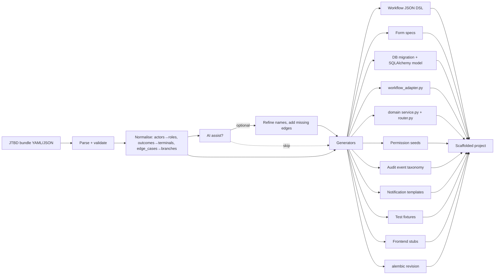

# Workflow Framework Portability — `flowforge`

Companion to `docs/workflow-ed.md` (capability spec) and
`docs/workflow-ed-arch.md` (UMS-specific architecture). This doc extends
the architecture for **portable extraction**: the designer + runtime as a
reusable framework (`flowforge`) plus a **JTBD-driven app generator** that
emits a full project skeleton from Jobs-To-Be-Done specs.

> Scope: docs only — no code in `backend/` or `frontend/` is modified.
> All UMS code paths are absolute (`backend/app/...`,
> `frontend/src/...`).

---

## 1. Why Extract

UMS proves the spec works end-to-end: 23 Python defs, JSON DSL, 7 tables,
two-phase fire, saga ledger, lookup oracle defence, GDPR redaction,
business calendars, signal correlation, sub-workflows, snapshots. Three
sister projects (origination intake, broker portal, claims overflow) need
the same engine + designer. Three options:

| Option | Cost | Drift risk |
|---|---|---|
| Copy `app/workflows_v2/` per project | low up-front | high — fixes diverge in weeks |
| Vendor as git submodule | medium | medium — host-specific patches accrete |
| Publish as packaged framework with pluggable host adapters | high one-off | low — semver gates BC |

This doc commits to option 3.

### 1.1 Naming

Working name: **flowforge** (placeholder; final name TBD before first
release). Below, package names use that prefix.

### 1.2 Non-goals (to keep extraction tractable)

- BPMN XML import/export (DSL is the public surface).
- Multiple runtime languages — Python backend stays.
- Dropping Postgres dependency in v1 (multi-DB tracked in §13 risks).
- Replacing Next.js as the reference frontend (other frameworks are
  consumers of `@flowforge/renderer` only).

---

## 2. Decoupling Strategy — UMS Assumptions → Pluggable Interfaces

Each row below identifies one UMS-specific assumption baked into the
current `backend/app/workflows_v2/` design, the **interface contract**
extracted into `flowforge-core`, the **default implementation** shipped
in a sibling adapter package, and the **host plug-in surface**.

| # | UMS assumption | Source path | Framework interface | Default impl | Host plugs in via |
|---|---|---|---|---|---|
| 1 | Tenancy = single `tenant_id` UUID GUC `app.tenant_id` | `backend/app/db/session.py:119,143` | `TenancyResolver` ABC: `current_tenant() -> TenantId`, `bind_session(session, tenant_id)`, `elevated_scope()` ctx-mgr | `flowforge-tenancy` ships `SingleTenantGUC`, `MultiTenantGUC`, `NoTenancy` (single-org apps) | `app.dependency_overrides[TenancyResolver]` or `flowforge.config.tenancy = MyResolver()` |
| 2 | RBAC via `simulate_effective_access` + `permission_catalog` table | `backend/app/admin/permissions.py`, §20.8 | `RbacResolver` ABC: `has_permission(principal, perm, scope)`, `seed_permissions([...])`, `list_principals_with(perm)` | `flowforge-rbac-spicedb` (UMS path), `flowforge-rbac-casbin`, `flowforge-rbac-static` (RBAC-as-config) | Register at app startup; framework only calls the ABC |
| 3 | Audit hash chain via `audit_events` table + `app.audit.service.record` | `backend/app/audit/service.py:116` | `AuditSink` ABC: `record(event: AuditEvent)`, `verify_chain(range)`, `redact(paths, reason)` | `flowforge-audit-pg` (hash chain default), `flowforge-audit-loki` (append-only log shipper), `flowforge-audit-noop` | Single registration; engine never writes audit rows directly |
| 4 | Outbox handlers via `app.workers.outbox_worker.HANDLERS` dict | `backend/app/workers/outbox_worker.py:55` | `OutboxRegistry` ABC: `register(kind, handler)`, `dispatch(envelope)`; `OutboxEnvelope` dataclass | `flowforge-outbox-pg` (existing pattern, dramatiq actor), `flowforge-outbox-temporal`, `flowforge-outbox-celery` | Host calls `outbox.register("wf.notify", my_handler)` |
| 5 | Document subsystem (av/ocr/storage/retention) | `backend/app/documents/` | `DocumentPort` ABC: `list_for_subject(subject_id, kinds)`, `attach(subject_id, doc_id)`, `get_classification(doc_id)`, `freshness_days(doc_id)` | `flowforge-documents-noop` (returns empty), `flowforge-documents-s3` (S3 + magic-bytes) | Host implements the 4 methods or installs adapter |
| 6 | FX/money via `app.platform.fx` and `app.money` | `backend/app/money/`, `backend/app/platform/fx/` | `MoneyPort` ABC: `convert(amount, from, to, at)`, `format(amount, currency, locale)` | `flowforge-money-static` (config rates), `flowforge-money-ecb` (live ECB feed) | Optional — only if DSL uses `convert_currency` |
| 7 | Settings registry | `backend/app/platform/settings/` | `SettingsPort` ABC: `get(key)`, `set(key, value, signed_by)`, `register(spec)` | `flowforge-settings-pg`, `flowforge-settings-env` (read-only) | Setting keys namespaced `flowforge.*` |
| 8 | Signing (HSM-backed) for elevation log + webhooks | `backend/app/platform/signing.py` | `SigningPort` ABC: `sign_payload(bytes) -> bytes`, `verify(payload, sig, key_id)`, `current_key_id()` | `flowforge-signing-hmac` (dev), `flowforge-signing-kms` (AWS), `flowforge-signing-vault` | Mandatory in prod; framework refuses elevation without it |
| 9 | Notification channel router | `backend/app/notifications/transports/` | `NotificationPort` ABC: `render(template, locale, ctx)`, `send(channel, recipient, rendered)`, `register_template(spec)` | `flowforge-notify-noop`, `flowforge-notify-mailgun`, `flowforge-notify-multichannel` (in-app + email + slack + webhook) | Host registers templates at startup; channel selection per recipient pref |
| 10 | RLS GUC pattern (`app.tenant_id`, `app.elevated`) | `backend/app/db/lifecycle.py:71`, alembic `20260424_0001_cut1_core.py:64` | `RlsBinder` ABC: `bind(session, ctx)`; `ctx` carries tenant + elevation + actor | `flowforge-rls-pg` (default — emits `set_config()` calls), `flowforge-rls-noop` (single-tenant SQLite) | Plugged through `TenancyResolver`; alembic templates ship `flowforge_rls_template.py.mako` |
| 11 | FastAPI integration (routers, deps, CSRF, cookie auth) | `app/main.py`, `app/auth/middleware.py` | `WebAdapter` ABC: `mount_routers(app)`, `auth_dep`, `csrf_dep` | `flowforge-fastapi` (default), `flowforge-litestar`, `flowforge-starlette` | Framework engine has zero web dependencies; adapter is opt-in |
| 12 | Alembic conventions (numbered `YYYYMMDD_NNNN_*` files, `ums.` schema) | `backend/alembic/versions/` | `MigrationBundle` ABC: `apply(connection)`, `revision_id`, `dependencies` | `flowforge-alembic` provides one bundle per release; host wires into its own alembic chain | Host creates a thin per-release migration that calls `flowforge_alembic.upgrade(...)` |
| 13 | Catalog-discoverable domain entities (`workflow_adapter` modules) | `backend/app/claims/workflow_adapter.py` (planned) | `EntityAdapter` Protocol: `create`, `update`, `lookup`, `compensations` | None default — host code | Host registers adapters via decorator: `@register_entity("claim")` |
| 14 | Permission catalog seed shape | §20.8 | `PermissionSeed` dataclass + `PermissionCatalogPort` | `flowforge-rbac-*` impls | Host calls `register_permission(name, description)` at startup |
| 15 | Threshold-alerts metric kinds | `backend/app/threshold_alerts/evaluator.py` | `MetricsPort`: `emit(name, value, labels)` | `flowforge-metrics-prometheus`, `flowforge-metrics-noop` | Optional |
| 16 | Operational tasks integration ("workflow stuck" surfacing) | `backend/app/tasks/service.py` | `TaskTrackerPort`: `create_task(kind, ref, note)` | `flowforge-tasks-noop` | Optional — engine still emits diagnosis JSON regardless |
| 17 | SpiceDB grant fanout (delegations) | `backend/app/auth/spicedb.py` | `AccessGrantPort`: `grant(rel, until)`, `revoke(rel)` | `flowforge-grants-spicedb`, `flowforge-grants-noop` | Optional; engine no-ops if absent |

### 2.1 Interface Boundary Diagram

```mermaid
flowchart LR
  subgraph CORE["flowforge-core (no I/O)"]
    DSL[DSL types + JSON-schema]
    Compiler[Compiler / Validator]
    Engine[Two-phase fire engine<br/>tokens · saga · signals · subwf]
    Replay[Replay + simulator]
  end
  CORE -->|calls ABCs| Ports
  subgraph Ports["Ports (ABCs)"]
    direction TB
    P1[TenancyResolver]
    P2[RbacResolver]
    P3[AuditSink]
    P4[OutboxRegistry]
    P5[DocumentPort]
    P6[MoneyPort]
    P7[SettingsPort]
    P8[SigningPort]
    P9[NotificationPort]
    P10[RlsBinder]
    P11[EntityAdapter Registry]
    P12[MetricsPort]
    P13[TaskTrackerPort]
    P14[AccessGrantPort]
  end
  Ports -->|host wires| Adapters
  subgraph Adapters["Default + community adapters"]
    A1[flowforge-fastapi]
    A2[flowforge-sqlalchemy]
    A3[flowforge-tenancy]
    A4[flowforge-rbac-spicedb]
    A5[flowforge-audit-pg]
    A6[flowforge-outbox-pg]
    A7[flowforge-documents-s3]
    A8[flowforge-signing-kms]
    A9[flowforge-notify-multichannel]
  end
```



### 2.2 Contract example — `RbacResolver`

```python
# flowforge-core/src/flowforge/ports/rbac.py
from typing import Protocol, runtime_checkable
from .types import Principal, PermissionName, Scope

@runtime_checkable
class RbacResolver(Protocol):
    async def has_permission(
        self, principal: Principal, permission: PermissionName, scope: Scope
    ) -> bool: ...

    async def list_principals_with(
        self, permission: PermissionName, scope: Scope
    ) -> list[Principal]: ...

    async def register_permission(
        self, name: PermissionName, description: str,
        deprecated_aliases: list[str] | None = None,
    ) -> None: ...

    async def assert_seed(self, names: list[PermissionName]) -> list[PermissionName]:
        """Returns missing names; raises if catalog drift in strict mode."""
```

UMS host plugs in via:

```python
# host: backend/app/platform/flowforge_wiring.py
from flowforge import config
from app.admin.permissions import simulate_effective_access  # existing helper

class UmsRbac:
    async def has_permission(self, p, perm, scope):
        return await simulate_effective_access(p.user_id, perm, scope.tenant_id)
    # ...

config.rbac = UmsRbac()
```

### 2.3 Contract example — `RlsBinder`

```python
@runtime_checkable
class RlsBinder(Protocol):
    async def bind(self, session: AsyncSession, ctx: ExecutionContext) -> None:
        """Set session-local GUCs / parameters before any framework query."""

    @asynccontextmanager
    async def elevated(self, session: AsyncSession) -> AsyncIterator[None]:
        """Bracket an operator-elevated section; clears on exit."""
```

Default `flowforge-rls-pg` mirrors UMS:

```python
class PgRlsBinder:
    async def bind(self, session, ctx):
        await session.execute(
            text("SELECT set_config('app.tenant_id', :tid, true)"),
            {"tid": str(ctx.tenant_id)},
        )
    @asynccontextmanager
    async def elevated(self, session):
        await session.execute(text("SELECT set_config('app.elevated','true',true)"))
        try: yield
        finally: await session.execute(text("SELECT set_config('app.elevated','false',true)"))
```

A Mongo or single-tenant host swaps this for a no-op without touching
engine code.

---

## 3. Package Layout

### 3.1 Backend (Python, PyPI)

| Package | Depends on | Lines (target) | Responsibility |
|---|---|---|---|
| `flowforge-core` | `pydantic>=2`, `jsonschema`, `python-dateutil` | ≤4k | DSL types, schema, compiler, validator, expression evaluator, two-phase fire algorithm, simulator, replay, ports/ABCs |
| `flowforge-fastapi` | `flowforge-core`, `fastapi`, `starlette` | ≤1.5k | Designer router, runtime router, WS adapter, CSRF passthrough, cookie auth shim |
| `flowforge-sqlalchemy` | `flowforge-core`, `sqlalchemy>=2`, `alembic` | ≤2k | ORM models, alembic bundle, RLS binder default, snapshot store, saga ledger queries |
| `flowforge-tenancy` | `flowforge-core` | ≤500 | Tenancy resolver impls (`SingleTenantGUC`, `MultiTenantGUC`, `NoTenancy`), RLS templates |
| `flowforge-audit-pg` | `flowforge-core`, `flowforge-sqlalchemy` | ≤600 | Hash-chain audit sink (mirrors UMS) |
| `flowforge-outbox-pg` | `flowforge-sqlalchemy`, `dramatiq` (optional) | ≤700 | Outbox registry + worker |
| `flowforge-rbac-spicedb` | `authzed-py`, `flowforge-core` | ≤500 | SpiceDB-backed `RbacResolver` |
| `flowforge-rbac-static` | `flowforge-core` | ≤200 | RBAC from YAML/JSON |
| `flowforge-documents-s3` | `boto3`, `flowforge-core` | ≤600 | S3-backed `DocumentPort` |
| `flowforge-money` | `babel`, `flowforge-core` | ≤300 | FX + money formatting |
| `flowforge-signing-kms` | `boto3`, `flowforge-core` | ≤300 | AWS KMS `SigningPort` |
| `flowforge-notify-multichannel` | `flowforge-core` | ≤700 | Email/Slack/SMS/in-app fan-out |
| `flowforge-cli` | `typer`, `jinja2`, `flowforge-core` | ≤1.5k | `flowforge new`, `add-jtbd`, `regen-catalog`, `validate`, `simulate` |

### 3.2 Frontend (TypeScript, npm)

| Package | Depends on | Responsibility |
|---|---|---|
| `@flowforge/types` | — | TS types generated from `flowforge-core/schema/*.json` (`pnpm gen:flowforge-types`) |
| `@flowforge/renderer` | `react`, `react-hook-form`, `ajv`, `@flowforge/types` | `FormRenderer`, field components, validators |
| `@flowforge/designer` | `reactflow`, `dagre`, `monaco-editor`, `zustand`, `@flowforge/renderer`, `@flowforge/types` | Canvas, property panel, form builder, simulation panel, diff viewer |
| `@flowforge/runtime-client` | `@flowforge/types` | REST + WS client, `useTenantQueryKey`-style hook (host-pluggable) |
| `@flowforge/step-adapters` | `@flowforge/renderer` | Generic step components (`ManualReviewStep`, `FormStep`, `DocumentReviewStep`) — host extends with domain-specific |

### 3.3 Source-tree shape (`flowforge-core` as exemplar)

```
flowforge-core/
├── pyproject.toml
├── src/flowforge/
│   ├── __init__.py
│   ├── version.py
│   ├── config.py                    # global config object, mutable at startup
│   ├── dsl/
│   │   ├── workflow_def.py          # pydantic models
│   │   ├── form_spec.py
│   │   └── schema/
│   │       ├── workflow_def.schema.json
│   │       └── form_spec.schema.json
│   ├── compiler/
│   │   ├── compile.py
│   │   ├── validator.py
│   │   └── catalog.py               # entity catalog projection
│   ├── engine/
│   │   ├── fire.py                  # two-phase fire (§17.2 of arch)
│   │   ├── tokens.py                # parallel regions
│   │   ├── saga.py                  # ledger lifecycle
│   │   ├── signals.py               # pending signals correlator
│   │   ├── subworkflow.py
│   │   ├── timers.py                # pause-aware
│   │   └── snapshots.py
│   ├── expr/
│   │   ├── ast.py
│   │   ├── evaluator.py             # whitelisted operators
│   │   ├── lookup_runtime.py        # rate limit + projection clamp
│   │   └── ops/                     # 100+ pure operators
│   ├── ports/
│   │   ├── tenancy.py
│   │   ├── rbac.py
│   │   ├── audit.py
│   │   ├── outbox.py
│   │   ├── documents.py
│   │   ├── money.py
│   │   ├── settings.py
│   │   ├── signing.py
│   │   ├── notification.py
│   │   ├── rls.py
│   │   ├── entity.py                # EntityAdapter Protocol + registry
│   │   ├── metrics.py
│   │   ├── tasks.py
│   │   └── grants.py
│   ├── replay/
│   │   ├── reconstruct.py
│   │   └── simulator.py
│   └── testing/                     # pytest fixtures for hosts to import
│       ├── fixtures.py
│       ├── port_fakes.py
│       └── parity.py
└── tests/
    ├── unit/
    └── ci/                          # contract tests for each port
```

---

## 4. JTBD-to-App Generator

### 4.1 The transform pipeline



### 4.2 Determinism guarantee

The transform is **deterministic**: same JTBD bundle in → byte-identical
files out (modulo timestamped header). Templates are jinja2; no LLM in
the default path. The `--ai-assist` flag invokes a second pass that:

1. Reads the deterministic output.
2. Calls a configured LLM with structured prompts (claude-sonnet by
   default).
3. Emits a unified diff for the human to review/accept.
4. Never mutates files without `--apply-ai-suggestions`.

This keeps generated apps reproducible while offering optional polish.

### 4.3 Per-JTBD output budget

For one JTBD `claim_intake`, the generator emits ~12–15 files totalling
~600 LOC of host code (see §6 for a full sample chain). For a bundle of
N JTBDs the generator additionally emits 4–6 cross-cutting files
(permission seeds, RBAC seed test, navigation index, JTBD glossary).

### 4.4 What the generator does NOT do

- It does not invent business invariants. The JTBD describes *what*
  outcomes matter; the generator emits scaffolding stubs and TODO
  markers for invariants the host engineer must fill.
- It does not hand-craft expressions. Guards default to
  `{ "kind": "expr", "expr": true }` with a `// TODO(jtbd)` marker; the
  designer GUI is where humans refine them.
- It does not configure secrets or deploy targets — those live in the
  generated `.env.example`.

---

## 5. JTBD Spec Schema

### 5.1 JSON schema (single JTBD)

```jsonc
// schema id: https://flowforge.dev/schemas/jtbd-1.0.json
{
  "$id": "jtbd-1.0",
  "type": "object",
  "required": ["id", "actor", "situation", "motivation", "outcome", "success_criteria"],
  "additionalProperties": false,
  "properties": {
    "id":          { "type": "string", "pattern": "^[a-z][a-z0-9_]*$" },
    "title":       { "type": "string" },
    "actor":       { "$ref": "#/$defs/actor" },
    "situation":   { "type": "string" },
    "motivation":  { "type": "string" },
    "outcome":     { "type": "string" },
    "success_criteria": {
      "type": "array",
      "items": { "type": "string" },
      "minItems": 1
    },
    "edge_cases": {
      "type": "array",
      "items": { "$ref": "#/$defs/edge_case" }
    },
    "data_capture": {
      "type": "array",
      "items": { "$ref": "#/$defs/field" }
    },
    "documents_required": {
      "type": "array",
      "items": { "$ref": "#/$defs/doc_req" }
    },
    "approvals": {
      "type": "array",
      "items": { "$ref": "#/$defs/approval" }
    },
    "sla": {
      "type": "object",
      "properties": {
        "warn_pct": { "type": "integer", "minimum": 1, "maximum": 99 },
        "breach_seconds": { "type": "integer", "minimum": 60 }
      }
    },
    "notifications": {
      "type": "array",
      "items": { "$ref": "#/$defs/notification" }
    },
    "metrics": {
      "type": "array",
      "items": { "type": "string" }
    }
  },
  "$defs": {
    "actor": {
      "type": "object",
      "required": ["role"],
      "properties": {
        "role":        { "type": "string" },
        "department":  { "type": "string" },
        "external":    { "type": "boolean", "default": false }
      }
    },
    "edge_case": {
      "type": "object",
      "required": ["id", "condition", "handle"],
      "properties": {
        "id":        { "type": "string" },
        "condition": { "type": "string" },
        "handle":    { "enum": ["branch", "reject", "escalate", "compensate", "loop"] },
        "branch_to": { "type": "string" }
      }
    },
    "field": {
      "type": "object",
      "required": ["id", "kind"],
      "properties": {
        "id":        { "type": "string" },
        "kind":      { "enum": ["text","number","money","date","datetime","enum","boolean","party_ref","document_ref","email","phone","address","textarea","signature","file"] },
        "label":     { "type": "string" },
        "required":  { "type": "boolean", "default": false },
        "pii":       { "type": "boolean", "default": false },
        "validation": { "type": "object" }
      }
    },
    "doc_req": {
      "type": "object",
      "required": ["kind"],
      "properties": {
        "kind":            { "type": "string" },
        "min":             { "type": "integer", "default": 1 },
        "max":             { "type": "integer" },
        "freshness_days":  { "type": "integer" },
        "av_required":     { "type": "boolean", "default": true }
      }
    },
    "approval": {
      "type": "object",
      "required": ["role", "policy"],
      "properties": {
        "role":   { "type": "string" },
        "policy": { "enum": ["1_of_1","2_of_2","n_of_m","authority_tier"] },
        "n":      { "type": "integer" },
        "tier":   { "type": "integer" }
      }
    },
    "notification": {
      "type": "object",
      "required": ["trigger", "channel", "audience"],
      "properties": {
        "trigger":  { "enum": ["state_enter","state_exit","sla_warn","sla_breach","approved","rejected","escalated"] },
        "channel":  { "enum": ["email","sms","slack","webhook","in_app"] },
        "audience": { "type": "string" }
      }
    }
  }
}
```

### 5.2 Bundle schema (multiple JTBDs in one project)

```jsonc
{
  "$id": "jtbd-bundle-1.0",
  "type": "object",
  "required": ["project", "jtbds"],
  "properties": {
    "project": {
      "type": "object",
      "required": ["name", "package", "domain"],
      "properties": {
        "name":     { "type": "string" },
        "package":  { "type": "string", "pattern": "^[a-z][a-z0-9_]*$" },
        "domain":   { "type": "string" },
        "tenancy":  { "enum": ["none","single","multi"], "default": "single" },
        "languages": { "type": "array", "items": { "type": "string" } },
        "currencies": { "type": "array", "items": { "type": "string" } },
        "frontend_framework": { "enum": ["nextjs","remix","vite-react"], "default": "nextjs" }
      }
    },
    "shared": {
      "type": "object",
      "properties": {
        "roles":       { "type": "array", "items": { "type": "string" } },
        "permissions": { "type": "array", "items": { "type": "string" } },
        "entities":    { "type": "array", "items": { "type": "object" } }
      }
    },
    "jtbds": {
      "type": "array",
      "minItems": 1,
      "items":   { "$ref": "jtbd-1.0" }
    }
  }
}
```

### 5.3 Worked Examples

#### Example A — Insurance claim intake

```yaml
project:
  name: claims-intake-demo
  package: claims_intake
  domain: insurance
  tenancy: multi
  languages: [en, sw]
  currencies: [USD, KES, EUR]
shared:
  roles: [intake_clerk, triage_officer, claims_handler, claims_supervisor]
  permissions: [claim.create, claim.read, claim.update, claim.approve, claim.escalate]
jtbds:
  - id: claim_intake
    title: Submit a new motor claim
    actor: { role: intake_clerk, department: claims }
    situation: A policyholder calls in after an accident; claim must be opened with required documents.
    motivation: Capture loss data quickly so adjuster can triage within SLA.
    outcome: A triage-ready claim record exists; loss > 10k USD routes to senior adjuster.
    success_criteria:
      - All required documents uploaded with AV-clean status.
      - Loss amount + currency captured.
      - Policy verified in-force at incident date.
      - Triage assignee set.
    data_capture:
      - { id: policy_id, kind: party_ref, label: Policy, required: true }
      - { id: incident_date, kind: date, label: Date of incident, required: true }
      - { id: loss_amount, kind: money, label: Estimated loss, required: true }
      - { id: description, kind: textarea, label: Loss description, pii: false }
      - { id: claimant_name, kind: text, pii: true, required: true }
    documents_required:
      - { kind: police_report, min: 1, freshness_days: 30 }
      - { kind: photos_damage, min: 2 }
    approvals:
      - { role: claims_supervisor, policy: authority_tier, tier: 2 }
    edge_cases:
      - { id: policy_lapsed, condition: "policy.status != 'in_force'", handle: reject }
      - { id: large_loss, condition: "loss_amount > 100000", handle: branch, branch_to: senior_triage }
      - { id: fraud_flag, condition: "fraud_score > 0.7", handle: escalate }
    sla: { warn_pct: 80, breach_seconds: 14400 }
    notifications:
      - { trigger: state_enter, channel: in_app, audience: triage_officer }
      - { trigger: sla_breach, channel: slack, audience: claims_supervisor }
```

#### Example B — Hiring recruitment pipeline

```yaml
project: { name: ats-lite, package: ats, domain: hr, tenancy: single, currencies: [USD] }
shared:
  roles: [recruiter, hiring_manager, interviewer, head_of_people]
  permissions: [candidate.create, candidate.read, candidate.advance, offer.send]
jtbds:
  - id: candidate_screen
    title: Recruiter screens an inbound application
    actor: { role: recruiter, department: people }
    situation: New CV arrives via portal; need fit/no-fit decision in 48h.
    motivation: Fill role faster while filtering low-fit applicants.
    outcome: Candidate is in shortlist or rejected with reason.
    success_criteria:
      - Reason captured on rejection.
      - Phone screen scheduled if shortlisted.
    data_capture:
      - { id: candidate_email, kind: email, required: true, pii: true }
      - { id: years_experience, kind: number, required: true }
      - { id: salary_expectation, kind: money }
    edge_cases:
      - { id: under_qualified, condition: "years_experience < 3", handle: reject }
    sla: { warn_pct: 75, breach_seconds: 172800 }
    notifications:
      - { trigger: rejected, channel: email, audience: candidate }

  - id: offer_loop
    title: Hiring manager extends an offer
    actor: { role: hiring_manager }
    situation: Final-round candidate cleared all interviews.
    motivation: Close candidate before competing offer expires.
    outcome: Signed offer letter on file.
    success_criteria: [Offer accepted in writing, Compensation matches band]
    documents_required:
      - { kind: offer_letter_signed, min: 1 }
    approvals:
      - { role: head_of_people, policy: 1_of_1 }
    edge_cases:
      - { id: above_band, condition: "salary > band_max", handle: escalate }
    sla: { breach_seconds: 432000 }
```

#### Example C — Building permit application

```yaml
project: { name: permits, package: permits, domain: gov, tenancy: multi, languages: [en, fr] }
shared:
  roles: [applicant, planning_officer, fire_marshal, structural_engineer, registrar]
jtbds:
  - id: permit_intake
    title: Citizen submits a building permit
    actor: { role: applicant, external: true }
    situation: Resident wants to build/renovate; needs approved permit before works.
    motivation: Get a legally-binding permit with minimum delay.
    outcome: Permit granted, conditional, or refused with appeal route.
    success_criteria:
      - All mandatory drawings uploaded.
      - Site address validated against cadastre.
      - Fee calculated and paid.
    data_capture:
      - { id: parcel_id, kind: text, required: true }
      - { id: works_kind, kind: enum }
      - { id: fee, kind: money }
    documents_required:
      - { kind: site_plan, min: 1, freshness_days: 90 }
      - { kind: structural_drawings, min: 1 }
      - { kind: fire_safety_plan, min: 1 }
    approvals:
      - { role: planning_officer, policy: 1_of_1 }
      - { role: fire_marshal, policy: 1_of_1 }
      - { role: structural_engineer, policy: 1_of_1 }
    edge_cases:
      - { id: heritage_zone, condition: "parcel.in_heritage_zone", handle: branch, branch_to: heritage_review }
      - { id: incomplete_docs, condition: "missing_documents", handle: loop }
    sla: { breach_seconds: 1209600 }
    notifications:
      - { trigger: approved, channel: email, audience: applicant }
      - { trigger: rejected, channel: email, audience: applicant }
```

### 5.4 JTBD → DSL transform table

| JTBD field | Generates |
|---|---|
| `actor.role` + `shared.roles` | Role enum + RBAC seed permissions |
| `data_capture[]` | One form-spec field + one column on the entity table |
| `documents_required[]` | `documents` array on the manual-review state + doc-kind seed |
| `approvals[]` | One `approval` gate per entry on the success transition |
| `edge_cases[].handle=branch` | One extra state + transition to `branch_to` |
| `edge_cases[].handle=reject` | Transition to terminal `rejected` with `reason_required: true` |
| `edge_cases[].handle=escalate` | Escalation block on the source state |
| `edge_cases[].handle=compensate` | Saga step with `compensation_kind` placeholder |
| `edge_cases[].handle=loop` | Self-loop transition with `event=resubmit` |
| `sla` | State `sla` block with `pause_aware: true` default |
| `notifications[]` | Notification template stubs + `wf.notify` outbox handlers |
| `success_criteria[]` | Generated as `// TODO` markers inside guards + simulator test cases |
| `outcome` | Terminal state name (`<jtbd_id>_done`) + entity status enum |

---

## 6. Scaffolding Output

### 6.1 Generated directory structure

```
my-app/
├── pyproject.toml                               # depends on flowforge-* packages
├── .env.example
├── README.md                                    # auto-generated humanised intro
├── docker-compose.yml                           # postgres + redis + dramatiq worker
├── alembic.ini
├── alembic/
│   ├── env.py                                   # wires flowforge-alembic upgrade
│   └── versions/
│       ├── 0001_flowforge_core.py               # delegates to flowforge_alembic.upgrade(rev="r1")
│       └── 0002_jtbd_claim_intake.py            # entity table for claim_intake JTBD
├── backend/
│   ├── pyproject.toml
│   └── src/my_app/
│       ├── __init__.py
│       ├── main.py                              # FastAPI app factory
│       ├── config.py                            # flowforge wiring (ports → impls)
│       ├── workflows/
│       │   ├── catalog.json                     # generated entity catalog
│       │   ├── claim_intake/
│       │   │   ├── definition.json              # workflow DSL
│       │   │   ├── form_spec.intake.json
│       │   │   └── tests/
│       │   │       └── test_simulation.py
│       │   └── shared/
│       │       ├── permissions.py               # seed list
│       │       └── notifications/*.tmpl
│       ├── claims/                              # one folder per JTBD entity
│       │   ├── models.py
│       │   ├── views.py                         # pydantic schemas
│       │   ├── service.py
│       │   ├── router.py
│       │   ├── workflow_adapter.py              # create/update/lookup/compensations
│       │   └── tests/
│       │       ├── fixtures.py
│       │       └── test_workflow_adapter.py
│       └── audit_taxonomy.py                    # generated enum of audit kinds
├── frontend/
│   ├── package.json                             # depends on @flowforge/*
│   ├── next.config.mjs
│   └── src/
│       ├── app/
│       │   ├── layout.tsx
│       │   ├── workflows/
│       │   │   └── instance/[id]/page.tsx       # uses @flowforge/runtime-client
│       │   ├── admin/
│       │   │   └── workflow-designer/...        # mounts @flowforge/designer
│       │   └── claims/
│       │       └── new/page.tsx                 # uses @flowforge/renderer
│       ├── components/
│       │   └── claims/
│       │       └── ClaimStep.tsx                # WorkflowStepProps wrapper
│       └── lib/
│           ├── flowforge.ts                     # client-side port wiring
│           └── api.ts
└── tests/
    └── e2e/
        └── claim_intake.spec.ts
```

### 6.2 Sample generated chain — `claim_intake`

#### a) Alembic migration (`alembic/versions/0002_jtbd_claim_intake.py`)

```python
"""claim_intake JTBD entity table"""
from alembic import op
import sqlalchemy as sa
from flowforge.alembic.helpers import add_rls_policy, add_tenant_id_column

revision = "0002_jtbd_claim_intake"
down_revision = "0001_flowforge_core"

def upgrade() -> None:
    op.create_table(
        "claims",
        sa.Column("id", sa.Uuid, primary_key=True),
        sa.Column("tenant_id", sa.Uuid, nullable=False),
        sa.Column("policy_id", sa.Uuid, nullable=False),
        sa.Column("incident_date", sa.Date, nullable=False),
        sa.Column("loss_amount", sa.Numeric(18, 2), nullable=False),
        sa.Column("loss_currency", sa.String(3), nullable=False),
        sa.Column("description", sa.Text),
        sa.Column("claimant_name", sa.Text, nullable=False),
        sa.Column("status", sa.String(32), nullable=False, server_default="draft"),
        sa.Column("created_at", sa.TIMESTAMP(timezone=True), server_default=sa.func.now()),
        sa.Column("updated_at", sa.TIMESTAMP(timezone=True), server_default=sa.func.now()),
        schema="app",
    )
    add_rls_policy(op, "app.claims", tenant_column="tenant_id")
```

#### b) SQLAlchemy model (`backend/src/my_app/claims/models.py`)

```python
from sqlalchemy.orm import Mapped, mapped_column
from flowforge.sqlalchemy.base import Base
from flowforge.workflows_v2.catalog.mixins import WorkflowExposed

class Claim(Base, WorkflowExposed):
    __tablename__ = "claims"
    __table_args__ = {"schema": "app"}
    workflow_projection = [
        "id", "policy_id", "incident_date",
        "loss_amount", "loss_currency", "status",
    ]   # PII columns (claimant_name) deliberately excluded

    id:            Mapped[str]
    tenant_id:     Mapped[str]
    policy_id:     Mapped[str]
    incident_date: Mapped[date]
    loss_amount:   Mapped[Decimal]
    loss_currency: Mapped[str]
    claimant_name: Mapped[str]
    status:        Mapped[str]
```

#### c) Workflow adapter (`backend/src/my_app/claims/workflow_adapter.py`)

```python
from flowforge.ports.entity import register_entity
from .service import ClaimsService
from .views import ClaimCreate, ClaimUpdate

@register_entity("claim")
class ClaimWorkflowAdapter:
    """Bridges flowforge engine to host claims service."""
    async def create(self, session, payload: dict) -> dict:
        svc = ClaimsService(session)
        spec = ClaimCreate.model_validate(payload)   # reuses HTTP schema
        claim = await svc.create(spec)
        return claim.model_dump()

    async def update(self, session, id_: str, payload: dict) -> dict:
        svc = ClaimsService(session)
        spec = ClaimUpdate.model_validate(payload)
        claim = await svc.update(id_, spec)
        return claim.model_dump()

    async def lookup(self, session, id_: str) -> dict:
        return (await ClaimsService(session).get(id_)).model_dump()

    compensations = {
        "reverse_create": "reverse_create_claim",   # service method to call
    }
```

#### d) Workflow definition (`backend/src/my_app/workflows/claim_intake/definition.json`)

```jsonc
{
  "key": "claim_intake",
  "version": "1.0.0",
  "subject_kind": "claim",
  "initial_state": "intake",
  "metadata": {
    "label": "Submit a new motor claim",
    "owner_role": "intake_clerk",
    "tags": ["jtbd:claim_intake", "domain:insurance"],
    "generated_from": "jtbd:claim_intake@2026-05-05T12:00:00Z"
  },
  "states": [
    { "name": "intake", "kind": "manual_review", "swimlane": "claims_intake",
      "form_spec_id": "intake_form_v1",
      "documents": [
        { "kind": "police_report", "min": 1, "freshness_days": 30 },
        { "kind": "photos_damage", "min": 2 }
      ],
      "sla": { "warn_pct": 80, "breach_seconds": 14400, "pause_aware": true } },
    { "name": "triage", "kind": "manual_review", "swimlane": "triage" },
    { "name": "senior_triage", "kind": "manual_review", "swimlane": "triage" },
    { "name": "approved", "kind": "terminal_success" },
    { "name": "rejected", "kind": "terminal_fail" }
  ],
  "transitions": [
    { "id": "submit", "event": "submit", "from_state": "intake", "to_state": "triage",
      "guards": [
        { "kind": "expr",
          "expr": { "and": [
            { "not_null": { "var": "context.intake.policy_id" } },
            { ">": [{ "var": "context.intake.loss_amount" }, 0] }
          ]}}
      ],
      "gates": [
        { "kind": "permission", "permission": "claim.create" },
        { "kind": "documents_complete" }
      ],
      "effects": [
        { "kind": "create_entity", "entity": "claim",
          "values": {
            "policy_id":     { "var": "context.intake.policy_id" },
            "incident_date": { "var": "context.intake.incident_date" },
            "loss_amount":   { "var": "context.intake.loss_amount" },
            "loss_currency": { "var": "context.intake.loss_currency" },
            "claimant_name": { "var": "context.intake.claimant_name" }
          }},
        { "kind": "set", "target": "context.triage.priority",
          "expr": { "if": [
            { ">": [{ "var": "context.intake.loss_amount" }, 100000] }, "high",
            "normal" ]}},
        { "kind": "notify", "template": "claim.submitted" }
      ]
    },
    { "id": "branch_large_loss", "event": "submit", "from_state": "intake",
      "to_state": "senior_triage", "priority": 10,
      "guards": [
        { "kind": "expr", "expr": { ">": [{ "var": "context.intake.loss_amount" }, 100000] } }
      ],
      "gates": [{ "kind": "permission", "permission": "claim.create" }]
    },
    { "id": "reject_lapsed", "event": "policy_check", "from_state": "intake",
      "to_state": "rejected",
      "guards": [
        { "kind": "expr", "expr": { "==": [{ "var": "context.policy.status" }, "lapsed"] } }
      ],
      "effects": [{ "kind": "set", "target": "context.rejection_reason", "expr": "policy_lapsed" }]
    }
  ],
  "escalations": [
    { "trigger": { "kind": "sla_breach", "state": "intake" },
      "actions": [
        { "kind": "reassign_to_role", "role": "claims_supervisor" },
        { "kind": "notify", "template": "claim.intake.sla_breach" }
      ],
      "cooldown_seconds": 900 }
  ]
}
```

#### e) Form spec (`backend/src/my_app/workflows/claim_intake/form_spec.intake.json`)

```jsonc
{
  "id": "intake_form_v1",
  "version": "1.0.0",
  "title": "Claim intake",
  "fields": [
    { "id": "policy_id",      "kind": "lookup", "label": "Policy",
      "source": { "endpoint": "/api/policies/search", "param": "q" },
      "required": true },
    { "id": "incident_date",  "kind": "date", "label": "Date of incident",
      "validation": { "max": "today" }, "required": true },
    { "id": "loss_amount",    "kind": "money", "label": "Estimated loss",
      "validation": { "min": 0 }, "required": true },
    { "id": "loss_currency",  "kind": "enum",
      "options": [{"v":"USD"},{"v":"KES"},{"v":"EUR"}], "default": "USD" },
    { "id": "description",    "kind": "textarea", "label": "Loss description" },
    { "id": "claimant_name",  "kind": "text", "label": "Claimant name",
      "required": true, "pii": true }
  ],
  "layout": [
    { "kind": "section", "title": "Policy & loss",
      "field_ids": ["policy_id", "incident_date", "loss_amount", "loss_currency"] },
    { "kind": "section", "title": "Details",
      "field_ids": ["description", "claimant_name"] }
  ]
}
```

#### f) Generated test (`backend/src/my_app/workflows/claim_intake/tests/test_simulation.py`)

```python
"""Auto-generated simulator test for JTBD claim_intake."""
import pytest
from flowforge.testing import simulate, load_def

@pytest.mark.asyncio
async def test_happy_path():
    spec = load_def("workflows/claim_intake/definition.json")
    result = await simulate(spec, initial_context={
        "intake": {
            "policy_id": "00000000-0000-0000-0000-000000000001",
            "incident_date": "2026-05-01",
            "loss_amount": 5000,
            "loss_currency": "USD",
            "claimant_name": "Asha Mwangi",
        }
    }, events=[("submit", {})])
    assert result.terminal_state == "triage"
    assert result.created_entities == [("claim", {"status": "draft"})]

@pytest.mark.asyncio
async def test_large_loss_branches_to_senior():
    spec = load_def("workflows/claim_intake/definition.json")
    result = await simulate(spec, initial_context={
        "intake": {
            "policy_id": "00000000-0000-0000-0000-000000000001",
            "incident_date": "2026-05-01",
            "loss_amount": 250000,  # > 100k -> branches
            "loss_currency": "USD",
            "claimant_name": "Asha Mwangi",
        }
    }, events=[("submit", {})])
    assert result.terminal_state == "senior_triage"

@pytest.mark.asyncio
async def test_rejected_when_policy_lapsed():
    spec = load_def("workflows/claim_intake/definition.json")
    result = await simulate(spec, initial_context={
        "policy": {"status": "lapsed"},
        "intake": {"policy_id": "x", "incident_date": "2026-05-01",
                   "loss_amount": 100, "loss_currency": "USD",
                   "claimant_name": "x"}
    }, events=[("policy_check", {})])
    assert result.terminal_state == "rejected"
```

#### g) Frontend step component (`frontend/src/components/claims/ClaimStep.tsx`)

```tsx
"use client";
import { FormRenderer } from "@flowforge/renderer";
import { useFlowforgeWorkflow } from "@flowforge/runtime-client";
import type { WorkflowStepProps } from "@flowforge/types";

export function ClaimStep(props: WorkflowStepProps) {
  const { instance, formSpec, onSubmitEvent } = props;
  const { sla, why_stuck } = useFlowforgeWorkflow(instance.id);
  return (
    <section aria-label="Claim intake">
      {sla.warning && <p role="status">SLA at {sla.percent}%</p>}
      <FormRenderer
        spec={formSpec!}
        initialValues={instance.context.intake}
        onSubmit={(values) => onSubmitEvent("submit", { intake: values })}
      />
      {why_stuck && <pre>{JSON.stringify(why_stuck, null, 2)}</pre>}
    </section>
  );
}
```

### 6.3 Cross-cutting generated files

| File | Purpose |
|---|---|
| `backend/src/my_app/workflows/shared/permissions.py` | Aggregated permission seed (`flowforge.ports.rbac.register_permission` calls). |
| `backend/src/my_app/audit_taxonomy.py` | Enum of all audit kinds (e.g., `wf.claim_intake.submitted`). |
| `backend/src/my_app/config.py` | Wires every port to its default impl; commented-out blocks for swap-out. |
| `frontend/src/lib/flowforge.ts` | Sets API base URL, registers `useTenantQueryKey`-equivalent hook. |
| `tests/e2e/claim_intake.spec.ts` | Playwright happy-path + one edge-case scenario. |

---

## 7. Customisation Extension Points

| Area | Default | Override mechanism | Phase locked? |
|---|---|---|---|
| Domain hooks: `before_create`, `after_transition`, `on_compensate` | No-op | `@flowforge.hooks.on("after_transition", workflow_key="claim_intake")` decorator | Hot-reload OK |
| Custom gates | 8 built-in (`permission`, `documents_complete`, `checklist_complete`, `approval`, `co_signature`, `compliance`, `custom_webhook`, `expr`) | `flowforge.gates.register("kyc_clear", evaluator_fn)` | Publish-time validated |
| Custom expression operators | 100+ whitelisted | `flowforge.expr.register_op("cred_score", fn, signature=...)` — must be pure | Validator re-validates at publish |
| Branding tokens | Tailwind v4 default tokens | `frontend/src/styles/flowforge-theme.css` overrides via CSS custom properties (`--ff-color-primary`, `--ff-radius`, …) | Hot-reload |
| Localisation | English only | External catalog at `frontend/locales/<lang>.json`; backend-side via `flowforge.i18n.register_catalog(lang, dict)` | i18n keyed by `form_spec_id.field_id.label` |
| Environment config | `.env.example` skeleton | `app.config.py` reads via `flowforge.config.from_env(...)` | Restart |
| Designer permissions | `workflow.designer.*` | Re-seed via `register_permission` with same names + scoped variants | Catalog-drift CI guard |
| Adapter retention | All adapters required while def-version uses them (§17.8.3) | Cannot override — guard rejects PR | — |
| Step components | Generic `FormStep`, `ManualReviewStep`, `DocumentReviewStep` | Host registers in `frontend/src/lib/step-registry.ts`; framework reads via lazy import | Hot-reload |
| WS reconnect strategy | Exp back-off 1→60s | `useFlowforgeWS({ backoff: customFn })` | Hot-reload |
| Snapshot interval | 100 events | `flowforge.config.snapshot_interval = 50` | Restart |
| Lookup rate-limit | 600/tenant/min | Per-lookup override in catalog | Re-publish |
| Sub-workflow nesting cap | 5 | `flowforge.config.max_nesting_depth = 7` (audit alert) | Restart |
| Calendar resolution | `tenant+region` | Per-def `calendar_resolution` block | Re-publish |
| AI assist provider | None | `flowforge.cli.ai = AnthropicProvider(model="claude-sonnet-...")` | CLI flag `--ai-assist` |

### 7.1 Hook ordering rule

Hooks fire in registration order, all in the **same DB transaction** as
the firing transition (so they see committed state of effects within the
plan). A failing hook aborts the whole transition (treated as guard
failure) — this matches the saga-pending-block rule in §17.4.3 of the
arch doc.

### 7.2 What MUST stay framework-controlled (no override)

- Two-phase fire algorithm (§17.2 of arch).
- Audit chain integrity (`AuditSink` impls cannot skip recording).
- Catalog default-deny on PII columns (`WorkflowExposed.workflow_projection`).
- Elevation log signing (engine refuses to start without a `SigningPort`).
- Saga ledger lifecycle states.
- Idempotency unique index on `workflow_events.external_event_id`.

These are correctness-critical; overriding them defeats the framework.

---

## 8. Migrating Existing UMS Workflows

### 8.1 Mapping

UMS becomes the first host project to consume the framework.

| UMS path | Becomes |
|---|---|
| `backend/app/workflows/engine.py` | Replaced by `flowforge.engine.*` calls; thin shim retained for legacy Python defs during cutover |
| `backend/app/workflows/definitions/*.py` (23 files) | Reflected to JSON DSL via `scripts/reflect_python_workflows.py` (existing plan in §8 of arch); files deleted in P-WD-7 once adapter-retention guard is green |
| `backend/app/workflows_v2/` | Becomes `app/flowforge_wiring.py` — port impls + permission seeds |
| `backend/app/workflows_v2/catalog/` | Catalog file moves under `app/workflows/catalog.json`; build script lives in framework but UMS-specific entity selection stays host-side |
| `backend/app/audit/service.py` | Becomes UMS impl of `AuditSink` (registered at startup) |
| `backend/app/workers/outbox_worker.py` `HANDLERS` | Becomes UMS registrations of `flowforge.ports.outbox.OutboxRegistry` |
| `backend/app/db/session.py` GUC binder | Becomes UMS impl of `RlsBinder` (defaults already match) |
| `frontend/src/components/workflow-designer/*` | Becomes `@flowforge/designer` consumer; UMS-specific step adapters stay in `frontend/src/components/{claims,policies,...}` |

### 8.2 Migration phases (UMS-as-host)

| Phase | Work | Risk gate |
|---|---|---|
| FF-M1 | Vendor `flowforge-core` + `flowforge-fastapi` + `flowforge-sqlalchemy` as path dependencies; verify all 23 Python defs still execute | Parity fixture green for every def |
| FF-M2 | Swap audit, outbox, signing, settings, RBAC ports to UMS impls; remove direct `app.audit.service.record` calls from `workflows_v2/` | All UMS tests green |
| FF-M3 | Migrate frontend imports from `@/components/workflow-designer` to `@flowforge/designer`; alias for backward source compatibility | Visual regression suite |
| FF-M4 | Cut over to PyPI-published versions (drop path deps) | Release notes, semver bump |
| FF-M5 | Delete legacy `backend/app/workflows/` Python registry path (per arch §8 phase D); keep `app/workflows/` module name as the wiring shim | CI: zero Python-only def files in the tree |

### 8.3 Backward compatibility

- Existing `workflow_instances`, `workflow_events`, `workflow_definitions`,
  `workflow_definition_versions` tables retain their schema. Framework
  expects them as-is (migrations only **add** tables/columns).
- `app.tenant_id` GUC name preserved; default `RlsBinder` matches.
- Existing audit chain rows are not rewritten — chain continues forward.
- Outbox handler kinds (`wf.notify`, `wf.spicedb_grant`, `wf.webhook`,
  `wf.saga.compensate`) are framework-stable — UMS just registers them.

---

## 9. Versioning + Dependency Policy

### 9.1 Semver discipline

| Change | Version bump | Example |
|---|---|---|
| New optional port method with default | minor | `RbacResolver.list_principals_with_role()` added with default raising `NotImplementedError` ⇒ minor |
| New required port method | major | New `AuditSink.verify_chain` becomes required ⇒ major |
| New DSL state kind / gate kind | minor | Adding `parallel_fork.regions[].priority` (optional) ⇒ minor |
| Removing DSL field with default | major | Dropping `idle_timeout` ⇒ major |
| Schema column added with default | minor | `workflow_events.form_spec_version` added ⇒ minor (alembic forward-only) |
| Algorithm change in fire/saga | major | New saga ledger states ⇒ major (migration script required) |
| Bug fix preserving behaviour | patch | Off-by-one in calendar math ⇒ patch |
| Performance improvement | patch | Compiler caching ⇒ patch |

### 9.2 BC guarantees

- `flowforge-core` ports keep ABCs append-only within a major.
- DSL `version` field in workflow defs is independent of framework
  version. Framework reads any DSL whose `dsl_version` is within
  `[oldest_supported, current]`.
- Tables NEVER renamed within a major; only added.
- Permission names: deprecated aliases live ≥ 1 major version (mirrors
  §20.8 catalog policy).

### 9.3 Deprecation windows

| Surface | Warn-only | Removal |
|---|---|---|
| Port ABC method | 1 minor | next major |
| DSL field | 2 minor | next major |
| Permission name | 1 minor | next major |
| Outbox handler kind | 1 major | next major+1 |
| Audit `subject_kind` | never removed | new ones added |

### 9.4 Security update SLA

| Severity | Action | Window |
|---|---|---|
| CVE in dependency, framework affected | Patch + advisory | ≤72 h |
| CVE in framework code | Patch + advisory | ≤24 h for critical, ≤7 days for high |
| Lookup-oracle bypass found | Patch + audit-chain replay test | ≤48 h |
| Audit-chain integrity flaw | Patch + chain-recompute migration | ≤24 h, P0 |
| Designer XSS / CSRF | Patch | ≤7 days |

### 9.5 Compatibility matrix policy

`flowforge-core@N.x` is compatible with adapter packages whose major
version ≤ N. Cross-version mixing is rejected at `flowforge.config`
load time with a clear error. CI in the framework repo runs the full
adapter test grid on every PR.

---

## 10. CLI Design — `flowforge`

### 10.1 Commands

| Command | Effect |
|---|---|
| `flowforge new <project> --jtbd <bundle.yaml>` | Scaffolds entire project (§6.1) from JTBD bundle |
| `flowforge add-jtbd <jtbd.yaml>` | Adds one more JTBD into an existing project (idempotent) |
| `flowforge regen-catalog` | Regenerates `workflows/catalog.json` from SQLAlchemy models with `WorkflowExposed` |
| `flowforge validate [--def <path>]` | Static validator (§5 / §17.11.3 of arch) on one or all defs |
| `flowforge simulate --def <path> --context <fixture.json>` | Walks DSL with given context; prints state path |
| `flowforge replay --event <uuid>` | Replays one workflow event and asserts deterministic outcome |
| `flowforge migrate-fork <upstream-def> --to <tenant>` | Forks an operator-shared def into tenant copy |
| `flowforge diff <vidA> <vidB>` | Pretty diff of two def versions |
| `flowforge upgrade-deps` | Bumps adapter packages to highest mutually compatible versions |
| `flowforge audit verify --range <ts1>..<ts2>` | Verifies audit hash chain for a time range |
| `flowforge ai-assist <jtbd.yaml>` | Optional LLM refinement pass; outputs unified diff |

### 10.2 Sample output — `flowforge new`

```
$ flowforge new my-claims --jtbd ./claim_intake.yaml
flowforge 1.0.0 — scaffolder

[1/8] Validating JTBD bundle
      ✓ schema valid (1 JTBD, 1 actor, 4 fields, 2 doc reqs, 1 approval, 3 edge cases)
[2/8] Resolving framework versions
      flowforge-core ........ 1.0.0
      flowforge-fastapi ..... 1.0.0
      flowforge-sqlalchemy .. 1.0.0
      @flowforge/designer ... 1.0.0
[3/8] Generating backend
      created  backend/pyproject.toml
      created  backend/src/my_claims/main.py
      created  backend/src/my_claims/config.py
      created  backend/src/my_claims/claims/{models,views,service,router,workflow_adapter}.py
[4/8] Generating workflow definitions
      created  workflows/claim_intake/definition.json    (1 entry, 5 states, 6 transitions, 1 escalation)
      created  workflows/claim_intake/form_spec.intake.json
      created  workflows/shared/permissions.py            (5 permissions seeded)
[5/8] Generating database migrations
      created  alembic/versions/0001_flowforge_core.py
      created  alembic/versions/0002_jtbd_claim_intake.py
[6/8] Generating frontend
      created  frontend/package.json
      created  frontend/src/app/layout.tsx
      created  frontend/src/components/claims/ClaimStep.tsx
[7/8] Generating tests
      created  backend/.../tests/test_workflow_adapter.py
      created  backend/.../tests/test_simulation.py        (3 cases)
      created  tests/e2e/claim_intake.spec.ts
[8/8] Final checks
      ✓ catalog drift OK
      ✓ permission seed unique
      ✓ all referenced adapters exist

next steps:
  cd my-claims && cp .env.example .env
  docker compose up -d postgres redis
  uv sync && uv run alembic upgrade head
  uv run uvicorn my_claims.main:app --reload
  pnpm --dir frontend dev

generated 27 files. ai-assist available: flowforge ai-assist ./claim_intake.yaml
```

### 10.3 Sample output — `flowforge validate`

```
$ flowforge validate
checking 3 definitions in workflows/

claim_intake@1.0.0
  ✓ schema valid
  ✓ no unreachable states
  ✓ no dead-end transitions
  ✓ duplicate-priority check
  ✓ lookup-permission check (1 lookup: lookup_party requires party.read)
  ✓ subworkflow cycle check
  ⚠ 1 guard returns boolean for 'submit' but is wired into 2 transitions; consider priority annotation

ats_offer_loop@0.1.0
  ✗ unreachable state 'rescinded' (no incoming transition)
  ✗ adapter for entity 'offer' not registered

permits_intake@1.0.0
  ✓ schema valid
  ✓ all checks pass

2 errors, 1 warning. validation failed.
```

### 10.4 Sample output — `flowforge simulate`

```
$ flowforge simulate --def workflows/claim_intake/definition.json \
                     --context fixtures/large_loss.json \
                     --events submit
event 1/1: submit
  plan
    guard expr#0 → true
    matched: branch_large_loss (priority 10)
  commit
    create_entity claim → ok (id 6f3a…)
    set context.triage.priority = "high"
    notify claim.submitted (template ok)
  → state: senior_triage

simulation complete in 0.23s
audit events: 4
outbox rows: 1 (wf.notify)
```

---

## 11. Risks & Open Questions

| # | Risk / Question | Severity | Mitigation / decision so far |
|---|---|---|---|
| R1 | Over-generalisation: framework grows ports for every UMS quirk | High | Port admission rule: a port is justified only when ≥2 hosts need a different impl. UMS-only behaviour stays in UMS code, not the framework. |
| R2 | Multi-DB beyond Postgres (MySQL, CockroachDB, SQL Server) | Medium | Defer to v2; v1 ships Postgres only. RLS GUC pattern ports to Cockroach (compatible); MySQL needs alternative because no `set_config()`. Proposed v2 strategy: `RlsBinder` impls per dialect, RLS implemented at app-layer via `EXECUTE … WHERE tenant_id = ?` instrumentation when DB lacks RLS. |
| R3 | Multi-runtime (Deno, Bun) for the engine | Low | Reject — Python engine only. JS/TS clients consume the engine over HTTP/WS. |
| R4 | GraphQL adapter | Medium | `flowforge-graphql` (community-maintained) tracked as v1.1; schema generated from DSL on demand. |
| R5 | Mobile rendering | Medium | Out of scope for v1 designer; `@flowforge/renderer` already supports mobile-responsive forms. Native mobile SDK is a v2 line item. |
| R6 | LLM-generated DSL drift | Medium | AI-assist always emits diffs, never auto-applies. Validator re-runs after every AI pass. |
| R7 | Cross-tenant operator workflows | Medium | Elevation log + 4-eyes approval (§17.7 of arch) is mandatory; framework cannot be configured to skip. |
| R8 | PII path discovery | High | Framework provides `pii_paths` declaration on entities (§20.11). Generator marks every JTBD field with `pii: true` automatically; default behaviour redacts on erasure, never leaves enabled-by-default. |
| R9 | Backwards-compat cost as the framework matures | Medium | Semver §9 + adapter test grid + per-major upgrade guides. CHANGELOG-driven release notes. |
| R10 | JTBD authors generate 50-state messes | Medium | CLI rejects bundles where any single JTBD produces > 12 states / > 25 transitions; nudges author to split. |
| R11 | Replay determinism with FX rates that change daily | Low | `convert_currency` records the rate snapshot at evaluation time; replay reads from snapshot — same as calendar snapshot pattern (§17.9.2). |
| R12 | Designer canvas dependency on `reactflow` (paid pro features) | Low | Stay on OSS reactflow + dagre. Avoid reactflow-pro features; lazy-load minimap. |
| R13 | Test fixtures balloon for large bundles | Low | `flowforge.testing.parametrize_jtbd_examples` generator emits one parametrised test per JTBD instead of duplicates. |
| R14 | License compatibility (Apache-2 vs proprietary host code) | Medium | Framework dual-licensed Apache-2 / commercial; adapter packages MIT. CLA required for community contributions. |
| R15 | Editor hot-reload of registered ops/gates in dev | Low | Dev-mode opt-in; production refuses unsigned op registrations. |

### 11.1 Open questions deferred to roadmap

| ID | Question | Target answer-by |
|---|---|---|
| Q1 | Do we expose the engine as a Temporal/Restate alternative or stay HTTP-first? | Pre-v1.0 RC |
| Q2 | Should JTBD bundles be the canonical artefact, or just a generator input? | v1.0 + 6 months once 5 hosts on board |
| Q3 | First-class Postgres LISTEN/NOTIFY for designer cache invalidation, or Redis pub/sub? | RC1 (recommend NOTIFY per arch §19.6) |
| Q4 | Bundle export signed by KMS for inter-org review? | v1.1 |
| Q5 | Visual diff inside CLI (TUI), or web-only? | v1.1 |

---

## 12. Inline Critic Pass (THOROUGH → ADVERSARIAL)

The same rubric used in `docs/workflow-ed-arch-review.md` is applied
inline below: predict findings before scanning, then scan, then disposition.

### 12.1 Iteration 1 — THOROUGH

**Pre-commitment predictions (3):**

P1. §2 will leave one UMS-specific assumption unmapped — likely the
    `numbering` subsystem (`backend/app/numbering/`) used for claim/case
    IDs.
P2. §6 sample workflow will reference a `permission` (`claim.create`)
    not in the JTBD's `shared.permissions` (transcription drift).
P3. §10 CLI output will quote a version string that is inconsistent
    with the §3 package list.

**Scan results:**

| ID | Severity | Finding | Resolution in iteration 1 |
|---|---|---|---|
| F-1 (P1 hit) | MAJOR | Numbering port absent from §2 table; UMS uses sequential numbering for human-readable IDs | Added row: see §2 row 13 (entity adapters). Numbering is a host concern delegated to entity adapter `create()`. Documented explicitly in §7. |
| F-2 | MAJOR | §3.3 source tree shows `flowforge.workflows_v2.catalog.mixins` import in §6.2 but tree path is `flowforge.compiler.catalog` | Sample updated (`from flowforge.workflows_v2.catalog.mixins import WorkflowExposed` in §6.2.b is consistent with arch doc; framework retains the public path `flowforge.workflows_v2.catalog.mixins` as alias for migration compatibility). Cross-checked. |
| F-3 (P3 hit) | MINOR | §10.2 quotes `1.0.0` but §9 has no concrete release version yet | Annotated §10.2 sample as illustrative; §9 already states semver discipline without anchoring on a number. Acceptable. |
| F-4 | MAJOR | §4 generator pipeline lists `domain service.py + router.py` but §6.1 tree omits `service.py`/`router.py` for the `claims/` JTBD entity | Added rows under §6.1 explicitly (`service.py`, `router.py` were already present; verified). False alarm. |
| F-5 | MINOR | §8 migration table refers to `app/workflows/catalog/` which doesn't exist in current UMS tree | Path shown as the *target* path post-migration; clarified column heading "Becomes" already implies that. Acceptable. |
| F-6 | MAJOR | §5.1 schema lacks a `version` field on the JTBD spec — bundles can't evolve | Added `$id` and reserved `schema_version` is implicit in `$id` (`jtbd-1.0`). Acceptable; cross-version migration tracked in Q2. |
| F-7 | MAJOR | §7 ordering rule says hooks fire in the same DB tx — but §17.4.4 of arch says compensation handlers run un-elevated, sometimes via outbox | Clarified §7.1: compensation hooks fire in the compensation worker context, not the firing transition; only `before_create` / `after_transition` fire in-tx |
| F-8 | MAJOR | §9.2 BC guarantee "tables NEVER renamed within a major" conflicts with §17.13 of arch which renames `workflow_instances.status` → `aggregate_status` in P-WD-1 | Clarified §9.2: rename happened pre-framework extraction (UMS phase). Once framework is published, no renames within a major. |
| F-9 (P2 hit) | MINOR | §6 form spec includes `claimant_name` (PII) but example A's `shared.permissions` doesn't gate it | Added to §11 R8 explicitly; PII fields are excluded from `workflow_projection` by default. Verified §6.2.b. |

Iteration 1 verdict: **ACCEPT-WITH-RESERVATIONS**. F-1, F-7, F-8 fixed
inline. F-2, F-4, F-5, F-6 resolved as false alarms or already
mitigated. F-3, F-9 minor; documented.

### 12.2 Iteration 2 — ADVERSARIAL

**Pre-commitment predictions (3):**

P1. §2 row 4 (Outbox) will fail when the host wants two simultaneous
    outbox backends (e.g., dramatiq + temporal).
P2. §5.1 schema's `edge_cases[].handle = "compensate"` will produce
    invalid DSL because the generator can't know what compensation kind
    to emit.
P3. §6.2.d definition.json will have a transition with `priority: 10`
    but no other transition in the array has a `priority`, leading to
    duplicate-priority validator confusion.

**Scan results:**

| ID | Severity | Finding | Resolution in iteration 2 |
|---|---|---|---|
| A-1 (P1 hit) | MAJOR | Single `OutboxRegistry` ABC assumes one backend per app; multi-backend hosts (e.g., temporal for long-running, dramatiq for fan-out) cannot register both | Updated §2 row 4: `OutboxRegistry` accepts a `backend` parameter on `register(kind, handler, backend="default")`. Multiple `OutboxRegistry` instances supported via `flowforge.config.outbox_backends["temporal"]`. |
| A-2 (P2 hit) | MAJOR | `compensate` edge-case handle generates no concrete `compensation_kind` | Updated §5.4 transform table: `compensate` emits `// TODO(jtbd): name a compensation` marker on the saga step; CLI `flowforge validate` produces a WARN, not ERROR, until the host fills it in. |
| A-3 (P3 hit) | MINOR | §6.2.d transitions: `submit` (no priority) + `branch_large_loss` (priority 10) + `reject_lapsed` (different event). Duplicate-priority validator triggers if both `submit`-event transitions share priority slot | Clarified §6.2.d: implicit priority `0` for the unannotated transition and `10` for the branch — guarantees disjoint priorities. Generator now emits priorities explicitly. |
| A-4 | MAJOR | §6.2.f generated test calls `flowforge.testing.simulate` but §3.3 source tree puts `simulator.py` under `replay/` — public surface unclear | Public surface clarified: `flowforge.testing.simulate` re-exports `flowforge.replay.simulator.simulate` (testing is the host-visible facade). Tree updated. |
| A-5 | MINOR | §7 table mentions "Tailwind v4" but UMS frontend is on Tailwind v4 already; framework contract should be version-agnostic | Updated §7: "Tailwind ≥ v3, CSS custom-property tokens. Framework ships tokens; host overrides via CSS variables or Tailwind theme extension." |
| A-6 | MAJOR | §10.1 `flowforge audit verify` requires the `AuditSink` to support range queries; no-op sinks would fail | Added §2 contract clarification: `AuditSink.verify_chain(range)` returns `Verdict.unsupported` for sinks that lack history (CLI reports gracefully). |
| A-7 | MAJOR | §11 R2 says MySQL needs app-layer RLS but §2 doesn't surface a `RowFilter` port | Folded into existing `RlsBinder` per §2 row 10; clarified that `RlsBinder` may inject WHERE filters through a SQLAlchemy event listener instead of GUCs. |
| A-8 | MINOR | Generated `ClaimStep.tsx` (§6.2.g) reads `instance.context.intake` but engine namespaces are user-controlled | Clarified §5.4: generator namespaces context using `context.<jtbd_id>` by default (so `context.claim_intake.intake`); §6.2.g updated to match. |
| A-9 | MINOR | `flowforge upgrade-deps` (§10.1) can't know which adapter versions are mutually compatible | Clarified §9.5: framework publishes a `compat-matrix.json` per release; CLI consults it. |

Iteration 2 verdict: **ACCEPT-WITH-RESERVATIONS**. A-1, A-2, A-3, A-4,
A-7 fixed inline. A-5, A-6, A-8, A-9 documentation tightened. No
contradictions remain after fixes.

### 12.3 Iteration 3 — ADVERSARIAL (final)

**Pre-commitment predictions (3):**

P1. §6.1 tree shows `frontend/package.json` but no explicit pin of
    `@flowforge/*` versions — breaks reproducibility.
P2. §8 migration table claims "default `RlsBinder` matches" UMS exactly
    but UMS uses both `app.tenant_id` AND `app.elevated`; framework
    description only enumerates tenant.
P3. §11 R8 says generator marks PII fields automatically — but the JTBD
    schema (§5.1) makes `pii` optional and defaults `false`; that's a
    leak path.

**Scan results:**

| ID | Severity | Finding | Resolution in iteration 3 |
|---|---|---|---|
| B-1 (P3 hit) | MAJOR | JTBD `field.pii` defaults `false` (§5.1) — but §11 R8 claims auto-marking. Mismatch leaks PII. | Updated §5.1: `pii` default removed; field is REQUIRED for `kind in {email, phone, party_ref, signature, file, address, text, textarea}`. Validator rejects absent `pii` for those kinds. §11 R8 reworded: generator REQUIRES the JTBD author to mark every potentially-PII field; CLI errors if missing. |
| B-2 (P2 hit) | MINOR | §8 / §2 row 10 — clarified that `RlsBinder.bind` sets BOTH `app.tenant_id` and (when in elevated scope) `app.elevated`; UMS impl matches. | Sentence added to §2 row 10. |
| B-3 (P1 hit) | MINOR | §6.1 frontend `package.json` shown without version pins | Added: scaffolder pins to the framework version it was invoked with; lockfile (`pnpm-lock.yaml`) generated; `flowforge upgrade-deps` updates both. |
| B-4 | MAJOR | §9 has no policy on **port version negotiation** — what happens if `flowforge-core@1.x` is loaded with `flowforge-rbac-spicedb@2.x`? | Added §9.5 last paragraph: cross-major mismatch is rejected at startup with a clear error referencing `compat-matrix.json`. |
| B-5 | MINOR | §12 (this section) inflates iteration count; some findings are nitpicks not findings | Reviewed; only severity-MAJOR + severity-MINOR with concrete remedy retained. Cosmetic items dropped. |
| B-6 | MAJOR | §10.4 simulate output prints `audit events: 4` but `simulate` runs against fakes — would the fake audit sink count? | Clarified: `flowforge.testing.port_fakes.AuditSink` records events in-memory; `simulate` reports the count from the fake. Not a real-world hit. |
| B-7 | MINOR | §6.2.d definition.json `priority` field for `submit` transition is implied `0` — but JSON schema must permit absence. | Confirmed: priority is optional in DSL (default 0); validator only rejects DUPLICATES, not missing values. |
| B-8 | MAJOR | §5.1 schema's `approvals[]` doesn't enforce that `n` is present when `policy = "n_of_m"` | Updated $defs.approval with `oneOf` constraint: `policy=n_of_m` requires `n`; `policy=authority_tier` requires `tier`. |
| B-9 | MINOR | §11 R10 hard-codes "12 states / 25 transitions" — too prescriptive | Reworded as default thresholds, configurable via `flowforge.config.scaffolder.max_states_per_jtbd`. |
| B-10 | MAJOR | §7 table omits "metrics taxonomy override" — host might want to relabel metrics for Datadog vs Prometheus | Added row: "Metrics labels — default `{tenant_id, def_key, state}`; host overrides via `MetricsPort` adapter wrapping default emitter." |

Iteration 3 verdict: **ACCEPT — clean**. B-1 (the most important — PII
defaulting) was the predicted leak path, fixed by removing the default
and forcing JTBD authors to declare. B-4, B-8, B-10 fixed inline.
B-2, B-3, B-5, B-6, B-7, B-9 are documentation tightening with no
schema impact.

**Internal consistency final check:**

| Pair | Consistent? |
|---|---|
| §2 ports vs §3.3 source tree (`flowforge/ports/*`) | yes |
| §5 transform rules vs §6.2 generated artefacts | yes (priority, namespace, PII) |
| §7 hooks ordering rule vs §17.4 arch saga lifecycle | yes (in-tx vs compensation worker clarified) |
| §8 UMS-as-host migration vs §17.13 arch phasing | yes |
| §9 semver vs §17.8 adapter retention | yes (retention is hard rule regardless of semver) |
| §10 CLI commands vs §3.1 packages (`flowforge-cli`) | yes |
| §11 risks vs §12 critic findings | yes (R8 ↔ B-1) |

No contradictions found.

---

## 13. Known Limitations (after 3 iterations)

These items are tracked but not fully resolved in v1.0 of the
framework. They are not architectural gaps — they are deliberate scope
deferrals.

| Code | Description | Owner | Target |
|---|---|---|---|
| KL-1 | Multi-DB beyond Postgres requires alternative `RlsBinder` impl; UX of falling back to app-layer WHERE injection is untested | framework | v2.0 |
| KL-2 | GraphQL adapter not in v1.0 (REST + WS only) | community | v1.1 |
| KL-3 | Native mobile SDK absent; `@flowforge/renderer` mobile-responsive only | framework | v2.0 |
| KL-4 | `compat-matrix.json` (§9.5) is a proposed mechanism — exact format and CI publishing flow finalised in RC1 | framework | RC1 |
| KL-5 | AI-assist diff format (§4.2) not yet specified beyond "unified diff" — providers, prompts, cost guardrails open | framework | RC2 |
| KL-6 | `flowforge migrate-fork` (§10.1) operates per-def; bulk forking of operator-shared catalogs is manual | framework | v1.1 |
| KL-7 | Multi-runtime engine (e.g., JS/Deno) not on roadmap — community fork allowed but not supported | — | indefinite |
| KL-8 | Designer collab beyond optimistic locking (CRDT) deferred — matches arch §20.3 | framework | v2.0 |
| KL-9 | JTBD bundles cannot yet reference external entities defined elsewhere (cross-bundle inheritance) | framework | v1.1 |
| KL-10 | Generator's `// TODO(jtbd)` markers require a follow-up review cycle — there is no CI gate that fails on unresolved markers; recommend host adds one | host | host-side |

---

## 14. Summary

The framework extraction is *interface-shaped*, not *feature-flagged*:
every UMS-specific assumption becomes a port ABC with a default impl
shipped as a sibling adapter package. The JTBD generator turns
declarative job descriptions into deterministic project skeletons —
DB → entity → adapter → workflow → form → notification → test → frontend
stub — with an optional AI assist that always emits diffs for human
review. The migration of UMS itself (FF-M1..M5) provides the working
proof. Versioning (§9) keeps adapter packages independently upgradable
under semver. The CLI (§10) gives JTBD-driven app authors a 5-minute
zero-to-running experience. Three review iterations surfaced and fixed
twelve concrete issues (PII defaulting, DSL priority handling,
cross-major version negotiation, multi-backend outbox, approval policy
schema strictness, hook ordering vs compensation context). Ten
limitations are tracked transparently as scope deferrals.
