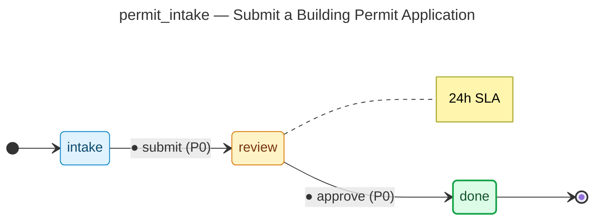
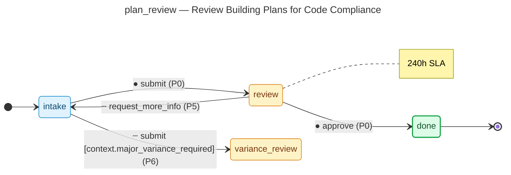
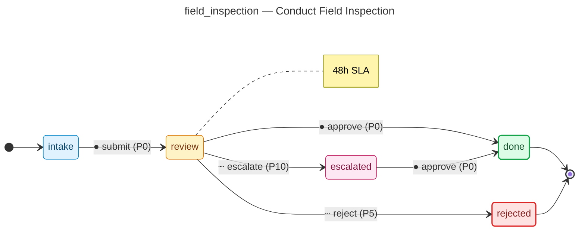
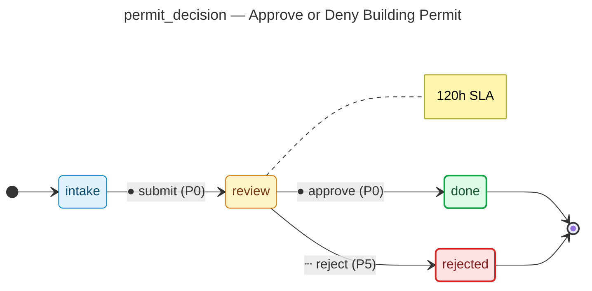

# building-permit

Generated by the flowforge JTBD generator. Domain: **municipal_services**.

## JTBDs in this project

- **permit_intake** — Submit a Building Permit Application
  - Actor: `applicant`
  - Outcome: Application is accepted and queued for plan review with a confirmed tracking number.
  - States: 3, transitions: 2
- **plan_review** — Review Building Plans for Code Compliance
  - Actor: `plan_reviewer`
  - Outcome: Plans are approved or corrections are requested with specific deficiencies listed.
  - States: 4, transitions: 4
- **field_inspection** — Conduct Field Inspection
  - Actor: `field_inspector`
  - Outcome: Inspection result recorded; either passed, failed with corrections, or re-inspection scheduled.
  - States: 5, transitions: 5
- **permit_decision** — Approve or Deny Building Permit
  - Actor: `chief_building_official`
  - Outcome: Permit is approved with conditions or denied with a written findings document.
  - States: 4, transitions: 3
- **permit_issuance** — Issue the Building Permit Certificate
  - Actor: `permit_clerk`
  - Outcome: Signed permit certificate issued and delivered; permit number recorded in the municipal registry.
  - States: 3, transitions: 2

## Layout

```
backend/                    # Python service
  src/building_permit/
    adapters/               # Workflow adapters per JTBD
    models/                 # SQLAlchemy 2.x models
    routers/                # FastAPI routers
    services/               # Domain services
    permissions.py          # RBAC catalog
    audit_taxonomy.py       # Audit topic catalog
    notifications.py        # Notification rules
  tests/                    # pytest simulation tests
  migrations/               # Alembic
frontend/                   # nextjs
workflows/                  # Workflow DSL JSONs + form specs + diagrams
```

## State-machine diagrams

Each JTBD's synthesised state machine is rendered below as a mermaid
`stateDiagram-v2`. The deterministic source lives at
`workflows/<id>/diagram.mmd` and is the single source of truth — hosts
that want SVG / PNG output run `mmdc -i workflows/<id>/diagram.mmd -o
diagram.svg` themselves; pre-rendered SVG isn't checked in because
mermaid-cli output isn't byte-stable across versions.

Edge styling: solid edges are happy-path (priority 0); dashed edges are
edge-case branches (priority 5+); dotted edges are escalations (priority
10+); blue dashed edges are saga compensations.

### Submit a Building Permit Application (`permit_intake`)

Source: [`workflows/permit_intake/diagram.mmd`](workflows/permit_intake/diagram.mmd)



### Review Building Plans for Code Compliance (`plan_review`)

Source: [`workflows/plan_review/diagram.mmd`](workflows/plan_review/diagram.mmd)



### Conduct Field Inspection (`field_inspection`)

Source: [`workflows/field_inspection/diagram.mmd`](workflows/field_inspection/diagram.mmd)



### Approve or Deny Building Permit (`permit_decision`)

Source: [`workflows/permit_decision/diagram.mmd`](workflows/permit_decision/diagram.mmd)



### Issue the Building Permit Certificate (`permit_issuance`)

Source: [`workflows/permit_issuance/diagram.mmd`](workflows/permit_issuance/diagram.mmd)


## Regenerating

This project is **regenerated** from a JTBD bundle. Edit the bundle and rerun:

```sh
flowforge new building-permit --jtbd jtbd.yaml --force
```
