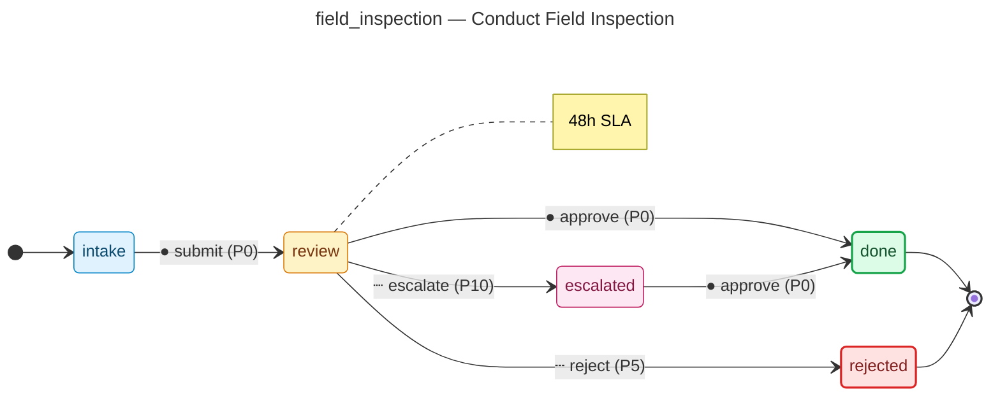

# Conduct Field Inspection — operator manual

> Generated by `flowforge jtbd-generate` from the JTBD bundle. Re-run the
> generator after editing the bundle; this file is regenerated end-to-end
> and should not be edited by hand.

| | |
|---|---|
| **JTBD id** | `field_inspection` |
| **Actor role** | `field_inspector` |
| **Project** | building-permit |

## Introduction

**Situation.** Construction has reached a stage requiring an official inspection (foundation, framing, electrical rough-in, plumbing rough-in, or final).

**Motivation.** Verify that work in progress matches approved plans and meets code before it is concealed or finalized.

**Outcome.** Inspection result recorded; either passed, failed with corrections, or re-inspection scheduled.

## How to know it worked

1. Inspection scheduled within 2 business days of request
2. Inspection card updated same day as inspection
3. Failed items described with specific code references

## State diagram

The synthesised state machine for `field_inspection` is rendered below as a
mermaid `stateDiagram-v2`. The canonical deterministic source lives at
[`../../workflows/field_inspection/diagram.mmd`](../../workflows/field_inspection/diagram.mmd)
and is the single source of truth; hosts that want SVG / PNG output run
`mmdc -i workflows/field_inspection/diagram.mmd -o diagram.svg` themselves
on the mermaid source.

## Form

The customer-facing form rendered for `field_inspection` captures
5 fields:

- **Inspection Type** (`inspection_type`) — `enum`, required
- **Inspection Date** (`inspection_date`) — `date`, required
- **Inspector Field Notes** (`inspector_notes`) — `textarea`, required
- **Result** (`pass_fail`) — `enum`, required
- **Correction Items** (`correction_items`) — `textarea`

Live rendering: see the generated frontend at
[`../../frontend/`](../../frontend/). The static form-spec source lives
at
[`../../workflows/field_inspection/form_spec.json`](../../workflows/field_inspection/form_spec.json).

Visual-regression baselines (when present) live under
`../../../screenshots/frontend/Step.<viewport>.png` per the framework's
W3 visual-regression invariants (mobile / tablet / desktop). When the
baseline is missing the renderer shows a broken-image fallback; that is
expected for any bundle whose hosting tree has not yet committed
Playwright screenshots. The image embed below resolves automatically once
the baseline lands:

## Audit topics

These audit topics fire during the JTBD's lifecycle. The audit-pg
adapter chain-verifies each topic at restore time. The cross-bundle
canonical catalog lives at
[`../../backend/src/building_permit/audit_taxonomy.py`](../../backend/src/building_permit/audit_taxonomy.py).

- **`field_inspection.approved`** — Approval event — a reviewer signed off on the record.
- **`field_inspection.escalated`** — Escalation event — the record crossed an authority tier and was routed to a senior approver.
- **`field_inspection.failed_inspection_rejected`** — Edge-case rejection — the `failed inspection` branch terminated the workflow.
- **`field_inspection.submitted`** — Submission event — the workflow's initial state was committed.

## Permissions

Operators need the following permissions to drive `field_inspection`
end-to-end. The full per-bundle permission catalog lives at
[`../../backend/src/building_permit/permissions.py`](../../backend/src/building_permit/permissions.py).

- `field_inspection.read` — read records owned by this JTBD
- `field_inspection.submit` — submit a new record into the workflow
- `field_inspection.review` — review a submitted record
- `field_inspection.approve` — approve a record that has cleared review
- `field_inspection.reject` — reject a record outright (no compensating workflow)
- `field_inspection.escalate` — escalate a record to the next authority tier
