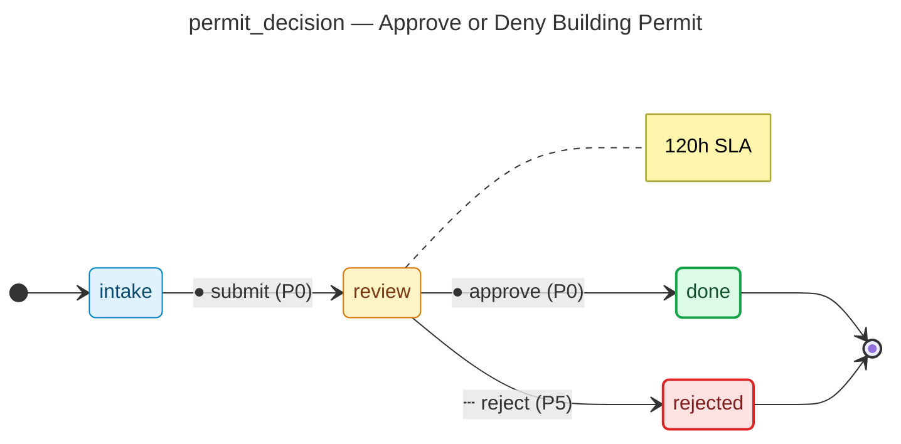

# Approve or Deny Building Permit — operator manual

> Generated by `flowforge jtbd-generate` from the JTBD bundle. Re-run the
> generator after editing the bundle; this file is regenerated end-to-end
> and should not be edited by hand.

| | |
|---|---|
| **JTBD id** | `permit_decision` |
| **Actor role** | `chief_building_official` |
| **Project** | building-permit |

## Introduction

**Situation.** All plan reviews and required inspections are complete; the chief building official must make a final approval or denial decision.

**Motivation.** Provide a legally binding decision that either authorizes construction to proceed or formally denies the application with stated reasons.

**Outcome.** Permit is approved with conditions or denied with a written findings document.

## How to know it worked

1. Decision issued within 5 business days of plan review approval
2. Denial includes written findings citing specific code sections
3. Approved permit includes all applicable conditions of approval

## State diagram

The synthesised state machine for `permit_decision` is rendered below as a
mermaid `stateDiagram-v2`. The canonical deterministic source lives at
[`../../workflows/permit_decision/diagram.mmd`](../../workflows/permit_decision/diagram.mmd)
and is the single source of truth; hosts that want SVG / PNG output run
`mmdc -i workflows/permit_decision/diagram.mmd -o diagram.svg` themselves
on the mermaid source.

## Form

The customer-facing form rendered for `permit_decision` captures
4 fields:

- **Decision** (`decision`) — `enum`, required
- **Conditions of Approval** (`conditions`) — `textarea`
- **Denial Findings** (`denial_findings`) — `textarea`
- **Permit Expiry Date** (`expiry_date`) — `date`

Live rendering: see the generated frontend at
[`../../frontend/`](../../frontend/). The static form-spec source lives
at
[`../../workflows/permit_decision/form_spec.json`](../../workflows/permit_decision/form_spec.json).

Visual-regression baselines (when present) live under
`../../../screenshots/frontend/Step.<viewport>.png` per the framework's
W3 visual-regression invariants (mobile / tablet / desktop). When the
baseline is missing the renderer shows a broken-image fallback; that is
expected for any bundle whose hosting tree has not yet committed
Playwright screenshots. The image embed below resolves automatically once
the baseline lands:

## Audit topics

These audit topics fire during the JTBD's lifecycle. The audit-pg
adapter chain-verifies each topic at restore time. The cross-bundle
canonical catalog lives at
[`../../backend/src/building_permit/audit_taxonomy.py`](../../backend/src/building_permit/audit_taxonomy.py).

- **`permit_decision.approved`** — Approval event — a reviewer signed off on the record.
- **`permit_decision.denied_rejected`** — Edge-case rejection — the `denied` branch terminated the workflow.
- **`permit_decision.submitted`** — Submission event — the workflow's initial state was committed.

## Permissions

Operators need the following permissions to drive `permit_decision`
end-to-end. The full per-bundle permission catalog lives at
[`../../backend/src/building_permit/permissions.py`](../../backend/src/building_permit/permissions.py).

- `permit_decision.read` — read records owned by this JTBD
- `permit_decision.submit` — submit a new record into the workflow
- `permit_decision.review` — review a submitted record
- `permit_decision.approve` — approve a record that has cleared review
- `permit_decision.reject` — reject a record outright (no compensating workflow)
