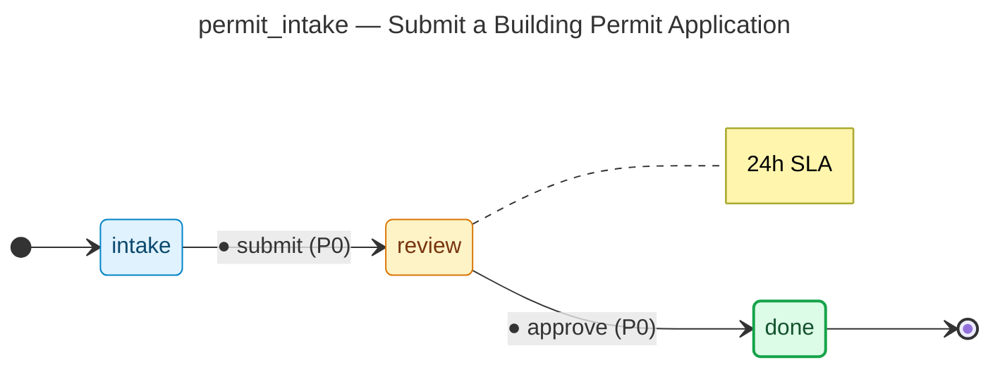

# Submit a Building Permit Application — operator manual

> Generated by `flowforge jtbd-generate` from the JTBD bundle. Re-run the
> generator after editing the bundle; this file is regenerated end-to-end
> and should not be edited by hand.

| | |
|---|---|
| **JTBD id** | `permit_intake` |
| **Actor role** | `applicant` |
| **Project** | building-permit |

## Introduction

**Situation.** A property owner or contractor needs to begin construction and must obtain a building permit before breaking ground.

**Motivation.** Comply with municipal code, avoid stop-work orders, and get official approval to build.

**Outcome.** Application is accepted and queued for plan review with a confirmed tracking number.

## How to know it worked

1. Applicant receives a tracking number within 1 business day
2. All required documents are attached before submission
3. Fees are calculated and payment initiated at submission

## State diagram

The synthesised state machine for `permit_intake` is rendered below as a
mermaid `stateDiagram-v2`. The canonical deterministic source lives at
[`../../workflows/permit_intake/diagram.mmd`](../../workflows/permit_intake/diagram.mmd)
and is the single source of truth; hosts that want SVG / PNG output run
`mmdc -i workflows/permit_intake/diagram.mmd -o diagram.svg` themselves
on the mermaid source.

## Form

The customer-facing form rendered for `permit_intake` captures
9 fields:

- **Property Owner Name** (`owner_name`) — `text`, required, PII
- **Owner Email** (`owner_email`) — `email`, required, PII
- **Owner Phone** (`owner_phone`) — `phone`, required, PII
- **Construction Site Address** (`site_address`) — `address`, required
- **Parcel / APN Number** (`parcel_number`) — `text`, required
- **Permit Type** (`permit_type`) — `enum`, required
- **Project Description** (`project_description`) — `textarea`, required
- **Estimated Construction Cost** (`estimated_cost`) — `money`, required
- **Contractor License Number** (`contractor_license`) — `text`

Live rendering: see the generated frontend at
[`../../frontend/`](../../frontend/). The static form-spec source lives
at
[`../../workflows/permit_intake/form_spec.json`](../../workflows/permit_intake/form_spec.json).

Visual-regression baselines (when present) live under
`../../../screenshots/frontend/Step.<viewport>.png` per the framework's
W3 visual-regression invariants (mobile / tablet / desktop). When the
baseline is missing the renderer shows a broken-image fallback; that is
expected for any bundle whose hosting tree has not yet committed
Playwright screenshots. The image embed below resolves automatically once
the baseline lands:

## Audit topics

These audit topics fire during the JTBD's lifecycle. The audit-pg
adapter chain-verifies each topic at restore time. The cross-bundle
canonical catalog lives at
[`../../backend/src/building_permit/audit_taxonomy.py`](../../backend/src/building_permit/audit_taxonomy.py).

- **`permit_intake.approved`** — Approval event — a reviewer signed off on the record.
- **`permit_intake.submitted`** — Submission event — the workflow's initial state was committed.

## Permissions

Operators need the following permissions to drive `permit_intake`
end-to-end. The full per-bundle permission catalog lives at
[`../../backend/src/building_permit/permissions.py`](../../backend/src/building_permit/permissions.py).

- `permit_intake.read` — read records owned by this JTBD
- `permit_intake.submit` — submit a new record into the workflow
- `permit_intake.review` — review a submitted record
- `permit_intake.approve` — approve a record that has cleared review
