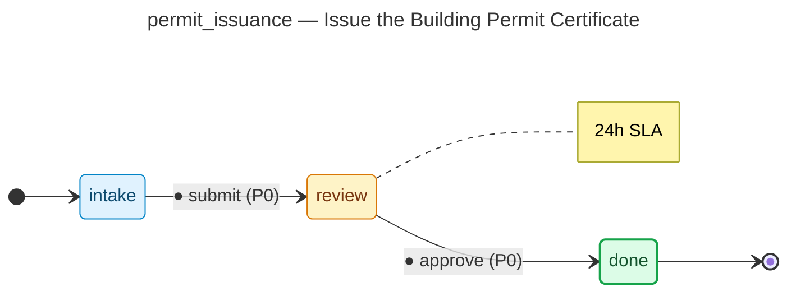

# Issue the Building Permit Certificate — operator manual

> Generated by `flowforge jtbd-generate` from the JTBD bundle. Re-run the
> generator after editing the bundle; this file is regenerated end-to-end
> and should not be edited by hand.

| | |
|---|---|
| **JTBD id** | `permit_issuance` |
| **Actor role** | `permit_clerk` |
| **Project** | building-permit |

## Introduction

**Situation.** The permit has been approved and the permit certificate must be generated, signed, and delivered to the applicant so construction can legally begin.

**Motivation.** Provide the applicant with a legally valid permit document they can post at the construction site as required by law.

**Outcome.** Signed permit certificate issued and delivered; permit number recorded in the municipal registry.

## How to know it worked

1. Permit certificate issued within 1 business day of approval
2. Certificate includes permit number, site address, expiry, and conditions
3. Permit recorded in the municipal registry before delivery

## State diagram

The synthesised state machine for `permit_issuance` is rendered below as a
mermaid `stateDiagram-v2`. The canonical deterministic source lives at
[`../../workflows/permit_issuance/diagram.mmd`](../../workflows/permit_issuance/diagram.mmd)
and is the single source of truth; hosts that want SVG / PNG output run
`mmdc -i workflows/permit_issuance/diagram.mmd -o diagram.svg` themselves
on the mermaid source.

## Form

The customer-facing form rendered for `permit_issuance` captures
5 fields:

- **Permit Number** (`permit_number`) — `text`, required
- **Issued Date** (`issued_date`) — `date`, required
- **Clerk Signature** (`clerk_signature`) — `signature`, required
- **Total Fee Collected** (`fee_amount`) — `money`, required
- **Payment Receipt Number** (`receipt_number`) — `text`, required

Live rendering: see the generated frontend at
[`../../frontend/`](../../frontend/). The static form-spec source lives
at
[`../../workflows/permit_issuance/form_spec.json`](../../workflows/permit_issuance/form_spec.json).

Visual-regression baselines (when present) live under
`../../../screenshots/frontend/Step.<viewport>.png` per the framework's
W3 visual-regression invariants (mobile / tablet / desktop). When the
baseline is missing the renderer shows a broken-image fallback; that is
expected for any bundle whose hosting tree has not yet committed
Playwright screenshots. The image embed below resolves automatically once
the baseline lands:

## Audit topics

These audit topics fire during the JTBD's lifecycle. The audit-pg
adapter chain-verifies each topic at restore time. The cross-bundle
canonical catalog lives at
[`../../backend/src/building_permit/audit_taxonomy.py`](../../backend/src/building_permit/audit_taxonomy.py).

- **`permit_issuance.approved`** — Approval event — a reviewer signed off on the record.
- **`permit_issuance.submitted`** — Submission event — the workflow's initial state was committed.

## Permissions

Operators need the following permissions to drive `permit_issuance`
end-to-end. The full per-bundle permission catalog lives at
[`../../backend/src/building_permit/permissions.py`](../../backend/src/building_permit/permissions.py).

- `permit_issuance.read` — read records owned by this JTBD
- `permit_issuance.submit` — submit a new record into the workflow
- `permit_issuance.review` — review a submitted record
- `permit_issuance.approve` — approve a record that has cleared review
