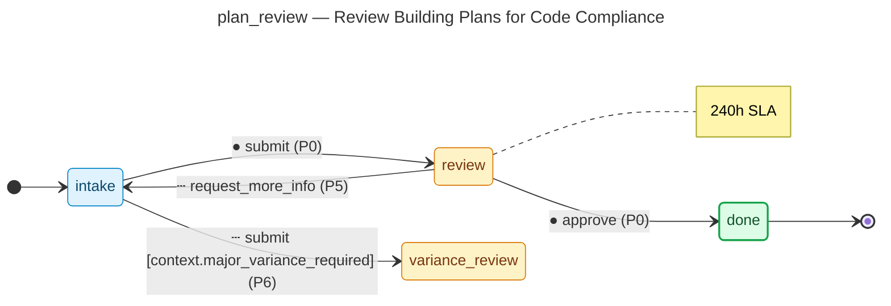

# Review Building Plans for Code Compliance — operator manual

> Generated by `flowforge jtbd-generate` from the JTBD bundle. Re-run the
> generator after editing the bundle; this file is regenerated end-to-end
> and should not be edited by hand.

| | |
|---|---|
| **JTBD id** | `plan_review` |
| **Actor role** | `plan_reviewer` |
| **Project** | building-permit |

## Introduction

**Situation.** A permit application has been accepted and plans must be reviewed for compliance with building codes, zoning, and fire safety regulations.

**Motivation.** Ensure construction meets all applicable codes before approval to protect public safety.

**Outcome.** Plans are approved or corrections are requested with specific deficiencies listed.

## How to know it worked

1. Initial review completed within 10 business days
2. All code violations are documented with IBC references
3. Applicant notified of outcome within 1 business day of decision

## State diagram

The synthesised state machine for `plan_review` is rendered below as a
mermaid `stateDiagram-v2`. The canonical deterministic source lives at
[`../../workflows/plan_review/diagram.mmd`](../../workflows/plan_review/diagram.mmd)
and is the single source of truth; hosts that want SVG / PNG output run
`mmdc -i workflows/plan_review/diagram.mmd -o diagram.svg` themselves
on the mermaid source.

## Form

The customer-facing form rendered for `plan_review` captures
3 fields:

- **Review Notes** (`review_notes`) — `textarea`, required
- **Applicable Code Sections** (`code_sections`) — `text`
- **Review Outcome** (`review_outcome`) — `enum`, required

Live rendering: see the generated frontend at
[`../../frontend/`](../../frontend/). The static form-spec source lives
at
[`../../workflows/plan_review/form_spec.json`](../../workflows/plan_review/form_spec.json).

Visual-regression baselines (when present) live under
`../../../screenshots/frontend/Step.<viewport>.png` per the framework's
W3 visual-regression invariants (mobile / tablet / desktop). When the
baseline is missing the renderer shows a broken-image fallback; that is
expected for any bundle whose hosting tree has not yet committed
Playwright screenshots. The image embed below resolves automatically once
the baseline lands:

## Audit topics

These audit topics fire during the JTBD's lifecycle. The audit-pg
adapter chain-verifies each topic at restore time. The cross-bundle
canonical catalog lives at
[`../../backend/src/building_permit/audit_taxonomy.py`](../../backend/src/building_permit/audit_taxonomy.py).

- **`plan_review.approved`** — Approval event — a reviewer signed off on the record.
- **`plan_review.corrections_needed_returned`** — Loop-back event — the `corrections needed` branch returned the record for revision.
- **`plan_review.major_variance_required`** — Edge-case branch — the `major variance required` route was taken.
- **`plan_review.submitted`** — Submission event — the workflow's initial state was committed.

## Permissions

Operators need the following permissions to drive `plan_review`
end-to-end. The full per-bundle permission catalog lives at
[`../../backend/src/building_permit/permissions.py`](../../backend/src/building_permit/permissions.py).

- `plan_review.read` — read records owned by this JTBD
- `plan_review.submit` — submit a new record into the workflow
- `plan_review.review` — review a submitted record
- `plan_review.approve` — approve a record that has cleared review
