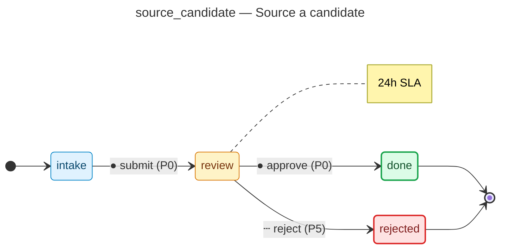
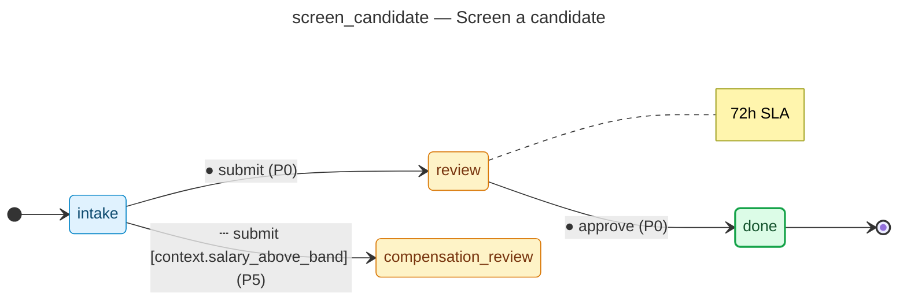
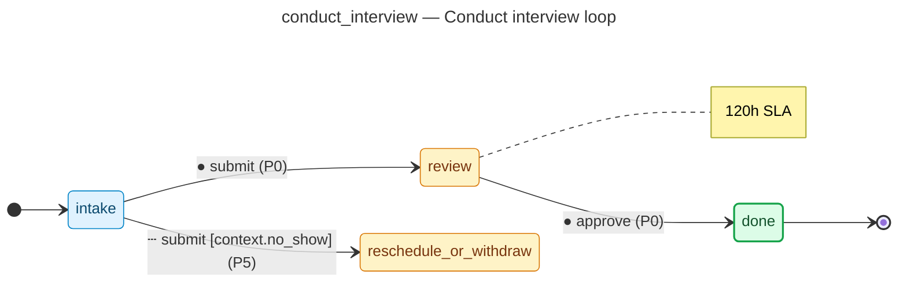
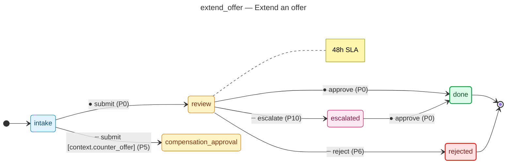

# hiring-pipeline

Generated by the flowforge JTBD generator. Domain: **hiring**.

## JTBDs in this project

- **source_candidate** — Source a candidate
  - Actor: `recruiter`
  - Outcome: candidate record created and ready for screening
  - States: 4, transitions: 3
- **screen_candidate** — Screen a candidate
  - Actor: `recruiter`
  - Outcome: candidate advanced to interview or rejected with documented rationale
  - States: 4, transitions: 3
- **conduct_interview** — Conduct interview loop
  - Actor: `hiring_manager`
  - Outcome: interview debrief completed with hire/no-hire consensus
  - States: 4, transitions: 3
- **extend_offer** — Extend an offer
  - Actor: `hr_partner`
  - Outcome: offer letter sent and candidate response recorded
  - States: 6, transitions: 6
- **complete_hire** — Complete hire and onboard
  - Actor: `hr_partner`
  - Outcome: hire record created, background check cleared, day-1 access provisioned
  - States: 4, transitions: 3

## Layout

```
backend/                    # Python service
  src/hiring_pipeline/
    adapters/               # Workflow adapters per JTBD
    models/                 # SQLAlchemy 2.x models
    routers/                # FastAPI routers
    services/               # Domain services
    permissions.py          # RBAC catalog
    audit_taxonomy.py       # Audit topic catalog
    notifications.py        # Notification rules
  tests/                    # pytest simulation tests
  migrations/               # Alembic
frontend/                   # nextjs
workflows/                  # Workflow DSL JSONs + form specs + diagrams
```

## State-machine diagrams

Each JTBD's synthesised state machine is rendered below as a mermaid
`stateDiagram-v2`. The deterministic source lives at
`workflows/<id>/diagram.mmd` and is the single source of truth — hosts
that want SVG / PNG output run `mmdc -i workflows/<id>/diagram.mmd -o
diagram.svg` themselves; pre-rendered SVG isn't checked in because
mermaid-cli output isn't byte-stable across versions.

Edge styling: solid edges are happy-path (priority 0); dashed edges are
edge-case branches (priority 5+); dotted edges are escalations (priority
10+); blue dashed edges are saga compensations.

### Source a candidate (`source_candidate`)

Source: [`workflows/source_candidate/diagram.mmd`](workflows/source_candidate/diagram.mmd)



### Screen a candidate (`screen_candidate`)

Source: [`workflows/screen_candidate/diagram.mmd`](workflows/screen_candidate/diagram.mmd)



### Conduct interview loop (`conduct_interview`)

Source: [`workflows/conduct_interview/diagram.mmd`](workflows/conduct_interview/diagram.mmd)



### Extend an offer (`extend_offer`)

Source: [`workflows/extend_offer/diagram.mmd`](workflows/extend_offer/diagram.mmd)



### Complete hire and onboard (`complete_hire`)

Source: [`workflows/complete_hire/diagram.mmd`](workflows/complete_hire/diagram.mmd)


## Regenerating

This project is **regenerated** from a JTBD bundle. Edit the bundle and rerun:

```sh
flowforge new hiring-pipeline --jtbd jtbd.yaml --force
```
