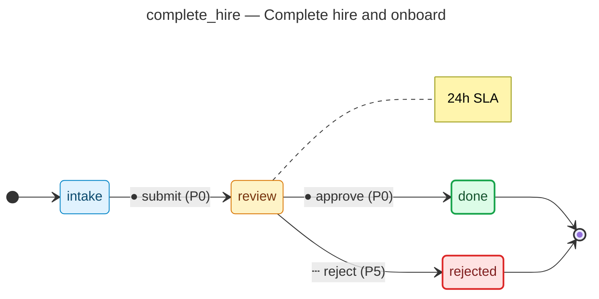

# Complete hire and onboard — operator manual

> Generated by `flowforge jtbd-generate` from the JTBD bundle. Re-run the
> generator after editing the bundle; this file is regenerated end-to-end
> and should not be edited by hand.

| | |
|---|---|
| **JTBD id** | `complete_hire` |
| **Actor role** | `hr_partner` |
| **Project** | hiring-pipeline |

## Introduction

**Situation.** candidate accepts offer and hr partner triggers pre-boarding and onboarding tasks

**Motivation.** ensure new hire is productive from day one with zero missed compliance steps

**Outcome.** hire record created, background check cleared, day-1 access provisioned

## How to know it worked

1. background check initiated within 24h of acceptance
2. IT provisioning ticket raised before start date
3. all pre-boarding documents signed at least 3 days before start

## State diagram

The synthesised state machine for `complete_hire` is rendered below as a
mermaid `stateDiagram-v2`. The canonical deterministic source lives at
[`../../workflows/complete_hire/diagram.mmd`](../../workflows/complete_hire/diagram.mmd)
and is the single source of truth; hosts that want SVG / PNG output run
`mmdc -i workflows/complete_hire/diagram.mmd -o diagram.svg` themselves
on the mermaid source.

## Form

The customer-facing form rendered for `complete_hire` captures
7 fields:

- **Acceptance date** (`acceptance_date`) — `date`, required
- **Legal name** (`legal_name`) — `text`, required, PII
- **National ID reference** (`national_id_ref`) — `text`, required, PII
- **Home address** (`home_address`) — `address`, required, PII
- **Emergency contact** (`emergency_contact`) — `text`, required, PII
- **Signed contract** (`signed_contract`) — `signature`, required, PII
- **Payroll account ref** (`bank_account_ref`) — `text`, required, PII

Live rendering: see the generated frontend at
[`../../frontend/`](../../frontend/). The static form-spec source lives
at
[`../../workflows/complete_hire/form_spec.json`](../../workflows/complete_hire/form_spec.json).

Visual-regression baselines (when present) live under
`../../../screenshots/frontend/Step.<viewport>.png` per the framework's
W3 visual-regression invariants (mobile / tablet / desktop). When the
baseline is missing the renderer shows a broken-image fallback; that is
expected for any bundle whose hosting tree has not yet committed
Playwright screenshots. The image embed below resolves automatically once
the baseline lands:

## Audit topics

These audit topics fire during the JTBD's lifecycle. The audit-pg
adapter chain-verifies each topic at restore time. The cross-bundle
canonical catalog lives at
[`../../backend/src/hiring_pipeline/audit_taxonomy.py`](../../backend/src/hiring_pipeline/audit_taxonomy.py).

- **`complete_hire.approved`** — Approval event — a reviewer signed off on the record.
- **`complete_hire.candidate_withdrawal_rejected`** — Edge-case rejection — the `candidate withdrawal` branch terminated the workflow.
- **`complete_hire.submitted`** — Submission event — the workflow's initial state was committed.

## Permissions

Operators need the following permissions to drive `complete_hire`
end-to-end. The full per-bundle permission catalog lives at
[`../../backend/src/hiring_pipeline/permissions.py`](../../backend/src/hiring_pipeline/permissions.py).

- `complete_hire.read` — read records owned by this JTBD
- `complete_hire.submit` — submit a new record into the workflow
- `complete_hire.review` — review a submitted record
- `complete_hire.approve` — approve a record that has cleared review
- `complete_hire.reject` — reject a record outright (no compensating workflow)
