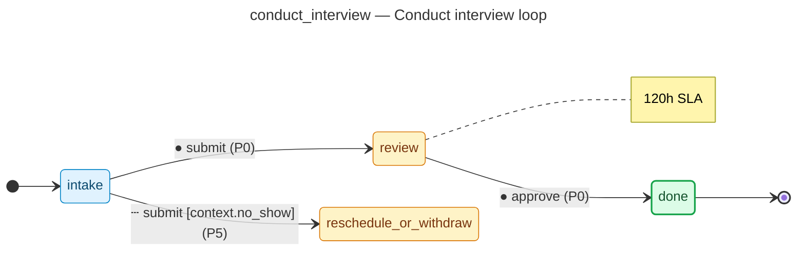

# Conduct interview loop — operator manual

> Generated by `flowforge jtbd-generate` from the JTBD bundle. Re-run the
> generator after editing the bundle; this file is regenerated end-to-end
> and should not be edited by hand.

| | |
|---|---|
| **JTBD id** | `conduct_interview` |
| **Actor role** | `hiring_manager` |
| **Project** | hiring-pipeline |

## Introduction

**Situation.** hiring manager coordinates structured interview panels for a screened candidate

**Motivation.** evaluate technical and cultural fit before extending an offer

**Outcome.** interview debrief completed with hire/no-hire consensus

## How to know it worked

1. all panel interviews completed within 5 business days of screen approval
2. structured scorecard submitted by every interviewer
3. debrief meeting held and decision recorded

## State diagram

The synthesised state machine for `conduct_interview` is rendered below as a
mermaid `stateDiagram-v2`. The canonical deterministic source lives at
[`../../workflows/conduct_interview/diagram.mmd`](../../workflows/conduct_interview/diagram.mmd)
and is the single source of truth; hosts that want SVG / PNG output run
`mmdc -i workflows/conduct_interview/diagram.mmd -o diagram.svg` themselves
on the mermaid source.

## Form

The customer-facing form rendered for `conduct_interview` captures
5 fields:

- **Panel scorecard summary** (`panel_scorecard`) — `textarea`, required
- **Technical score (1-5)** (`technical_score`) — `number`, required
- **Culture score (1-5)** (`culture_score`) — `number`, required
- **Debrief notes** (`debrief_notes`) — `textarea`, required
- **Interview date/time** (`interview_date`) — `datetime`, required

Live rendering: see the generated frontend at
[`../../frontend/`](../../frontend/). The static form-spec source lives
at
[`../../workflows/conduct_interview/form_spec.json`](../../workflows/conduct_interview/form_spec.json).

Visual-regression baselines (when present) live under
`../../../screenshots/frontend/Step.<viewport>.png` per the framework's
W3 visual-regression invariants (mobile / tablet / desktop). When the
baseline is missing the renderer shows a broken-image fallback; that is
expected for any bundle whose hosting tree has not yet committed
Playwright screenshots. The image embed below resolves automatically once
the baseline lands:

## Audit topics

These audit topics fire during the JTBD's lifecycle. The audit-pg
adapter chain-verifies each topic at restore time. The cross-bundle
canonical catalog lives at
[`../../backend/src/hiring_pipeline/audit_taxonomy.py`](../../backend/src/hiring_pipeline/audit_taxonomy.py).

- **`conduct_interview.approved`** — Approval event — a reviewer signed off on the record.
- **`conduct_interview.no_show`** — Edge-case branch — the `no show` route was taken.
- **`conduct_interview.submitted`** — Submission event — the workflow's initial state was committed.

## Permissions

Operators need the following permissions to drive `conduct_interview`
end-to-end. The full per-bundle permission catalog lives at
[`../../backend/src/hiring_pipeline/permissions.py`](../../backend/src/hiring_pipeline/permissions.py).

- `conduct_interview.read` — read records owned by this JTBD
- `conduct_interview.submit` — submit a new record into the workflow
- `conduct_interview.review` — review a submitted record
- `conduct_interview.approve` — approve a record that has cleared review
