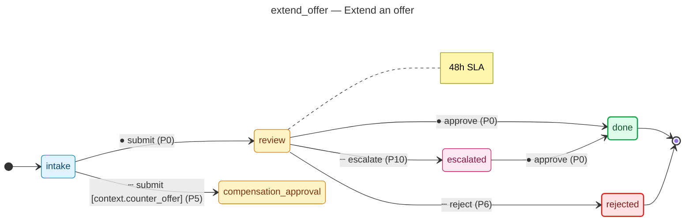

# Extend an offer — operator manual

> Generated by `flowforge jtbd-generate` from the JTBD bundle. Re-run the
> generator after editing the bundle; this file is regenerated end-to-end
> and should not be edited by hand.

| | |
|---|---|
| **JTBD id** | `extend_offer` |
| **Actor role** | `hr_partner` |
| **Project** | hiring-pipeline |

## Introduction

**Situation.** hr partner prepares and delivers a formal offer letter after interview approval

**Motivation.** convert approved candidate into accepted hire before they accept a competing offer

**Outcome.** offer letter sent and candidate response recorded

## How to know it worked

1. offer letter sent within 2 business days of interview approval
2. compensation within approved band
3. candidate response captured within offer expiry window

## State diagram

The synthesised state machine for `extend_offer` is rendered below as a
mermaid `stateDiagram-v2`. The canonical deterministic source lives at
[`../../workflows/extend_offer/diagram.mmd`](../../workflows/extend_offer/diagram.mmd)
and is the single source of truth; hosts that want SVG / PNG output run
`mmdc -i workflows/extend_offer/diagram.mmd -o diagram.svg` themselves
on the mermaid source.

## Form

The customer-facing form rendered for `extend_offer` captures
6 fields:

- **Base salary** (`base_salary`) — `money`, required
- **Bonus target** (`bonus_target`) — `money`
- **Proposed start** (`start_date`) — `date`, required
- **Offer expires** (`offer_expiry`) — `date`, required
- **Offer letter PDF** (`offer_letter`) — `file`, required, PII
- **RSU units** (`equity_units`) — `number`

Live rendering: see the generated frontend at
[`../../frontend/`](../../frontend/). The static form-spec source lives
at
[`../../workflows/extend_offer/form_spec.json`](../../workflows/extend_offer/form_spec.json).

Visual-regression baselines (when present) live under
`../../../screenshots/frontend/Step.<viewport>.png` per the framework's
W3 visual-regression invariants (mobile / tablet / desktop). When the
baseline is missing the renderer shows a broken-image fallback; that is
expected for any bundle whose hosting tree has not yet committed
Playwright screenshots. The image embed below resolves automatically once
the baseline lands:

## Audit topics

These audit topics fire during the JTBD's lifecycle. The audit-pg
adapter chain-verifies each topic at restore time. The cross-bundle
canonical catalog lives at
[`../../backend/src/hiring_pipeline/audit_taxonomy.py`](../../backend/src/hiring_pipeline/audit_taxonomy.py).

- **`extend_offer.approved`** — Approval event — a reviewer signed off on the record.
- **`extend_offer.counter_offer`** — Edge-case branch — the `counter offer` route was taken.
- **`extend_offer.escalated`** — Escalation event — the record crossed an authority tier and was routed to a senior approver.
- **`extend_offer.offer_expired_rejected`** — Edge-case rejection — the `offer expired` branch terminated the workflow.
- **`extend_offer.submitted`** — Submission event — the workflow's initial state was committed.

## Permissions

Operators need the following permissions to drive `extend_offer`
end-to-end. The full per-bundle permission catalog lives at
[`../../backend/src/hiring_pipeline/permissions.py`](../../backend/src/hiring_pipeline/permissions.py).

- `extend_offer.read` — read records owned by this JTBD
- `extend_offer.submit` — submit a new record into the workflow
- `extend_offer.review` — review a submitted record
- `extend_offer.approve` — approve a record that has cleared review
- `extend_offer.reject` — reject a record outright (no compensating workflow)
- `extend_offer.escalate` — escalate a record to the next authority tier
