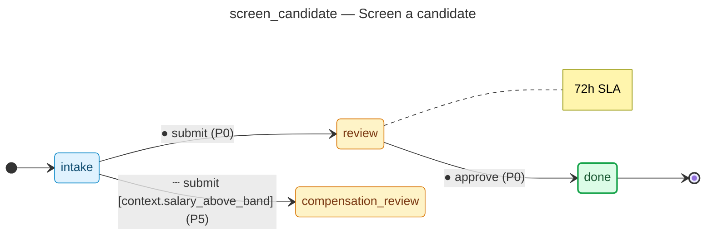

# Screen a candidate — operator manual

> Generated by `flowforge jtbd-generate` from the JTBD bundle. Re-run the
> generator after editing the bundle; this file is regenerated end-to-end
> and should not be edited by hand.

| | |
|---|---|
| **JTBD id** | `screen_candidate` |
| **Actor role** | `recruiter` |
| **Project** | hiring-pipeline |

## Introduction

**Situation.** recruiter reviews resume and conducts a phone screen to assess basic fit

**Motivation.** filter unqualified candidates before investing interview cycles

**Outcome.** candidate advanced to interview or rejected with documented rationale

## How to know it worked

1. phone screen completed within 3 business days of sourcing
2. screen decision recorded with pass/fail rationale

## State diagram

The synthesised state machine for `screen_candidate` is rendered below as a
mermaid `stateDiagram-v2`. The canonical deterministic source lives at
[`../../workflows/screen_candidate/diagram.mmd`](../../workflows/screen_candidate/diagram.mmd)
and is the single source of truth; hosts that want SVG / PNG output run
`mmdc -i workflows/screen_candidate/diagram.mmd -o diagram.svg` themselves
on the mermaid source.

## Form

The customer-facing form rendered for `screen_candidate` captures
5 fields:

- **Screen score (1-5)** (`screen_score`) — `number`, required
- **Screen notes** (`screen_notes`) — `textarea`, required
- **Years experience** (`years_exp`) — `number`, required
- **Salary expectation** (`salary_expect`) — `money`
- **Available from** (`availability`) — `date`

Live rendering: see the generated frontend at
[`../../frontend/`](../../frontend/). The static form-spec source lives
at
[`../../workflows/screen_candidate/form_spec.json`](../../workflows/screen_candidate/form_spec.json).

Visual-regression baselines (when present) live under
`../../../screenshots/frontend/Step.<viewport>.png` per the framework's
W3 visual-regression invariants (mobile / tablet / desktop). When the
baseline is missing the renderer shows a broken-image fallback; that is
expected for any bundle whose hosting tree has not yet committed
Playwright screenshots. The image embed below resolves automatically once
the baseline lands:

## Audit topics

These audit topics fire during the JTBD's lifecycle. The audit-pg
adapter chain-verifies each topic at restore time. The cross-bundle
canonical catalog lives at
[`../../backend/src/hiring_pipeline/audit_taxonomy.py`](../../backend/src/hiring_pipeline/audit_taxonomy.py).

- **`screen_candidate.approved`** — Approval event — a reviewer signed off on the record.
- **`screen_candidate.salary_above_band`** — Edge-case branch — the `salary above band` route was taken.
- **`screen_candidate.submitted`** — Submission event — the workflow's initial state was committed.

## Permissions

Operators need the following permissions to drive `screen_candidate`
end-to-end. The full per-bundle permission catalog lives at
[`../../backend/src/hiring_pipeline/permissions.py`](../../backend/src/hiring_pipeline/permissions.py).

- `screen_candidate.read` — read records owned by this JTBD
- `screen_candidate.submit` — submit a new record into the workflow
- `screen_candidate.review` — review a submitted record
- `screen_candidate.approve` — approve a record that has cleared review
