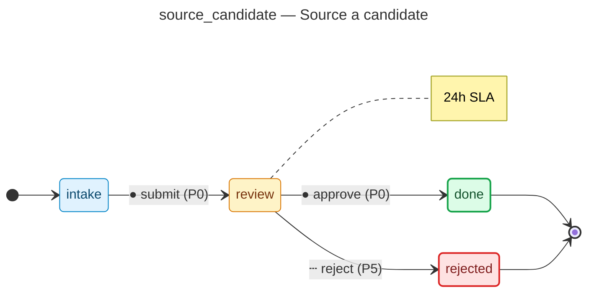

# Source a candidate — operator manual

> Generated by `flowforge jtbd-generate` from the JTBD bundle. Re-run the
> generator after editing the bundle; this file is regenerated end-to-end
> and should not be edited by hand.

| | |
|---|---|
| **JTBD id** | `source_candidate` |
| **Actor role** | `recruiter` |
| **Project** | hiring-pipeline |

## Introduction

**Situation.** recruiter identifies a potential hire from job board, referral, or direct outreach

**Motivation.** build a qualified pipeline for an open role

**Outcome.** candidate record created and ready for screening

## How to know it worked

1. candidate profile created within 1 business day of identification
2. source channel recorded for pipeline analytics

## State diagram

The synthesised state machine for `source_candidate` is rendered below as a
mermaid `stateDiagram-v2`. The canonical deterministic source lives at
[`../../workflows/source_candidate/diagram.mmd`](../../workflows/source_candidate/diagram.mmd)
and is the single source of truth; hosts that want SVG / PNG output run
`mmdc -i workflows/source_candidate/diagram.mmd -o diagram.svg` themselves
on the mermaid source.

## Form

The customer-facing form rendered for `source_candidate` captures
7 fields:

- **Full name** (`candidate_name`) — `text`, required, PII
- **Email** (`candidate_email`) — `email`, required, PII
- **Phone** (`candidate_phone`) — `phone`, PII
- **Role applied** (`role_title`) — `text`, required
- **Source channel** (`source_channel`) — `enum`, required
- **Resume** (`resume`) — `file`, PII
- **Notes** (`notes`) — `textarea`

Live rendering: see the generated frontend at
[`../../frontend/`](../../frontend/). The static form-spec source lives
at
[`../../workflows/source_candidate/form_spec.json`](../../workflows/source_candidate/form_spec.json).

Visual-regression baselines (when present) live under
`../../../screenshots/frontend/Step.<viewport>.png` per the framework's
W3 visual-regression invariants (mobile / tablet / desktop). When the
baseline is missing the renderer shows a broken-image fallback; that is
expected for any bundle whose hosting tree has not yet committed
Playwright screenshots. The image embed below resolves automatically once
the baseline lands:

## Audit topics

These audit topics fire during the JTBD's lifecycle. The audit-pg
adapter chain-verifies each topic at restore time. The cross-bundle
canonical catalog lives at
[`../../backend/src/hiring_pipeline/audit_taxonomy.py`](../../backend/src/hiring_pipeline/audit_taxonomy.py).

- **`source_candidate.approved`** — Approval event — a reviewer signed off on the record.
- **`source_candidate.duplicate_candidate_rejected`** — Edge-case rejection — the `duplicate candidate` branch terminated the workflow.
- **`source_candidate.submitted`** — Submission event — the workflow's initial state was committed.

## Permissions

Operators need the following permissions to drive `source_candidate`
end-to-end. The full per-bundle permission catalog lives at
[`../../backend/src/hiring_pipeline/permissions.py`](../../backend/src/hiring_pipeline/permissions.py).

- `source_candidate.read` — read records owned by this JTBD
- `source_candidate.submit` — submit a new record into the workflow
- `source_candidate.review` — review a submitted record
- `source_candidate.approve` — approve a record that has cleared review
- `source_candidate.reject` — reject a record outright (no compensating workflow)
