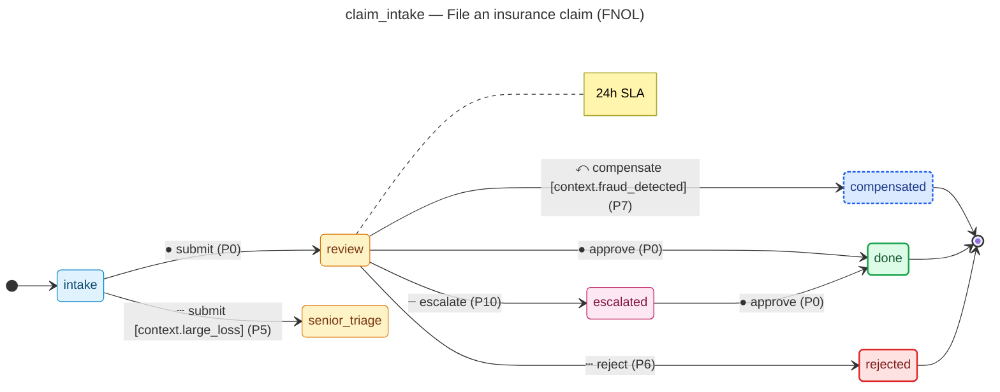

# insurance-claim-demo

Generated by the flowforge JTBD generator. Domain: **claims**.

## JTBDs in this project

- **claim_intake** — File an insurance claim (FNOL)
  - Actor: `claimant`
  - Outcome: Claim is accepted into triage and assigned to an adjuster within 24 hours.
  - States: 7, transitions: 7

## Layout

```
backend/                    # Python service
  src/insurance_claim_demo/
    adapters/               # Workflow adapters per JTBD
    models/                 # SQLAlchemy 2.x models
    routers/                # FastAPI routers
    services/               # Domain services
    permissions.py          # RBAC catalog
    audit_taxonomy.py       # Audit topic catalog
    notifications.py        # Notification rules
  tests/                    # pytest simulation tests
  migrations/               # Alembic
frontend/                   # nextjs
workflows/                  # Workflow DSL JSONs + form specs + diagrams
```

## State-machine diagrams

Each JTBD's synthesised state machine is rendered below as a mermaid
`stateDiagram-v2`. The deterministic source lives at
`workflows/<id>/diagram.mmd` and is the single source of truth — hosts
that want SVG / PNG output run `mmdc -i workflows/<id>/diagram.mmd -o
diagram.svg` themselves; pre-rendered SVG isn't checked in because
mermaid-cli output isn't byte-stable across versions.

Edge styling: solid edges are happy-path (priority 0); dashed edges are
edge-case branches (priority 5+); dotted edges are escalations (priority
10+); blue dashed edges are saga compensations.

### File an insurance claim (FNOL) (`claim_intake`)

Source: [`workflows/claim_intake/diagram.mmd`](workflows/claim_intake/diagram.mmd)



## Regenerating

This project is **regenerated** from a JTBD bundle. Edit the bundle and rerun:

```sh
flowforge new insurance-claim-demo --jtbd jtbd.yaml --force
```
