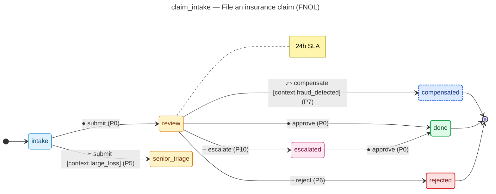

# File an insurance claim (FNOL) — operator manual

> Generated by `flowforge jtbd-generate` from the JTBD bundle. Re-run the
> generator after editing the bundle; this file is regenerated end-to-end
> and should not be edited by hand.

| | |
|---|---|
| **JTBD id** | `claim_intake` |
| **Actor role** | `claimant` |
| **Project** | insurance-claim-demo |

## Introduction

**Situation.** A policyholder suffers a covered loss and needs to submit a First Notice of Loss so recovery can begin.

**Motivation.** Recover insured losses as quickly as possible with minimal friction.

**Outcome.** Claim is accepted into triage and assigned to an adjuster within 24 hours.

## How to know it worked

1. Claim ID is generated and confirmed to the claimant within 5 minutes of submission.
2. Claim routed to correct triage queue within 24 hours.
3. Large-loss claims (> $100 000) automatically escalated to senior adjuster.
4. Lapsed-policy claims are rejected immediately with a reason code.

## State diagram

The synthesised state machine for `claim_intake` is rendered below as a
mermaid `stateDiagram-v2`. The canonical deterministic source lives at
[`../../workflows/claim_intake/diagram.mmd`](../../workflows/claim_intake/diagram.mmd)
and is the single source of truth; hosts that want SVG / PNG output run
`mmdc -i workflows/claim_intake/diagram.mmd -o diagram.svg` themselves
on the mermaid source.

## Form

The customer-facing form rendered for `claim_intake` captures
7 fields:

- **Claimant full name** (`claimant_name`) — `text`, required, PII
- **Policy number** (`policy_number`) — `text`, required
- **Date of loss** (`loss_date`) — `date`, required
- **Estimated loss amount** (`loss_amount`) — `money`, required
- **Description of loss** (`loss_description`) — `textarea`, required
- **Contact email** (`contact_email`) — `email`, required, PII
- **Contact phone** (`contact_phone`) — `phone`, PII

Live rendering: see the generated frontend at
[`../../frontend/`](../../frontend/). The static form-spec source lives
at
[`../../workflows/claim_intake/form_spec.json`](../../workflows/claim_intake/form_spec.json).

Visual-regression baselines (when present) live under
`../../../screenshots/frontend/Step.<viewport>.png` per the framework's
W3 visual-regression invariants (mobile / tablet / desktop). When the
baseline is missing the renderer shows a broken-image fallback; that is
expected for any bundle whose hosting tree has not yet committed
Playwright screenshots. The image embed below resolves automatically once
the baseline lands:

## Audit topics

These audit topics fire during the JTBD's lifecycle. The audit-pg
adapter chain-verifies each topic at restore time. The cross-bundle
canonical catalog lives at
[`../../backend/src/insurance_claim_demo/audit_taxonomy.py`](../../backend/src/insurance_claim_demo/audit_taxonomy.py).

- **`claim_intake.approved`** — Approval event — a reviewer signed off on the record.
- **`claim_intake.escalated`** — Escalation event — the record crossed an authority tier and was routed to a senior approver.
- **`claim_intake.lapsed_rejected`** — Edge-case rejection — the `lapsed` branch terminated the workflow.
- **`claim_intake.large_loss`** — Edge-case branch — the `large loss` route was taken.
- **`claim_intake.submitted`** — Submission event — the workflow's initial state was committed.

## Permissions

Operators need the following permissions to drive `claim_intake`
end-to-end. The full per-bundle permission catalog lives at
[`../../backend/src/insurance_claim_demo/permissions.py`](../../backend/src/insurance_claim_demo/permissions.py).

- `claim_intake.submit` — submit a new record into the workflow
- `claim_intake.review` — review a submitted record
- `claim_intake.approve` — approve a record that has cleared review
- `claim_intake.reject` — reject a record outright (no compensating workflow)
- `claim_intake.escalate` — escalate a record to the next authority tier
